# **THEME : "RENFORCEMENT DE LA SECURITE D'UNE ARCHITECTURE KUBERNETES"**

- ## **INTRODUCTION GÉNÉRALE**
    Avec l'évolution rapide des technologies de conteneurisation et l’adoption croissante de l’infrastructure cloud, Kubernetes est devenu un standard de facto pour le déploiement et la gestion des applications conteneurisées à grande échelle. En tant que système d’orchestration de conteneurs, Kubernetes facilite la mise en production, l’évolutivité et la résilience des applications en distribuant automatiquement les charges de travail dans un cluster de machines physiques ou virtuelles.

    Cependant, cette popularité croissante de Kubernetes s’accompagne de nouveaux défis en matière de sécurité. En raison de sa structure complexe, incluant de nombreux composants interconnectés (API, nœuds, pods, etc.), un cluster Kubernetes est vulnérable à plusieurs types de menaces, allant de l’accès non autorisé aux attaques de type escalade de privilèges. Les failles de sécurité dans l'infrastructure Kubernetes peuvent mettre en péril les applications et les données sensibles d’une organisation, rendant la sécurisation de ces environnements une priorité absolue.

    Ce projet se concentre sur le renforcement de la sécurité d'une architecture Kubernetes en appliquant des méthodologies et des techniques avancées pour réduire les vulnérabilités. En s'appuyant sur les meilleures pratiques de sécurité, le projet vise à fournir une solution complète qui répond aux enjeux suivants :
    - **Protection des accès** : Mettre en place des contrôles d’accès stricts pour prévenir les accès non autorisés.
    - **Isolation des composants** : Utiliser des politiques de réseau et de sécurité des pods pour segmenter l'infrastructure et limiter la portée des éventuelles intrusions.
    - **Surveillance et audit** : Intégrer des mécanismes de surveillance pour détecter et réagir aux comportements suspects en temps réel.

    Pour atteindre ces objectifs, nous avons adopté une approche basée sur la méthodologie agile Scrum, permettant un déploiement progressif des fonctionnalités de sécurité et une amélioration continue grâce aux retours obtenus à chaque itération. Ce rapport est structuré en plusieurs chapitres, chacun décrivant une étape clé du projet :
    1. Le premier chapitre présente le contexte, les objectifs du projet, et la méthodologie de travail.
    2. Le deuxième chapitre dresse un état de l’art des pratiques de sécurité dans Kubernetes, identifiant les défis et solutions actuels.
    3. Le troisième chapitre détaille la mise en place d'une architecture non sécurisée pour identifier les vulnérabilités potentielles par le biais de tests de pénétration.
    4. Le quatrième chapitre expose les mesures de sécurisation appliquées pour renforcer la protection du cluster.
    5. Enfin, le cinquième chapitre présente les tests finaux et l’évaluation des résultats obtenus, permettant de vérifier l'efficacité des mesures mises en place.

    Ce projet vise à établir un environnement Kubernetes résilient et sécurisé, offrant ainsi un modèle applicable aux infrastructures conteneurisées pour prévenir les risques de sécurité et garantir l'intégrité des applications déployées.

- ## **CHAPITRE 1 : Présentation du Projet**
    - ### Introduction
        Dans ce chapitre, nous posons les fondations du projet en détaillant son contexte, ses objectifs et la méthodologie adoptée. Nous abordons la problématique centrale à laquelle ce projet répond, ainsi que la solution proposée pour sécuriser une architecture Kubernetes. Ce chapitre décrit également les besoins fonctionnels et non fonctionnels du projet et présente une planification structurée suivant une approche itérative.

    - ### 1.1 Présentation de l'entreprise d'accueil
        TEK-UP University est une école de formation privée en informatique crée en 2014 et agréée par le ministère de l’enseignement supérieur, de la Recherche scientifique et des technologies de l’information et de la communication en Tunisie. 

        Elle est très attaché à la contribution de la qualité et de l'excellence dans tous les programmes académiques, qui se concentrent sur le développement des compétences professionnelles et la promotion de l'employabilité. Cela se traduit parla révision des programmes d'études pour s'assurer qu'ils sont conformes aux technologies et aux développements les plus récents et qu'ils sont accessibles à tous les étudiants, la fourniture d'un contenu académique de haute qualité et l'optimisation du potentiel des étudiants par la création d'un environnement qui conduit à un développement intellectuel et personnel et qui met l'accent sur la recherche académique.

        Sa mission est de former des ingénieurs et de les aider à innover et à développer de nouvelles idées tout en intégrant la technologie dans leurs projets et leur programme d'études. Une compréhension plus profonde du rôle de l'ingénieur y est développée, permettant aux étudiants d'identifier les besoins du monde d'aujourd'hui et de concevoir les meilleures solutions technologiques.

        Afin de réaliser sa vision et accomplir sa mission, TEK-UP se concentre principalement sur trois points :
        - Qualité des etudes : TEK-UP offre un environnement d'apprentissage de haute qualité. L'enseignement dispensé à l'université couvre des compétences spécifiques et des méthodes scientifiques qui permettront aux diplômés d'améliorer leurs qualifications.
        - Diverses méthodes de financement : Il existe de nombreuses façons de financer ses études à TEK-UP. Pour nous aider à nous offrir une formation adéquate quelle que soit notre situation financière, TEK-UP peut nous accorder un mode de financement spécifique qui nous permettra de payer nos études après l'obtention de notre diplôme, une fois que nous aurons décroché notre emploi.
        - Certifications internationales : chaque étudiant a la possibilité de passer près de 12 certifications internationales telles que CCNA, CCNP, LPIC, RHCSA, CEH, etc ...
        
        
    - ### 1.2 Contexte et Objectifs du projet
        - #### 1.2.1 Contexte du projet
            Avec l'adoption croissante des conteneurs pour le déploiement d'applications, Kubernetes est devenu une solution de référence pour l'orchestration des conteneurs. Cependant, cette popularité s'accompagne de nombreux défis en matière de sécurité. Les environnements Kubernetes peuvent être vulnérables à diverses menaces si des mesures de sécurité adéquates ne sont pas mises en place.

            Le contexte de ce projet s'inscrit dans la nécessité de renforcer la sécurité des environnements Kubernetes pour protéger les données et les applications des entreprises contre les attaques potentielles. Nous allons explorer les vulnérabilités communes et les solutions existantes pour proposer une architecture sécurisée.

        - #### 1.2.2 Objectifs de la sécurisation de l'architecture Kubernetes
            Les objectifs de ce projet sont multiples :
            - Identifier et comprendre les vulnérabilités spécifiques à Kubernetes.
            - Mettre en place une architecture Kubernetes initiale pour servir de base de comparaison.
            - Appliquer des techniques et des outils de sécurité pour renforcer cette architecture.
            - Évaluer l'efficacité des mesures de sécurité mises en place à travers des tests de pénétration.
            - Fournir des recommandations basées sur les résultats obtenus pour améliorer continuellement la sécurité dans les environnements Kubernetes.
        
    - ### 1.3 Problématique
        L'utilisation de Kubernetes apporte des avantages considérables en termes d'agilité et de scalabilité, mais expose aussi les systèmes à de nouveaux types de menaces. En effet, les infrastructures Kubernetes non sécurisées peuvent devenir des cibles privilégiées pour des cyberattaques, menaçant ainsi l’intégrité des applications et la confidentialité des données. La problématique centrale de ce projet est donc : **Comment sécuriser efficacement un cluster Kubernetes pour le protéger contre les menaces internes et externes tout en maintenant sa performance et sa disponibilité ?**
    
    - ### 1.4 Solution proposée
        Pour répondre à cette problématique, nous proposons une solution de sécurité complète qui se compose de :
        - **Contrôles d'accès stricts** (RBAC) : Limitation des permissions des utilisateurs et des applications pour minimiser les risques d'accès non autorisé.
        - **Politiques de réseau** : Isolation des différents composants et services au sein du cluster pour éviter le mouvement latéral des menaces.
        - **Sécurisation de l’API Kubernetes** : Mise en place de méthodes de surveillance des accès à l'API, point d’entrée critique du cluster.
        - **Analyse des images de pods** : Utiliser des outils adequats, afin de detecter des vulnerabilites dans les images.
        - **Surveillance et audit** : Intégration d’outils de surveillance et d’audit pour détecter rapidement les comportements anormaux et faciliter la réponse aux incidents.

        Ces mesures permettent de renforcer la sécurité du cluster tout en maintenant les performances et l’agilité de l’infrastructure.
    
    - ### 1.5 Identification des besoins fonctionnels et non fonctionnels
        - #### 1.5.1 Besoins fonctionnels
            Les besoins fonctionnels représentent les exigences directes pour assurer la sécurité du cluster Kubernetes :
            - **Contrôle d'accès basé sur les rôles (RBAC)** : Gestion des permissions afin que chaque utilisateur ait uniquement les droits nécessaires pour effectuer ses tâches.
            - **Politiques de réseau** : Implémentation de règles de réseau pour restreindre la communication entre les pods.
            - **Protection de l'API** : Configuration du parefeu pour restreindre l'acces au personnes autorisée.
            - **Surveillance et audit** : Mise en place de journaux d'audit détaillés et de systèmes d'alerte pour détecter les accès non autorisés et autres anomalies.

        - #### 1.5.2 Besoins non fonctionnels
            Les besoins non fonctionnels représentent les caractéristiques attendues en matière de performance et de résilience du système :
            - **Disponibilité** : Le cluster doit rester opérationnel, même en cas d'attaque ou d'incident de sécurité.
            - **Intégrité des données** : Les informations manipulées et stockées dans le cluster doivent être protégées contre toute modification non autorisée.
            - **Auditabilité** : Capacité de suivre les actions des utilisateurs et de fournir un historique détaillé des événements pour les besoins de conformité et de sécurité.

    - ### 1.6 Méthodologie de Travail
        - #### 1.6.1 Explication de la méthodologie Scrum et de ses principes
            Scrum est une méthodologie de gestion de projet agile qui se concentre sur la réalisation de projets complexes grâce à des itérations courtes appelées sprints. Chaque sprint dure généralement entre une et quatre semaines et produit un incrément du produit potentiellement livrable. Les principaux rôles dans Scrum incluent le Product Owner, le Scrum Master et l'équipe de développement.

            Les principes fondamentaux de Scrum incluent :
            - **Transparence** : Tous les aspects significatifs du processus doivent être visibles pour ceux responsables du résultat.
            - **Inspection** : Les utilisateurs Scrum doivent fréquemment inspecter les artefacts Scrum et l'avancement vers un objectif de sprint pour détecter des variations indésirables.
            - **Adaptation** : Si un utilisateur Scrum détecte un ou plusieurs aspects du processus qui dévient des limites acceptables, et que le produit fini sera inacceptable, il doit ajuster le processus ou le matériel en cours.

        - #### 1.6.2 Adaptation de Scrum au projet de sécurisation de l'architecture Kubernetes
            Pour ce projet, la méthodologie Scrum a été adaptée de la manière suivante :
            - **Product Owner** : Le superviseur du projet (ici, notre encadreur), responsable de la définition des priorités de sécurité et des critères d'acceptation.
            - **Scrum Master** : Le chef de projet (ici, moi), facilitant les réunions Scrum et aidant à éliminer les obstacles.
            - **Équipe de Développement** : Composée de moi uniquement, impliqué dans le projet et chargée de l'implémentation des fonctionnalités de sécurité.

            Les travaux ont été organisés en sprints allant de une a quatre semaines, chaque sprint ayant des objectifs clairs liés à la sécurisation de l'architecture Kubernetes. Les réunions ont permis de suivre les progrès et d'ajuster les plans si nécessaire.
        
        - #### 1.6.3 Planification du projet 
            La méthodologie Scrum a été choisie pour structurer et suivre le déroulement du projet. En utilisant des cycles itératifs (sprints), cette approche permet de tester et d'améliorer les fonctionnalités de sécurité au fur et à mesure, garantissant ainsi une progression continue vers une architecture Kubernetes sécurisée.

            **Phases du projet** :
            1. **Sprint 1 - Configuration de l’architecture initiale** : Mise en place d’un cluster Kubernetes de base pour identifier les vulnérabilités potentielles.
            2. **Sprint 2 - Test de pénétration** : Simulation d’attaques pour évaluer les risques et identifier les points faibles de l'architecture.
            3. **Planification des fonctionnalités de securité** : Identifier tous les points de securité a mettre en place.
            4. **Sprint 3 - Mise en œuvre des mesures de sécurité** : Application des solutions de sécurité telles que RBAC, Network Policies, et restrictions API.
            5. **Sprint 4 - Surveillance et évaluation** : Intégration de la surveillance continue et évaluation des performances et de la sécurité de l’architecture renforcée.

            Cette planification en sprints permet d’évaluer chaque étape, d’ajuster les configurations en fonction des résultats des tests.

            Le diagramme de GANTT suivant montre l'evolution de notre projet au fil du temps.
            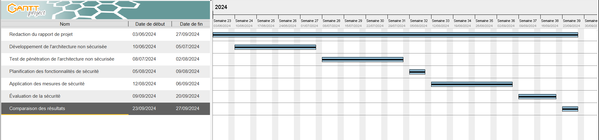

    - ### Conclusion

        Ce premier chapitre introduit les éléments de base du projet, en mettant en évidence les objectifs, la problématique, et les solutions envisagées pour sécuriser une architecture Kubernetes. La méthodologie Scrum, couplée à des sprints bien définis, offrira un cadre structuré pour mener à bien ce projet. Ces fondations théoriques et méthodologiques nous préparent à explorer en détail l'état de l'art de la sécurité dans les environnements Kubernetes dans le prochain chapitre.
 
- ## **CHAPITRE 2 : État de l'art**
    - ### Introduction

        Le déploiement de Kubernetes dans des environnements de production pose des défis de sécurité uniques en raison de la complexité et de l’échelle de cette infrastructure. La sécurité dans Kubernetes requiert une compréhension approfondie des menaces potentielles, des vulnérabilités, et des pratiques les plus récentes pour protéger les clusters. Dans ce chapitre, nous examinons la littérature et les recherches actuelles en matière de sécurité Kubernetes, identifions les principaux défis, et discutons des solutions et meilleures pratiques recommandées dans l’industrie pour garantir une architecture résiliente.

    - ### 2.1 Revue de la littérature sur la sécurité dans les environnements Kubernetes
        - #### 2.1.1 Études académiques et recherches
            Plusieurs études académiques et recherches ont exploré les vulnérabilités et les défis de sécurité associés à Kubernetes. C'est le cas du guide de cours, pour la certification professionnelle "Certified Kubernetes Security Specialist" elabore par **Benjamin Muschko**, permettant :
            -   d'identifier, atténuer et/ou minimiser les menaces pesant sur les applications natives du cloud et les clusters Kubernetes; 
            - apprendre les tenants et les aboutissants des fonctions de sécurité de Kubernetes et des outils externes pour la détection et l'atténuation de la sécurité; 
            - démontrer les compétences nécessaires pour assumer les responsabilités d'un administrateur Kubernetes ou d'un développeur d'applications du point de vue de la sécurité;
            - résoudre les problèmes réels de Kubernetes dans un environnement pratique, en ligne de commande.

            https://www.oreilly.com/library/view/certified-kubernetes-security/9781098132965/ 

        - #### 2.1.2 Articles et livres blancs de l'industrie
            En plus des recherches académiques, de nombreux articles et livres blancs publiés par des experts de l'industrie offrent des perspectives pratiques sur la sécurité Kubernetes. Des entreprises comme Google, Red Hat, et AWS ont publié des guides de meilleures pratiques et des études de cas détaillant les mesures de sécurité efficaces dans les environnements Kubernetes.

            Par exemple, le rapport d'etude de RedHat menée auprès de 600 professionnels du DevOps, intitulé **The state of Kubernetes security report: 2024 edition** examine certains des défis les plus courants en matière de sécurité cloud-native et les impacts commerciaux que les organisations de toutes tailles rencontrent aujourd'hui et propose des mesures que nous pouvons prendre pour renforcer la sécurité de nos environnements cloud-native.

            https://www.redhat.com/en/engage/state-kubernetes-security-report-2024

    - ### 2.2 Présentation des principaux défis et des solutions existantes
        - #### 2.2.1 Défis courants en sécurité Kubernetes
            Plusieurs défis spécifiques sont liés à la sécurisation d'un cluster Kubernetes en raison de sa complexité et de son échelle. Il s'agit de :
            - **La gestion des accès et des permissions (RBAC)** : Kubernetes manque de mécanismes de gestion d'acces natifs, ce qui peut rendre complexe le contrôle des permissions pour les utilisateurs et services externes.
            - **La sécurisation des communications réseau entre les composants** : Par défaut, les pods dans Kubernetes peuvent communiquer librement entre eux, ce qui augmente les risques de mouvement latéral en cas de compromission d’un pod.
            - **La protection de l'API contre des requetes provenant des source douteuses** : Kubernetes ne delimite pas les requetes qu'il traite lorsquil les recoit, meme si elle proviennent d'internet.
            - **La détection et la réponse aux menaces en temps réel** : dans un environnement dynamique comme Kubernetes, il est difficile de maintenir une surveillance continue et de réagir rapidement aux anomalies ou aux attaques.

        - #### 2.2.2 Solutions actuelles et meilleures pratiques
            Pour répondre aux défis de sécurité identifiés, plusieurs solutions et bonnes pratiques sont recommandées et adoptées dans les environnements Kubernetes modernes. Il s'agit de :
            - **Role-Based Access Control (RBAC)** : Permet de gérer les permissions en fonction des rôles d’utilisateurs, garantissant que seuls les utilisateurs autorisés peuvent accéder aux ressources critiques.
            - **Network Policies** : Les politiques de réseau permettent de segmenter les flux de données au sein du cluster, en limitant la communication entre les pods et en isolant les composants critiques.
            - **Restriction d'API** : La mise en place d'un firewall est importante, afin de decider de qui peut acceder l'API kubernetes ou non.
            - **Surveillance et audit** : L’intégration d’outils de surveillance et d’audit tels que Falco et Log Backend de Kubernetes est essentielle pour suivre les activités en temps réel, identifier les comportements anormaux et réagir aux incidents.
        
    - ### 2.3 Synthèse et positionnement du projet
        L’état de l’art révèle que, bien que Kubernetes dispose d'outils et de mécanismes de sécurité, des améliorations significatives sont encore nécessaires pour atteindre un niveau de sécurité optimal. Les failles identifiées, telles que l'accès non sécurisé aux pods et le manque de contrôle d'accès centralisé, constituent des risques importants pour les environnements en production.

        Le projet de sécurisation présenté dans ce rapport s'appuie sur les pratiques actuelles et les recommandations de l’industrie pour développer une solution robuste et intégrée qui réduit les vulnérabilités. En adoptant des mesures comme RBAC, les politiques de réseau, la protection de l'API, et des systèmes de surveillance, notre approche vise à combler les lacunes identifiées dans l’état de l’art et à fournir une architecture Kubernetes plus résiliente.

    - ### Conclusion
        Ce chapitre a permis de passer en revue les recherches et pratiques existantes en matière de sécurité Kubernetes, en mettant en lumière les principaux défis auxquels font face les entreprises qui déploient cette technologie. Les solutions et meilleures pratiques décrites serviront de cadre de référence pour la mise en œuvre des mesures de sécurité dans le projet. Dans le prochain chapitre, nous aborderons la mise en place d'une architecture non sécurisée de Kubernetes, qui servira de base pour identifier les vulnérabilités et tester les différentes solutions de sécurité proposées.
 
- ## **CHAPITRE 3 : Mise en place de l'architecture non securisee et test de penetration**
    - ### Introduction
        Dans ce chapitre, nous mettons en place une architecture Kubernetes initiale sans mesures de sécurité spécifiques. L'objectif est de configurer un cluster minimaliste, représentatif des environnements de production, mais délibérément vulnérable pour permettre l'identification des failles potentielles. Cette première étape est essentielle pour tester la résilience de l’infrastructure face aux attaques et pour observer les points faibles de l’architecture Kubernetes avant l'implémentation des mesures de sécurité. Les résultats de ces tests de pénétration serviront de référence pour évaluer l'efficacité des solutions de sécurité appliquées dans les chapitres suivants.

    - ### 3.1 Développement de l'architecture non sécurisée
        - #### 3.1.1 Mise en place de l'architecture initiale (Master et Workers)
            L'architecture initiale que nous allons déployer se presente comme suit dans l'image suivante :

            

            Nous trouvons ci-dessous un guide étape par étape sur l'installation et la configuration de la version 1.23.7 de Kubernetes pour les nœuds maître (master) et travailleurs (worker1 & worker2).

            **PRÉ-REQUIS DANS LES TROIS MACHINES** :
            - Ubuntu 22.04, à telecharger sur le site officiel d'Ubuntu.

                https://ubuntu.com/download/desktop

            - Swap désactivé, à l'aide de la commande suivante :

                    sudo swapoff -a && sudo sed -i '/ swap /s/^/#/' /etc/fstab
            
                Pour desactiver definitivement, executer aussi:

                    systemctl --type swap
                
                puis
                
                    systemctl mask <type>.swap

            - Docker v20.10 installé, à l'aide du script suivant :

                https://github.com/rancher/install-docker/blob/master/dist/20.10.24.sh

                    sudo usermod -aG docker <current_user>

            **NOEUD MASTER** :

            - Installer les dependances
                
                    sudo apt install socat -y
                    sudo apt install conntrack -y
            
            - Ouvrir le Changelog de GitHub suivant

            https://github.com/kubernetes/kubernetes/tree/master/CHANGELOG

            - Trouver la version requise de k8s. Dans notre cas, il s'agit de 1.23 :

            

            - Cliquer sur le lien "Server Binaries" dans la section "Download for ..." de la version 1.23.7.

            
            
            - Télécharger les binaires pour l'architecture de votre processeur. Dans notre cas, pour amd64 :

            
            
                wget https://dl.k8s.io/v1.23.7/kubernetes-server-linux-amd64.tar.gz

            - Désarchiver le paquet téléchargé

                    tar -xvf ./kubernetes-server-linux-amd64.tar.gz

            - Copier tous les binaires du dossier non archivé **./kubernetes/server/bin/** vers **/usr/bin/** :

                    sudo cp `find ./kubernetes/server/bin -maxdepth 1 -type f | sed 's/^\.\///' | grep -v "\."` /usr/bin/

            - Configurer kubelet en tant qu'unité de service :

                Créer le fichier **/etc/systemd/system/kubelet.service.d/10-kubeadm.conf** avec le contenu suivant :

                    sudo mkdir /etc/systemd/system/kubelet.service.d

                

                Créer un autre fichier **/usr/lib/systemd/system/kubelet.service** avec le contenu suivant à l'intérieur :

                

                Démarrer et activer kubelet.service :

                    sudo systemctl start kubelet.service
                    sudo systemctl enable kubelet.service
            
            - Initialiser le cluster:

                    sudo kubeadm init --kubernetes-version=v1.23.7 --pod-network-cidr=10.244.235.0/24
            
            - Donner l'autorisation a l'utilisateur courant d'executer les commandes Kubernetes:

                    mkdir -p $HOME/.kube
                    sudo cp -i /etc/kubernetes/admin.conf $HOME/.kube/config
                    sudo chown $(id -u):$(id -g) $HOME/.kube/config

            - Installer un gestionnaire réseaux. Dans notre cas, nous utiliserons CALICO :

                    kubectl apply -f https://docs.projectcalico.org/v3.21/manifests/calico.yaml

            **NOEUDS WORKER 1 ET 2**

            Le processus d'installation d'un nœud de travail est exactement le même que pour le nœud maître, sauf que apres avoir demarré et activé kubelet.service, nous devons exécuter la commande fournie par **kubeadm init** du master :

                    sudo kubeadm join 192.168.115.10:6443 --token c8kswm.plvgx5h7owe18bpt --discovery-token-ca-cert-hash sha256:99db9da245c433bbb334ffdb271071f02a4ec80854545b082977fc47108db1a9

            Une fois le cluster pret, on peut le constater avec les commandes suivantes dans la machine MASTER:

                kubectl get nodes
            

                kubectl get all (ou encore kubectl get all -n default)
            

        - #### 3.1.2 Configuration des différents composants (pods, services, réseaux, etc.)
            Pour cela, nous avons configuré une architecture Kubernetes de base comprenant plusieurs pods, services, et autres, tous representés dans les image suivante : 
            
            
            
            **NB:** Les configurations initiales suivantes des différents composant n'incluent aucune mésure de sécurité spécifique, afin de servir de référence pour les améliorations ultérieures.

            - Elements dans les namespace propres a l'installation de Kubernetes

                Dans ces namespaces, comme par example le namespace **kube-system**, nous n'avons rien a configurer, car tout se fait automatiquement lors de l'installation du cluster.

                    kubectl get all -n kube-system
                

            - Eléments dans le namespace de déploiement (**deploy**)

                Tout d'abord, nous configurons le namespace **deploy**. Cela créera le namespace et liera tous les comptes de service de cet espace de noms à la politique de sécurité restreinte du pod.
                
                Le contenu du fichier est le suivant:

                

                La commande suivante permet de créer le namespace deploy :

                    kubectl apply -f ns_deploy.yaml
                
                
                
                NB: Apres avoir deployé tous les élements de ce namespace, nous changerons le label **pod-security.kubernetes.io/enforce** pour lui donner la valeur **restricted**, afin d'appliquer une politique de securite aux pods qui y sont deployés.

                Ensuite, nous créons le compte de service (Service Account) **wordpress** dans le namespace de deploiement. Cela introduira également une vulnérabilité dans la mesure où nous autoriserons ce compte de service à effectuer une grande variété d'actions au sein de l'espace de noms spécifique. Il s'agit d'une hypothèse assez courante mais, comme nous le montrerons, elle peut permettre à un attaquant d'élargir le rayon d'action d'un exploit.

                Le contenu du fichier est le suivant :

                

                La commande suivante permet de créer le compte de service **wordpress**, ainsi que le role **allow_pod_read** permettant d'effectuer une variété d'actions:

                    kubectl apply -f sa_wordpress.yaml -n deploy
                
                
                
                NB: Le rolebinding **allow_pod_read_bind** permet de relier le compte de service précédent au role précédent.

                Ensuite, nous introduisons une deuxième vulnérabilité, permettant à cet utilisateur (SA) d'interroger les points d'extrémité du serveur API. Là encore, il ne s'agit pas nécessairement d'un problème évident, mais cela permettra à un attaquant d'obtenir des informations supplémentaires sur le cluster.

                Le contenu du fichier est le suivant:

                

                La commande suivante permet, comme defini dans le fichier precedent, de créer un nouveau role **allow_endpoint_access** et le lier au compte de service **wordpress**.

                    kubectl apply -f allow_to_see_endpoints.yaml

                
                
                Nous allons maintenant déployer l'application vulnérable dans le namespace deploy sécurisé.

                Le contenu du fichier est le suivant:

                

                La commande suivante permet d'appliquer le fichier precedent et créer le deploiement dans le namespace sécurisé.

                    kubectl apply -f wordpress_deployment.yaml -n deploy
                
                
                    
                Nous pouvons voir le pod fonctionner dans le namespace sécurisé :
                        
                    kubectl get all -n deploy
                
                
                Maintenant que l'application vulnérable fonctionne, nous l'exposons en dehors du cluster. Pour cela, nous avons besoin d'un Service de type NodePort, et de la commande suivante :

                    kubectl expose deployment wordpress -n deploy --type=NodePort --port=5000
                

                À ce stade, nous pouvons afficher l'application vulnérable dans le navigateur d'une machine externe au cluster, en renseignant le port **31411**.

                

                Maintenant, nous devons modifier le namespace deploy, afin de mettre le label sur **restricted**.
                
                    kubectl edit ns deploy

                

                

                Nous pouvons constater un **AVERTISSEMENT**, sur le fait qu'un pod ne respecte pas la politique de securite du namespace deploy, ce qui est necessaire pour les prochaines etapes de ce projet.

            - Eléments dans le namespace par defaut (**default**)

                A ce niveau, nous allons configurer le namespace par défaut et autoriser les comptes de service (sa) de ce namespace à accéder à la stratégie de sécurité Pod privilégiée. Là encore, il s'agit d'une vulnérabilité, basée sur l'hypothèse que nous contrôlons les autres namespace avec des liaisons de rôles spécifiques au namespace.

                Le contenu du fichier est le suivant:

                

                La commande suivante permet d'appliquer le fichier précédent:

                    kubectl apply -f ns_default_role.yaml
                
                                
                Ensuite, nous ajoutons le même compte de service et les mêmes rôles que dans notre espace de noms sécurisé :

                    kubectl apply -f sa_wordpress.yaml

                Nous ajoutons maintenant une instance de l'application vulnérable à l'espace de noms par défaut :
                    
                    kubectl apply -f wordpress_deployment.yaml

                Cela nous donne une configuration miroir dans le namespace par défaut que nous avons dans le namespace sécurisé deploy, mais par défaut nous n'appliquons pas la politique de sécurité restreinte du pod.

                    kubectl get all
                

    - ### 3.2 Test de pénétration de l'architecture non sécurisée
        - #### 3.2.1 Simulation d'attaques courantes
            Pour évaluer la sécurité de l'architecture non sécurisée, nous avons simulé une unique chaine complete d'attques, repartie en sept etapes, comprennant plusieurs types d'attaques, exploitant des vulnerabilites courantes.

            **a- Examen de la vulnérabilité**

            Lorsqu'on ouvre l'application vulnérable dans notre navigateur à l'adresse http://192.168.115.10:31411, on arrive sur la page d'accueil de l'application. Mais en faisant une recherche poussée sur le site web, on constate qu'on a une seconde page web a l'adresse http://192.168.115.10:31411/seckube, qui exploite la vulnérabilité RCE (Remote Code Execution) en passant un paramètre URL **cmd**. 
            
            
            
            Par exemple, l'url suivante exécute la commande **hostname** et affiche la sortie de la console sur la page retournée : http://192.168.115.10:31411/seckube?cmd=hostname

            

            Ceci prouve bien que le RCE fonctionne, alors utilisons-le pour obtenir des informations plus intéressantes. Remplacons le paramètre cmd par env pour imprimer les variables d'environnement des processus : http://192.168.115.10:31411/seckube?cmd=env

            

            En se basant sur les différents noms de variables commençant par KUBERNETES, il est assez sûr de supposer que ce processus s'exécute dans un conteneur, sur un cluster Kubernetes. De plus, étant donné que la commande hostname a retourné un nom préfixé par wordpress, la variable WORDPRESS_SERVICE_PORT=5000 signifie probablement qu'il y a un service Kubernetes qui écoute en interne sur le port 5000 et qu'une sorte de proxy qui traduit notre demande de port 31411 vers ce port. Enfin, la variable KUBERNETES_PORT=tcp://10.96.0.1:443 nous indique que l'adresse IP et le port internes de l'api-serveur Kubernetes sont 10.96.0.1:443.

            La prochaine information que nous voulons obtenir est l'adresse IP du pod dans lequel nous nous exécutons, alors lançons hostname -i : http://192.168.115.10:31411/seckube?cmd=hostname%20-i

            

            **b- Accès au serveur api**

            Chaque Pod Kubernetes dispose par défaut d'un jeton de service associé à son ServiceAccount. Par défaut, ce jeton est monté automatiquement dans chaque Pod dans le chemin **/var/run/secrets/kubernetes.io/serviceaccount/token**. Utilisons le RCE pour essayer d'imprimer ce jeton à l'aide de la commande **cat** : http://192.168.115.10:31411/seckube?cmd=cat%20/var/run/secrets/kubernetes.io/serviceaccount/token

            

            Nous avons maintenant le jeton Pod, nous avons donc des informations d'identification avec lesquelles nous pouvons jouer. Cela peut être utilisé pour nous aider à explorer d'autres endroits dans le cluster.

            Voyons maintenant si nous disposons d'une sorte d'outil que nous pouvons utiliser pour effectuer des appels web via notre RCE. Voyons si nous disposons de **curl** : http://192.168.115.10:31411/seckube?cmd=curl%20google.com

            

            On peut constater que nous avons bien access a l'outil curl.

            Ensuite, nous allons prendre tout ce que nous avons trouvee dans le conteneur et l'appliquer pour en sortir. Nous allons utiliser **curl** et le **token credential** pour essayer de nous connecter au serveur api de Kubernetes et lui demander les endpoints du cluster. Les détails de la connexion sont les suivants :

            - **Host** : la valeur de la variable KUBERNETES_PORT
            - **URI (identifiant uniforme de ressource)** : ici **endpoints**, dans le namespace par defaut, a l'emplacement **/api/v1/namespaces/default/endpoints**
            - **En-tête** : Un **Authorization: Bearer** contenant le contenu du fichier de jeton trouvee plus haut
            - **CA Cert** : Le certificat de l'autorité de certification qui, nous pouvons le supposer, se trouve dans l'emplacement par défaut, au même endroit que notre fichier de jetons, et s'appelle ca.crt.

            L'URL est le suivant : http://192.168.115.10:31411/seckube?cmd=curl%20--cacert%20/var/run/secrets/kubernetes.io/serviceaccount/ca.crt%20-H%20%22Authorization:%20Bearer%20$(cat%20/var/run/secrets/kubernetes.io/serviceaccount/token)%22%20https://10.96.0.1/api/v1/namespaces/default/endpoints

            

            Cette commande aboutit et la section qui nous interresse est :

                    "subsets": [
                      {
                        "addresses": [
                          {
                            "ip": "192.168.115.10"
                          }
                        ],
                        "ports": [
                          {
                            "name": "https",
                            "port": 6443,
                            "protocol": "TCP"
                          }
                        ]
                      }
                    ]
            
            **c- Recherche de faits sur le cluster**

            Nous voulons pouvoir utiliser kubectl pour accéder directement au cluster au lieu d'avoir à utiliser l'URL RCE encombrante. Pour ce faire, nous allons copier le contenu du jeton de http://192.168.115.10:31411/seckube?cmd=cat%20/var/run/secrets/kubernetes.io/serviceaccount/token dans le fichier de configuration kubectl. 

            Pour creer le fichier de configuration, nous nous servons du script suivant :

            

            Ce script permet de definir un nouvel utilisateur kubernetes nommee **seckube** avec son **TOKEN**, un nouveau cluster nommee **exploited**, creer un nouveau context nommee **exploited**, et de definir le context **exploited** comme celui par defaut.

            Lors de l'execution du script, il nous demande les informations suivantes, pour pouvoir se connecter au cluster distant :

            - Entrer le jeton : coller le contenu complet du jeton
            - Enter l'hote de l'API kubernetes : ici 192.168.115.10:6443.

            NB: Nous avons telecharger le binaire **kubectl** en suivant la meme procedure que lors du processus d'installation de kubernetes.

            

            Apres l'execution du script, nous obtenons le fichier suivant :

            

            Vérifions que le contexte est défini en exécutant la commande suivante : 
            
                kubectl config current-context 
            
            Il retourne **exploited**.

            Si cela ne fonctionne pas, il se peut que nous n'ayons pas defini la variable d'environnement **KUBECONFIG**. Pour résoudre ce problème, exécutons simplement la commande suivante : 
            
                export KUBECONFIG=kubeconfig 
            
            ou alors, executons cette commande : 
            
                kubectl config --kubeconfig=kubeconfig current-context

            

            Avec notre contexte kubectl maintenant défini, essayons d'accéder au cluster en exécutant la commande suivante :
            
                kubectl get pods
            
            

            L'erreur **Forbidden** que nous voyons ci-dessus nous indique simplement que le ServiceAccount que nous utilisons via le jeton n'a pas les privilèges suffisants pour lister les Pods dans le Namespace par défaut. Cette erreur, cependant, révèle quelque chose d'utile dans la valeur de l'utilisateur : **system:serviceaccount:deploy:webadmin**. Cette chaîne contient le nom de l'espace de nom dans lequel se trouve le ServiceAccount : **deploy**. Ainsi, le Pod à partir duquel nous avons copié le jeton s'exécute dans un espace de nom nommé "deploy".

            Compte tenu de ces informations, essayons de lister les Pods dans l'espace de nom deploy en ajoutant **-n deploy** à la commande :

                kubectl get pods -n deploy

            

            Succès ! C'est le pod que nous avons attaqué avec notre exploit RCE.

            Voyons quels autres privilèges ce jeton nous donne acces via la commande suivante :
            
                kubectl auth can-i --list

            

            Cela montre que, dans l'espace de noms par défaut, nous avons accès à tous les verbes (*) de la ressource endpoints et à un accès limité à d'autres ressources de type boilerplate qui ne sont pas intéressantes pour le moment (supprimées de l'exemple pour des raisons de concision.) L'absence de ressource pods ici est la raison pour laquelle nous avons obtenu cette erreur "Forbidden" lors de la première tentative de get pods dans l'espace de noms par défaut.

            Essayons la même commande dans l'espace de nom deploy: 
            
                kubectl auth can-i --list -n deploy
            
            

            Nous voyons ici le caractère générique **toutes les ressources (*.*)** avec l'ensemble de tous les verbes, ce qui signifie que nous avons un accès complet à toutes les ressources de l'espace de nom deploy !

            Nous savons maintenant que nous pouvons faire un certain nombre de choses dans l'espace de noms deploy, et pas grand-chose par défaut.

            **d- Établir une tête de pont dans le cluster**

            Maintenant que nous avons des permissions dans le namespace deploy, nous allons escalader nos privilèges pour pénétrer dans d'autres zones du cluster.

            Tout d'abord, exécutons le Pod wordpress et voyons ce qui est disponible pour nous. 

                kubectl exec -n deploy -it wordpress-<id_pod> -- bash

            

            Maintenant que nous avons un shell dans le Pod, voyons si nous sommes (ou pouvons devenir) root. Vérifions notre utilisateur avec **whoami** :

            

            Nous ne somme pas root, mais voyons si on peut devenir root avec la commande suivante: 
            
                sudo su-

            

            Pas de sudo. Cela nous indique que l'image est mieux construite que la plupart des images par défaut, car les auteurs ont pris le temps de passer à un utilisateur non root et n'utilisent pas sudo.

            Voyons si nous pouvons modifier le système de fichiers : 
            
                touch test
            
            

            Nous pouvons écrire dans le système de fichiers racine, ce qui signifie que nous pouvons télécharger un logiciel ou modifier une configuration. Nous savons déjà que nous avons curl, donc c'est tout à fait possible. Il s'agit d'une vulnérabilité, causée par le fait de ne pas définir **readonlyRootFilesystem=true** dans le contexte de securite du pod et de ne pas l'appliquer dans le **PSP (Pod Security Policy)**.

            Bien que cela soit intéressant, il sera difficile d'élever les privilèges à la racine dans le Pod, alors quittons la session exécutive, et passons à autre chose pour l'instant.

            Essayons de lancer un pod avec un utilisateur root en utilisant le fichier suivant, qui consiste en un conteneur exécutant l'image alpine qui dort simplement mais s'exécute en tant que root par défaut.

            

                kubectl apply -f root_pod.yaml

            

            L'erreur montre que plusieurs violations de **PodSecurity (PSP)** ont été détectées, ce qui indique que la PSA (Pod Security Admission) est activée. Sur la base des règles spécifiques citées, il s'agit probablement d'une politique restreinte (restricted) du contexte de securite du Pod. Cela empêche également le démarrage d'un conteneur privilégié.

            Compte tenu des restrictions imposées par le PSA, essayons de déployer notre propre pod à l'aide d'une image de conteneur et d'outils qui nous aideront à explorer le cluster. Le fichier suivant est un Pod qui exécute notre conteneur avec les paramètres de contexte de securite appropriés pour satisfaire la PSA.

            

                kubectl apply -f nonroot_nonpriv_restricted.yaml -n deploy
            
            

            Nous allons maintenant exécuter notre nouveau Pod et voir ce que nous pouvons faire : 
            
                kubectl exec -n deploy -it snyky -- bash
            
            

            Cette image contient sudo, mais malgré ce que dit l'invite de connexion, si nous essayons d'exécuter **sudo ls**, nous obtenons l'erreur suivante :

                sudo ls

            

            En effet, les paramètres securityContext du manifeste Pod sont définis sur **allowPrivilegeEscalation : false** pour satisfaire la PSA.

            À ce stade, nous n'avons pas d'accès root au Pod, mais nous disposons d'un shell dans un conteneur qui nous donne notre point de départ.

            **e- Explorer au-delà de notre espace de noms**

            Maintenant que nous possédons un conteneur dans le cluster, nous allons l'utiliser pour explorer davantage le cluster et essayer de trouver d'autres cibles. Puisque nous savons que le cluster héberge une application vulnérable en production, il y a de fortes chances que d'autres instances de cette application tournent ailleurs et puisqu'elle a été déployée avec un service sur le port 5000, il y a de fortes chances que la même configuration de déploiement soit utilisée.
            
            Pour ce faire, nous utiliserons l'outil nmap pour scanner le réseau à la recherche d'autres copies de cette application vulnérable en recherchant tout ce qui accepte des connexions sur le port 5000.

            Tout d'abord, tout en étant toujours exécuté dans le Pod snyky depuis les étapes précédentes, découvrons l'adresse IP de notre Pod. Il y a plusieurs façons de le faire : **hostname -i** ou **ifconfig** fonctionnent tous les deux ici

            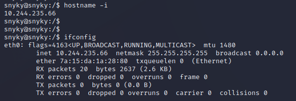

            Nous allons maintenant utiliser cette IP dans les arguments de nmap pour spécifier le réseau Pod : 
            
                nmap -sT -p 5000 -PN -n --open 10.244.235.66/24

            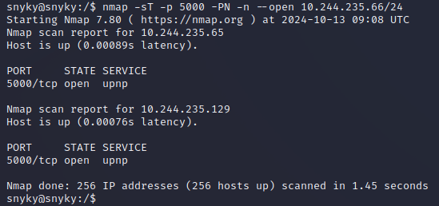

            Ce que nous voyons, c'est qu'il y a deux adresses IP qui écoutent sur le port 5000 :
            
            - 10.244.235.65: Il s'agit d'autre chose... peut-être une autre copie de l'application vulnérable ?
            - 10.244.235.129: Il s'agit du pod original que nous avons attaqué dans le namespace deploy.
            
            NB : Comme nous ne sommes pas l'utilisateur root, nous avons dû utiliser un scan de connexion TCP (option -sT) ; c'est une opération assez "bruyante" qui pourrait déclencher une détection d'intrusion et des tentatives de connexion enregistrées sur d'autres hôtes. Si nous etions root, l'analyse TCP SYN plus furtive (option -sS) serait préférable, mais elle nécessite des privilèges et/ou des capacités élevés.

                nmap -sS -p 5000 -PN -n --open 10.244.235.66/24
            
            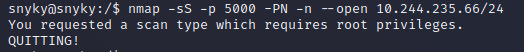

            **f- Échapper à notre espace de noms**

            Maintenant que nous savons qu'il existe un autre listener sur le port 5000 dans un autre namespace, nous allons utiliser un simple tunneling TCP pour l'attaquer.

            Dans le shell exec toujours ouvert depuis l'étape précédente, nous allons utiliser l'outil **socat** pour créer un tunnel vers ce nouvel auditeur : 
            
                socat tcp-listen:5001,reuseaddr,fork tcp:10.244.235.65:5000

            Cette commande laissera le Shell du conteneur SNYKY en suspend.

            Dans un nouveau shell, définissons notre variable de configuration Kubernetes et créons un **port-forward** dans le pod snyky :

                export KUBECONFIG=kubeconfig

                kubectl port-forward snyky 5001 -n deploy

            

            Avec ces tunnels en place, tout trafic TCP se connectant à notre machine locale sur le port 5001 sera transféré au pod snyky sur le port 5001. Ensuite, le processus socat transmettra ce trafic du pod snyky au service mystère sur le port 5000.

            Ouvrons http://localhost:5001 dans notre navigateur...

            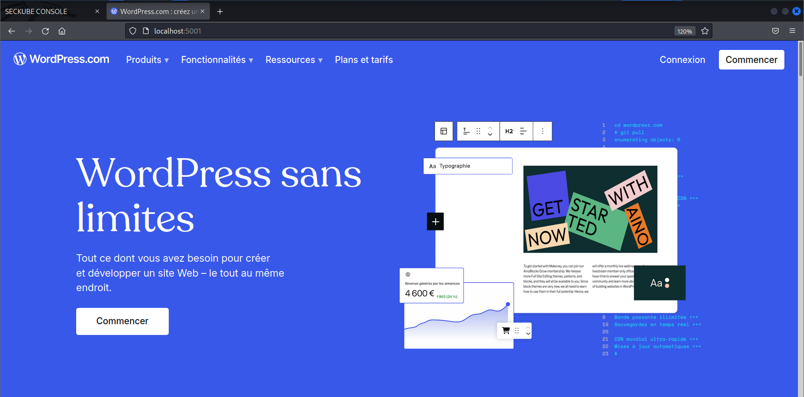

            On peut constater qaue c'est la même application s'y exécute. Ce qui nous interresse, c'est l'url cachee dans l'application.

            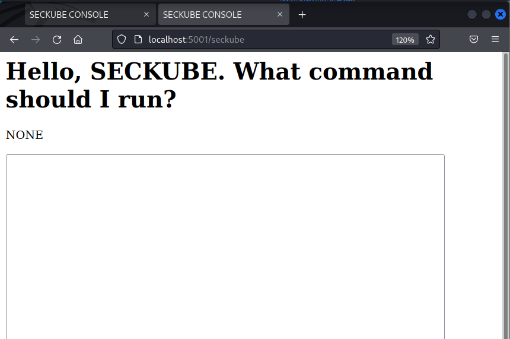

            Voyons si cette copie de l'application présente la vulnérabilité RCE en recherchant son jeton : http://localhost:5001/seckube?cmd=cat%20/var/run/secrets/kubernetes.io/serviceaccount/token

            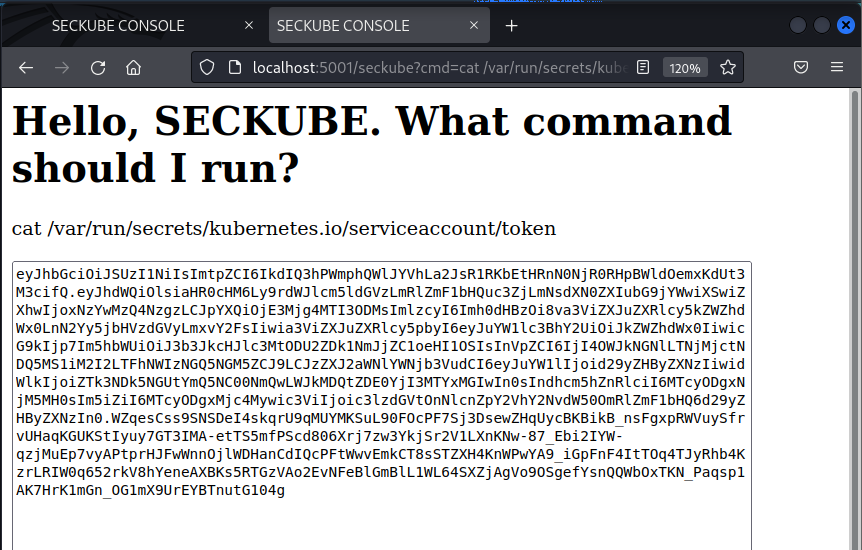

            Oui, c'est le cas et nous avons maintenant un autre jeton que nous pouvons expérimenter. Nous pouvons maintenant fermer le port-forward, tuer le processus socat et quitter la session exec du pod snyky, car nous n'en n'aurons plus besoin.

            Ouvrons le fichier kubeconfig dans un éditeur, commentons le token existant et insérons une nouvelle ligne avec le nouveau token dans notre navigateur.

            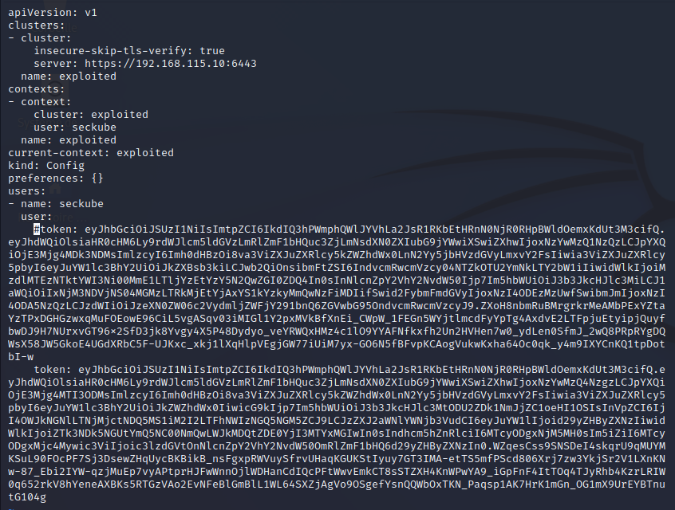

            Avec ce nouveau jeton en place, essayons à nouveau de lister les pods dans le namespace par defaut : 
            
                kubectl get pods

            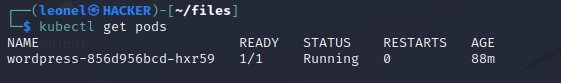

            Il semble qu'il y ait une copie de l'application dans le namespace par défaut et, par conséquent, nous avons maintenant un jeton ServiceAccount par défaut à notre disposition.

            Nous devrions voir quelles permissions ce nouveau jeton nous donne avec : 
            
                kubectl auth can-i --list
            
            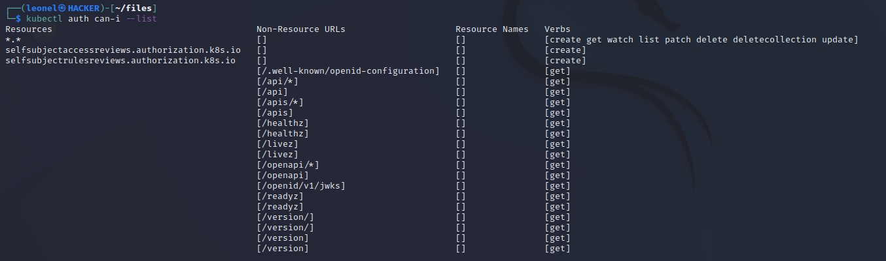

            Nous avons un accès complet à toutes les ressources (*.*) du namespace par défaut ! Cela arrive plus souvent qu'on ne le pense car la plupart des développeurs n'écrivent des restrictions RBAC que pour les ressources des Namespaces dans lesquels leurs applications vivent, laissant la valeur par défaut à quelqu'un d'autre. Malheureusement, pour ce cluster, le RBAC par défaut pour le ServiceAccount par défaut est grand ouvert !

            Nous pouvons maintenant essayer de déployer un pod dans le namespace par défaut ; essayons à nouveau ce pod privilégié et voyons s'il fonctionne. Son contenu est le suivant :

            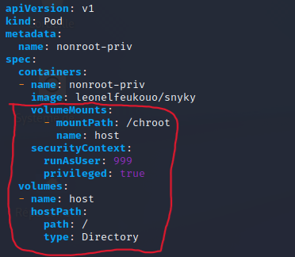 
            
                kubectl apply -f nonroot_priv.yaml
            
            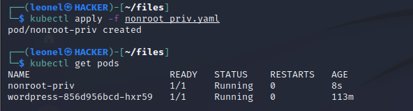

            Cela a fonctionné, ce qui indique que les restrictions de PSA dans le namespace par défaut sont assouplies ou inexistantes.

            Executons ce pod et voyons ce que nous pouvons faire : 
            
                kubectl exec -it nonroot-priv -- bash
            
            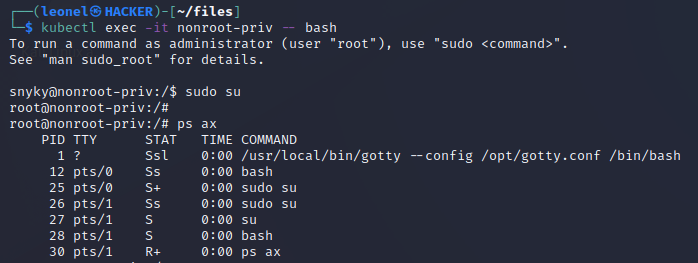

            Tout se passe bien jusqu'à présent, mais si nous regardons le manifeste de ce pod, nous constatons qu'on monte un volume hôte sur le chemin **/chroot** (section en encadree en rouge dans le manifeste).

            Executons la commande **chroot /chroot** dans le conteneur et voyons ce que nous obtenons.

            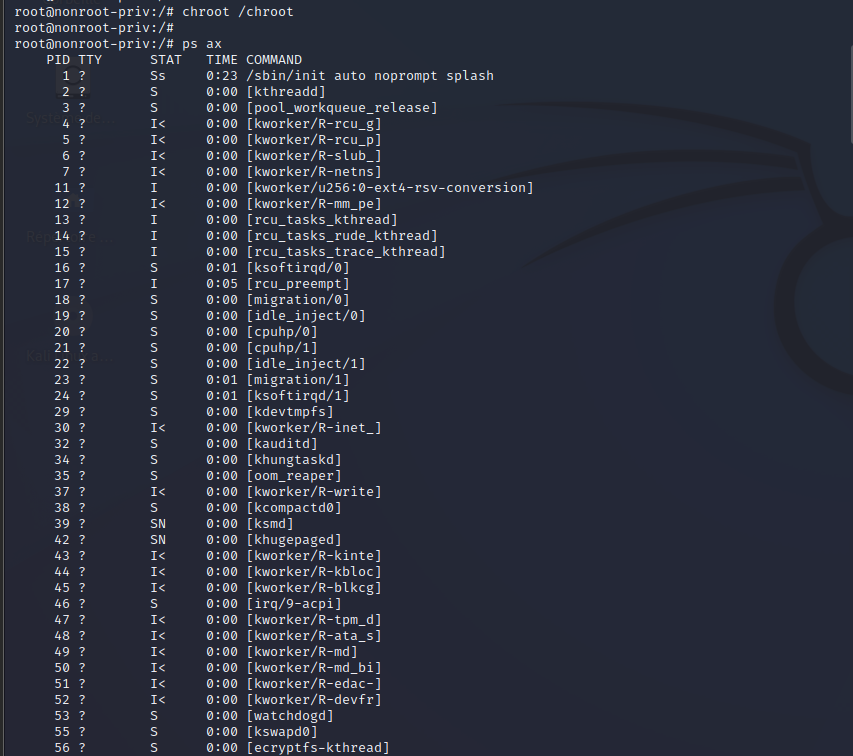

            Il s'agit des processus en cours d'exécution sur l'hôte qui execute le pod. Nous avons effectivement échappé à ce conteneur en montant le volume hôte / dans le conteneur et en le **chroot**ant.

            **g- Posséder le cluster**

            Maintenant que nous avons le système de fichiers de l'hôte sur le pod, nous avons accès à beaucoup plus d'informations. Ce qui est particulièrement intéressant pour nos objectifs est le jeton du kubelet qui a des permissions beaucoup plus larges que les jetons ServiceAccount que nous avons utilisés jusqu'à présent.

            Dans le shell de l'étape précédente - toujours en tant que root et avec le système de fichiers de l'hôte monté - nous allons récupérer le contexte du kubelet et l'utiliser pour regarder dans le namespace **kube-system** et lister les nœuds de ce cluster.

            Commandes que nous allons exécuter :

            - **export KUBECONFIG=/etc/kubernetes/kubelet.conf** : Ce fichier contient le jeton du kubelet.
            - **kubectl get pods -n kube-system** : Liste les pods du namespace **kube-system** dans le **control-plane**
            - **kubectl get nodes** : Liste les noms et les rôles des nœuds qui composent la grappe.

            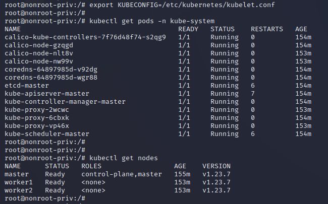

            Voyons si nous pouvons lancer un pod directement avec ce jeton. Nous essayons un simple shell busybox :

                kubectl run -it --rm busybox --image=busybox --restart=Never -- sh
            
            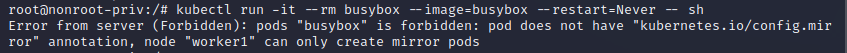

            Cette commande échoue car le token kubelet n'a pas encore toutes les permissions nécessaires pour démarrer via le serveur API. La ligne **mirror pods** est cependant intéressante, car elle nous permettrait de lancer n'importe quel pod directement dans **kube-system** en plaçant un fichier YAML dans **/etc/kubernetes/manifests** sur le nœud. Cela nous donnerait alors de nombreux vecteurs d'attaque contre les autres pods du plan de contrôle dans l'espace de noms kube-system. Nous laisserons cela de côté pour l'instant.

            Etant donné que nous pouvons voir les pods dans l'espace de noms kube-system, notre prochain objectif est de trouver des informations d'identification qui peuvent nous donner un accès de niveau administrateur au plan de contrôle. Essayons de lister les secrets dans l'espace de nom kube-system :

                kubectl get secrets -n kube-system
            
            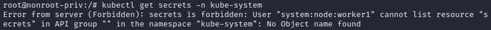

            Cela n'a pas fonctionné, mais il y a un autre vecteur d'attaque pour accéder à ces secrets : **etcd**.

            Puisque nous avons échappé à PSA, et que nous savons maintenant quels nœuds nous avons (un **worker nodes**), nous allons lancer un pod sur le nœud hébergeant etcd, et dans la configuration du pod, nous allons monter le système de fichiers de l'hôte pour nous donner les informations d'identification pour nous connecter à etcd.

            A partir de la liste des pods ci-dessus, nous pouvons voir que le serveur **etcd** semble fonctionner en tant que le pod **etcd-master**. Etcd est la persistance de l'état pour le cluster, nous devons y accéder et exfiltrer un jeton d'administration si possible.

            Tout d'abord, nous devons déterminer sur quel noeud tourne le serveur etcd et où sont stockées ses informations d'identification. Ceci sera disponible dans la description du pod :

                kubectl describe pod etcd-master -n kube-system
            
            La réponse contient beaucoup d'informations précieuses, nous allons donc l'examiner par morceaux :

            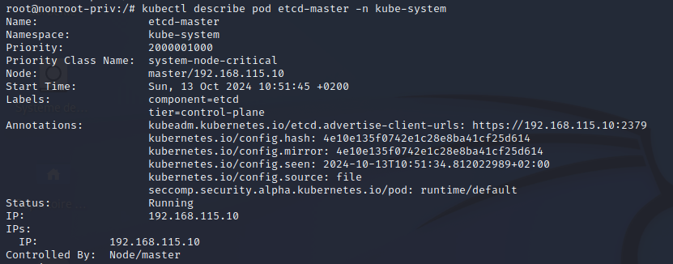

            A partir de là, nous voyons qu'il tourne sur le noeud **master**.

            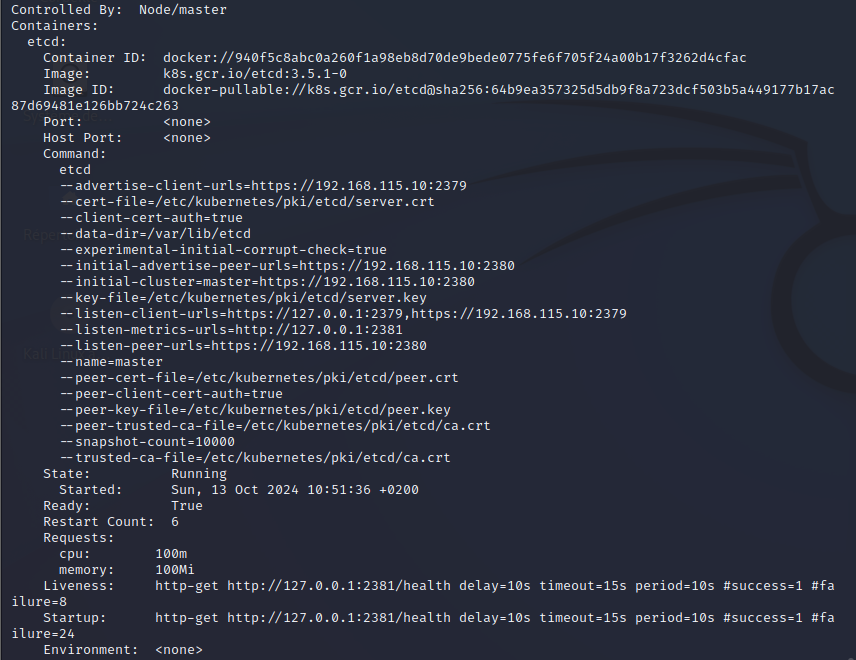

            Le serveur etcd ecoute sur a l'url suivante: https://192.168.115.10:2379

            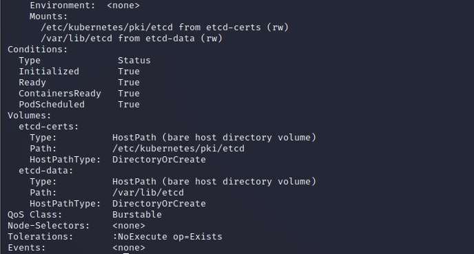

            Les certificats sont sauvegardee a l'adresse : **/etc/kubernetes/pki/etcd**

            Quittons le pod en cours d'execution et appliquons le pod **etcdclient** dont le manifest est le suivant:

            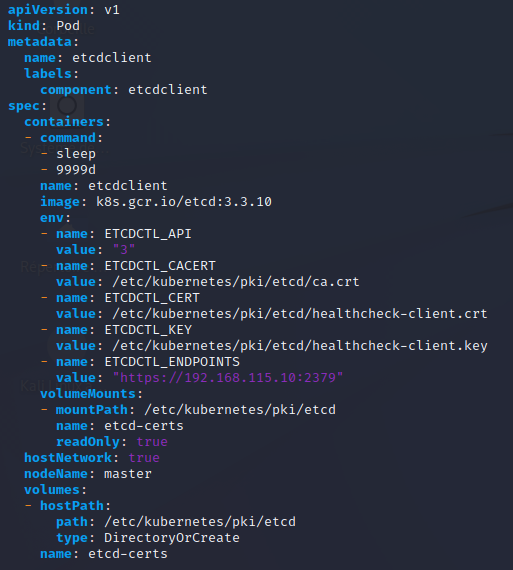

                kubectl apply -f etcdclient.yaml

            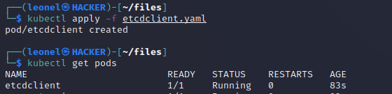

            Nous pouvons maintenant lancer **etcdctl** en exécutant ce pod pour tester notre connexion au serveur etcd :

                kubectl exec etcdclient -- /usr/local/bin/etcdctl member list
            
            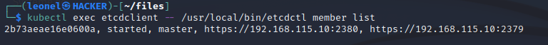

            C'est une réponse valide, donc nos informations d'identification et nos paramètres fonctionnent, maintenant cherchons quelque chose de plus intéressant.

            Etcd contient de nombreuses informations intéressantes sur le cluster, dont les secrets ne sont pas les moindres. On peut ennumerer ces secrets avec :

                kubectl exec etcdclient -- /usr/local/bin/etcdctl get '' --keys-only --from-key | grep secrets
            
            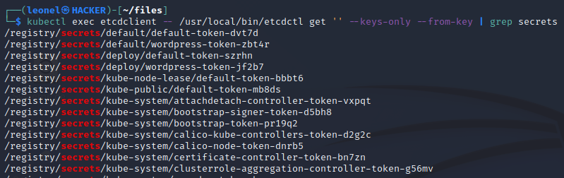
            
            La ligne contenant le role **clusterrole-aggregation-controller-token-g56mv** est un rôle dont les droits peuvent être utilisés.

            Obtenons maintenant le contenu du secret nommee clusterrole-aggregation-controller-token-g56mv:

                kubectl exec etcdclient -- /usr/local/bin/etcdctl get /registry/secrets/kube-system/clusterrole-aggregation-controller-token-g56mv
            
            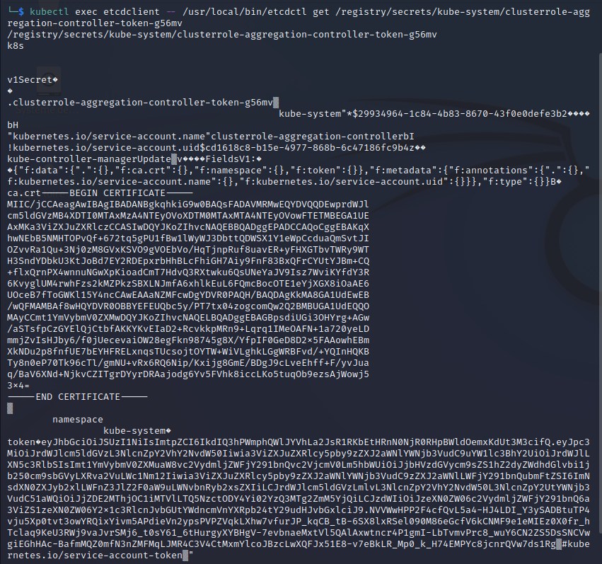

            Nous obtenons beaucoup de données de cette requête mais la dernière très longue ligne qui commence par **token�** est ce que nous voulons. Copions tout ce qui suit ce nom de champ (sans saisir le caractère non imprimable à la fin de token�) jusqu'au bout, mais sans inclure la partie **#kubernetes.io/service-account-token** à la fin.

            Voici un exemple de capture d'écran avec la partie en surbrillance que nous souhaitons copier :

            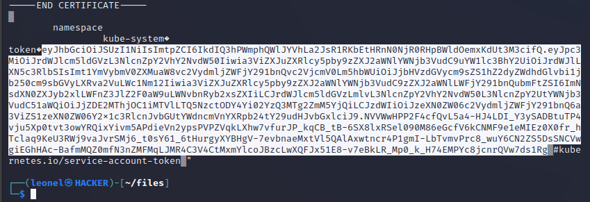

            Editons notre fichier kubeconfig une fois de plus, en commentant le jeton précédent : ajoutons-en un nouveau avec la chaîne que nous avons copiée.

            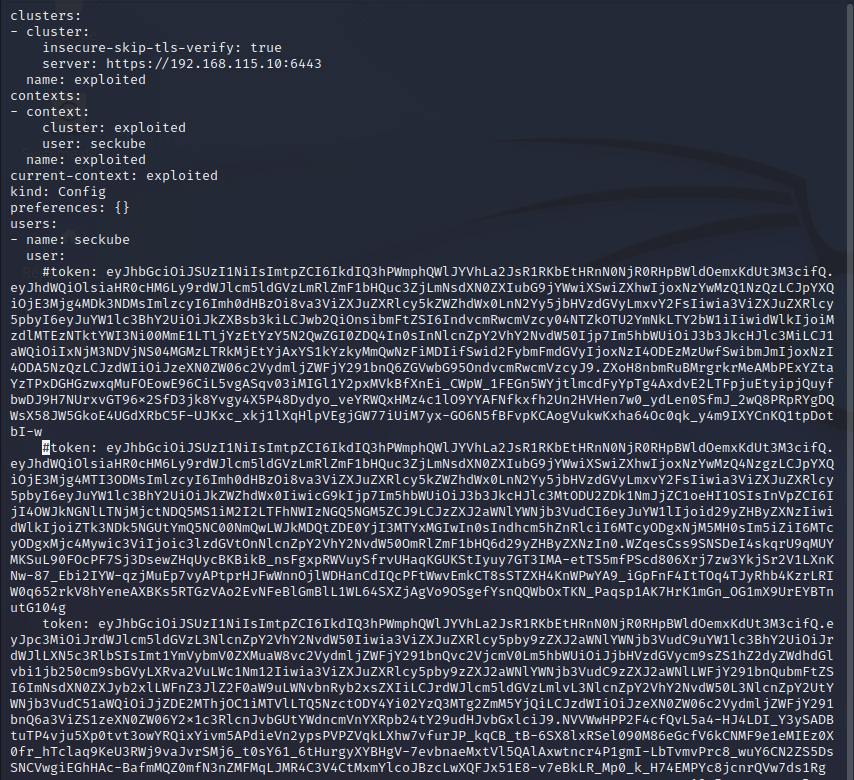

            Voyons quelles sont les autorisations de ce jeton :

                kubectl auth can-i --list
            
            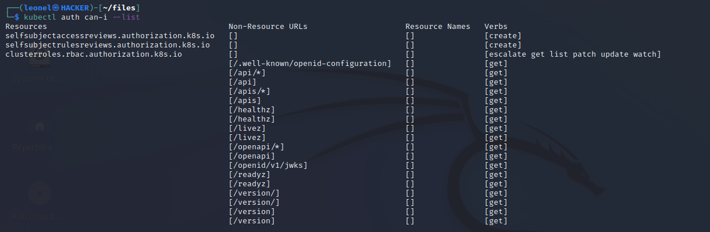

            Ce n'est pas tout à fait un accès administrateur complet, mais le fait que nous puissions escalader les ClusterRoles signifie que nous n'en sommes qu'à un pas.

            Modifions maintenant les droits du service account **clusterrole-aggregation-controller** afin de donner un acces administrateur complet : 
            
                kubectl edit clusterrole system:controller:clusterrole-aggregation-controller 
            
            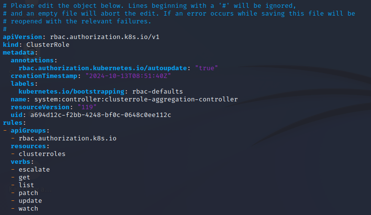

            L'image precedente est le contenu du clusterrole avant modifications.

            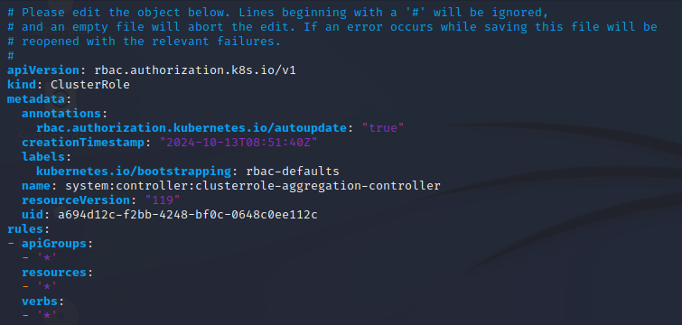

            Sauvegardons et quittons la session d'édition et nous devrions voir ce qui suit :

            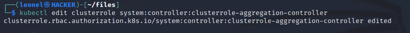

            Vérifions à nouveau les autorisations :

                kubectl auth can-i --list
            
            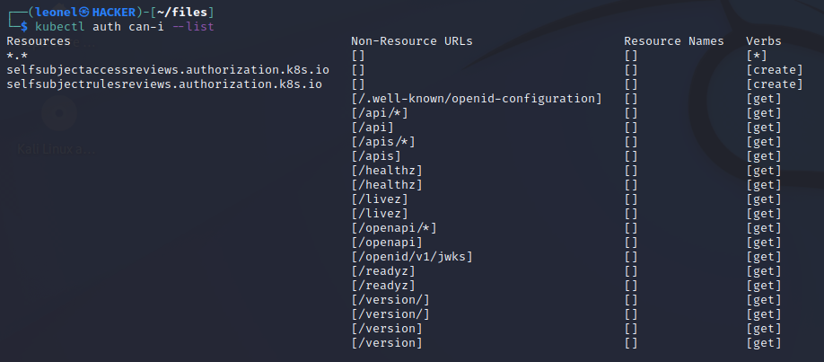

            Presentement, nous sommes les proprietaires du cluster. Nous pouvons effectuer toutes les operations que nous souhaitons dans le cluster.

        - #### 3.2.2 Identification des vulnérabilités et des points de faiblesses.
            Les tests de pénétration effectués précédemment ont révélé plusieurs vulnérabilités critiques dans l'architecture initiale de Kubernetes. Ces vulnérabilités exposent l'infrastructure à des attaques potentielles, compromettant la sécurité des applications déployées et des données sensibles. Voici une analyse approfondie des vulnérabilités identifiées :

            **a- Exécution de commandes arbitraires (Remote Code Execution) dans un pod à partir du navigateur**
            
            L'exécution de commandes arbitraires à distance (Remote Code Execution - RCE) est l'une des failles les plus critiques. Dans ce cas, un attaquant peut, via une simple interface navigateur, exécuter des commandes dans un pod sans authentification ou restriction. Cela donne à l'attaquant un accès direct aux ressources du cluster et aux informations sensibles. Cette vulnérabilité est souvent due au fait de l'utilisation d'une image de base non verifiee. L'attaquant pourrait exécuter des scripts malveillants, installer des backdoors, ou manipuler les applications déployées. Cela pourrait entraîner la perte ou le vol de données, voire le contrôle complet du cluster.

            

            **b- L'exposition des services accounts dans les pods**

            Par défaut, Kubernetes associe un service account à chaque pod dans un namespace donné. Si ce service account n'est pas correctement restreint, il peut être utilisé pour accéder à d'autres ressources du cluster avec des privilèges élevés. L'utilisation du service account par défaut est souvent négligée, laissant les pods avec des privilèges non nécessaires ou trop élevés. Cette mauvaise gestion des identités et des permissions expose le cluster à des attaques d'escalade de privilèges. Un attaquant pourrait utiliser le service account pour obtenir des tokens d'accès aux API Kubernetes, permettant l'accès à des secrets, la création ou suppression de ressources, voire le contrôle d'autres parties du cluster.

            

            **c- - L'absence de restrictions de réseau permettant une communication non sécurisée entre les pods**

            Dans l'architecture actuelle, il n'existe pas de restrictions de communication réseau entre les pods. Cela signifie que tous les pods peuvent librement communiquer entre eux, ce qui augmente le risque de propagation d'attaques internes. Par défaut, Kubernetes permet à tous les pods d'un cluster de communiquer entre eux sans restrictions. Sans l'implémentation de **Network Policies**, il n'y a pas de contrôle granulaire sur les communications entre les pods. Un attaquant ayant compromis un seul pod pourrait facilement se déplacer dans le réseau interne et attaquer d'autres pods, escaladant potentiellement ses privilèges ou compromettant davantage de ressources.

            

            **d- L'accès non autorisé à certains services**

            Certains services critiques du cluster sont exposés sans authentification ni autorisation. Cela inclut potentiellement l'accès à des bases de données, des API, ou d'autres services internes. Cette vulnérabilité est souvent due à une mauvaise configuration des accès API ou à l'absence de restrictions RBAC (Role-Based Access Control) pour contrôler qui peut interagir avec les ressources du cluster. Un accès non autorisé à ces services permettrait à un attaquant de lire, modifier ou détruire des données sensibles, compromettant ainsi l'intégrité et la confidentialité des informations.

            

            **e- L'utilisation de versions obsolètes de Kubernetes**

            Le cluster utilise une version de Kubernetes (v1.23.7) qui présente des vulnérabilités connues, permettant à un attaquant d'exploiter des failles pour accéder à certaines ressources ou contourner des restrictions de sécurité mises à jour dans les versions récentes. Cette utilisation de versions obsoletes est causee par l'absence de mises à jour régulières du cluster Kubernetes et de ses composants critiques. Les versions obsolètes sont particulièrement vulnérables aux attaques connues et aux exploits publiés. L'utilisation de versions obsolètes permettrait à des attaquants d'exploiter des vulnérabilités corrigées dans les versions plus récentes, compromettant ainsi la sécurité globale du cluster.

            

            

            
    - ### Conclusion
        Les tests de pénétration effectués sur l'architecture non sécurisée ont permis de mettre en évidence plusieurs vulnérabilités critiques au sein du cluster Kubernetes, notamment l'accès non restreint aux services et la communication non sécurisée entre les pods. Ces résultats confirment la nécessité de renforcer la sécurité du cluster en implémentant des politiques d’accès strictes, des contrôles de réseau, et une protection de l'API. Cette analyse approfondie des vulnérabilités nous offre une base solide pour définir et prioriser les mesures de sécurisation abordées dans le chapitre suivant.
 
- ## **CHAPITRE 4 : Sécurisation de l'architecture**
    - ### Introduction
        Ce chapitre se concentre sur la mise en œuvre des mesures de sécurité nécessaires pour renforcer l'architecture Kubernetes initiale. Après avoir identifié les vulnérabilités dans le chapitre précédent, il est essentiel d'appliquer des solutions robustes pour protéger le cluster contre les menaces internes et externes. Nous aborderons les différentes techniques de sécurisation, y compris l'implémentation de contrôles d'accès basés sur les rôles (RBAC), la configuration des politiques de réseau, et la sécurisation de l'API Kubernetes. 

    - ### 4.1 Planification des fonctionnalités de sécuritee à implémenter dans les sprints
        Pour garantir une approche itérative et progressive de la sécurisation du cluster Kubernetes, nous avons planifié les fonctionnalités de sécurité à implémenter en suivant la méthodologie Scrum. Les priorités ont été définies en fonction des vulnérabilités critiques identifiées lors des tests de pénétration, et chaque fonctionnalité de sécurité sera associée à des critères d'acceptation clairs pour valider son implémentation.

        - #### 4.1.1 Identification des priorités de sécurité
            Les priorités de sécurité sont basées sur les failles critiques découvertes lors de l'audit de sécurité initial et des tests de pénétration. Ces priorités sont essentielles pour durcir l'architecture Kubernetes contre les attaques externes et internes. Les mesures de sécurité identifiées incluent :
            
            - **Mise à jour de Kubernetes vers la dernière version stable et sécurisée** :
                La mise à jour doit être prioritaire, car elle constitue la base de toute autre mesure de sécurité. Les versions obsolètes contiennent souvent des vulnérabilités critiques.

            - **Implémentation de RBAC (Role-Based Access Control) pour contrôler les accès** :
                Un contrôle d'accès granulaire est fondamental pour protéger le cluster contre les accès non autorisés et limiter les actions des utilisateurs en fonction de leurs besoins.

            - **Configuration des politiques de réseau pour restreindre les communications entre les pods** : 
                Réduire la surface d'attaque en isolant les pods critiques et en autorisant uniquement les communications nécessaires est une mesure essentielle pour empêcher les attaques internes.
            
            - **Sécurisation des données sensibles, telles que les service accounts et les secrets** :
                La sécurisation des secrets et des service accounts est critique, car elle protège les informations d'identification sensibles, comme les tokens d'accès API, les mots de passe, ou les certificats. 
            
            - **Sécurisation de l'API** :
                L'API Kubernetes est l'un des principaux vecteurs d'attaque et doit être sécurisée pour éviter toute compromission du cluster.

            - **Scan complet des images de pods avant leur utilisation** :
                Le scan d'images est indispensable pour éviter l'introduction de logiciels vulnérables dans le cluster via des conteneurs mal sécurisés. Cela protège également contre les failles au niveau de la chaîne d'approvisionnement logicielle (Supply Chain Security).

        - #### 4.1.2 Définition des critères d'acceptation
            Les critères d'acceptation définissent les conditions minimales que chaque fonctionnalité de sécurité doit satisfaire pour être considérée comme correctement implémentée. Chaque critère est aligné sur les priorités de sécurité précédemment identifiées. 
            - **Le fonctionnement de Kubernetes avec la dernière version stable et sécurisée** : 
                Le cluster doit être mis à jour vers la dernière version de Kubernetes sans interruption des services en cours. La version utilisée doit être testée et approuvée pour corriger toutes les vulnérabilités connues.
            
            - **Capacité de restreindre les accès non autorisés (RBAC)** :
                Toutes les actions dans le cluster doivent être soumises à des règles RBAC strictes. Aucun utilisateur ou service ne doit avoir plus de privilèges que nécessaire pour accomplir ses tâches. Les logs d'audit doivent confirmer que seuls les utilisateurs autorisés accèdent aux ressources.

            - **Prévention des communications non sécurisées entre les pods (Network Policies)** : 
                Les Network Policies doivent être en place pour empêcher toute communication non autorisée entre les pods. Les tests de réseau doivent montrer que seuls les pods autorisés peuvent échanger des données entre eux, selon les règles définies.

            - **Protection efficace des données sensibles** : 
                Les secrets, tokens de service accounts, et autres données sensibles doivent être stockés de manière sécurisée et accessibles uniquement aux entités autorisées. Des audits de sécurité doivent prouver que les données sensibles ne sont pas exposées ou vulnérables aux attaques.

            - **Incapacité d'acceder a l'API** : 
                Les requetes API doivent etre restreintes aux adresses IP et utilisateurs autorisés, et toutes les communications avec l'API doivent etre protégées par TLS, avec une authentification forte en place.

            - **Utilisation des images de pods non vulnérables** : 
                Toutes les images déployées dans le cluster doivent avoir passé un scan de sécurité pour garantir qu'elles ne contiennent pas de failles connues. Les images vulnérables doivent être rejetées et remplacées par des versions corrigées.

    - ### 4.2 Application des mesures de sécurité recommandées
        L'application des mesures de sécurité dans un environnement Kubernetes est une étape critique pour protéger le cluster contre les menaces externes et internes. Cette section détaille les différentes étapes de la mise en œuvre des recommandations de sécurité identifiées, qui incluent la mise à jour du cluster, la configuration des contrôles d'accès (RBAC), la sécurisation des communications réseau, la gestion des secrets, la sécurité des pods, et la protection de l'API Kubernetes.

        - #### 4.2.1 Configuration des fonctionnalités de sécurité
            Pour protéger le cluster Kubernetes contre les attaques, plusieurs fonctionnalités et configurations de sécurité doivent être mis en place. Ces configurations sont essentielles pour restreindre les accès, sécuriser les communications, et garantir la bonne gestion des ressources sensibles. 
            
            - **Mise à jour de Kubernetes vers la dernière version stable et sécurisée**
            
                En suivant les etapes recommandees sur le site officiel de Kubernetes, nous avons mis a jour le cluster vers la dernier version de kubernetes stable et securisee.

                Lien officiel pour mettre a jour un cluster Kubernetes:
                https://kubernetes.io/docs/tasks/administer-cluster/kubeadm/kubeadm-upgrade/

                Ces etapes permettant la mise a jour du control plane et des workers nodes separement, incluent la migration de docker a containerd pour la gestion des containers, la mise a jour de kubeadm pour gerer le cluster, de kubectl pour interagir avec l'api kubernetes, ainsi que du kubelet pour assurer les communications entre les workers nodes et le control plane.

                

                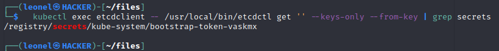
                a - g

            - **Mise en place de Network Policies pour restreindre les communications entre les pods**

                Lors du test de penetration, nous avons pu utiliser l'outil NMAP pour scanner le reseau de pod depuis un autre pod. 

                Pour empêcher toute communication réseau entre les pods des namespaces default et deploy, nous utilisons les **NetworkPolicy**. Ces politiques nous permettent de définir les règles de communication réseau au niveau des namespaces et des pods dans Kubernetes.

                Pour ce faire, en se basans sur le site officiel de Kubernetes, nous configurons deux **NetworkPolicy** que nous appliquons dans les namespaces (default et deploy) afin de bloquer toute communication entrante et sortante entre les pods des deux namespaces.

                https://kubernetes.io/docs/concepts/services-networking/network-policies/

                La configuration YAML du Networkpolicy du namespace par defaut est la suivante :

                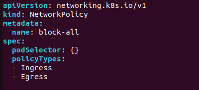

                Nous l'appliquons a l'aide de la commande suivante :

                    kubectl apply -f network_default.yaml
                
                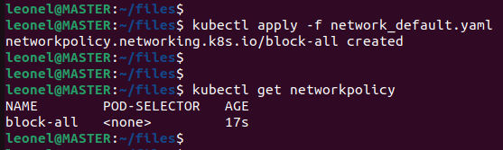
                
                La configuration YAML du Networkpolicy du namespace deploy est la suivante :

                

                NB: La regle qui apparait dans ce networkpolicy permet uniquement de laisser passer tout traffic venant des services kubernetes, comme c'est le cas avec le service qui permet l'acces a notre application.

                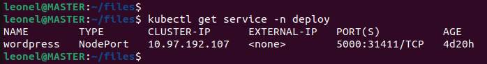

                Nous l'appliquons a l'aide de la commande suivante :

                    kubectl apply -f network_deploy.yaml
                
                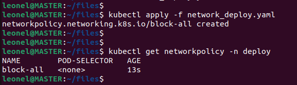

                Si l'on souhaite ajouter d'autres autorisations reseaux, il est necessaire de modifier les fichiers YAML afin d'ajouter les regles dont on a besoin.

            - **Implémentation de RBAC (Role-Based Access Control), et securisation des services account dans les pods**

                Lors de la phase de test de penetration, nous avons constatee que, a partir d'un service account vulnerable, un attanquant pouvait effectuer des actions de lecture et de modification dans le cluster.

                Ces actions etaient possibles, car des autorisations avec des privileges elevees avaient ete donne aux differents services accounts des namespaces default de deploy.

                Pour palier a ces problemes, nous allons tout d'abord suprimmer tous les roles et rolebindings qui ont ete prealablement defini, et par la suite nous creerons de nouveaux roles strictes que nous implementerons pour chaque service account du cluster, afin d'empecher ces derniers d'effectuer des actions non souhaitee.

                La liste des elements a supprimer est la suivante :

                    kubectl get roles

                    kubectl get rolebinding

                    kubectl get roles -n deploy

                    kubectl get rolebinding -n deploy

                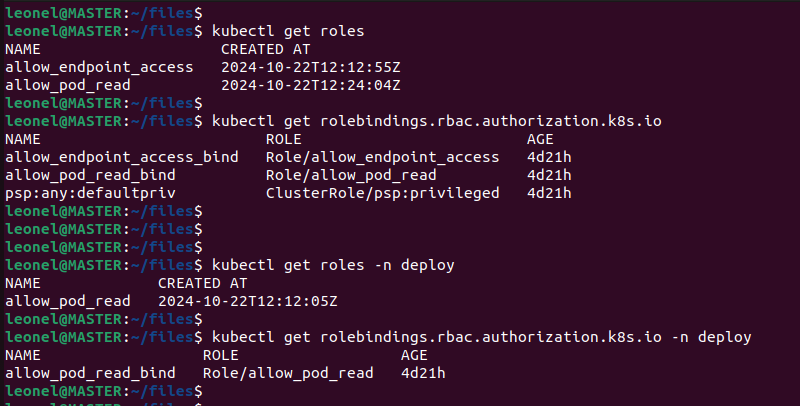

                Nous les supprimons comme suit :

                    kubectl delete role allow_endpoint_access

                    kubectl delete role allow_pod_read

                    kubectl delete rolebinding allow_endpoint_access_bind

                    kubectl delete rolebinding allow_pod_read_bind

                    kubectl delete rolebinding psp:any:defaultpriv

                    kubectl delete role allow_pod_read -n deploy

                    kubectl delete rolebinding allow_pod_read_bind -n deploy

                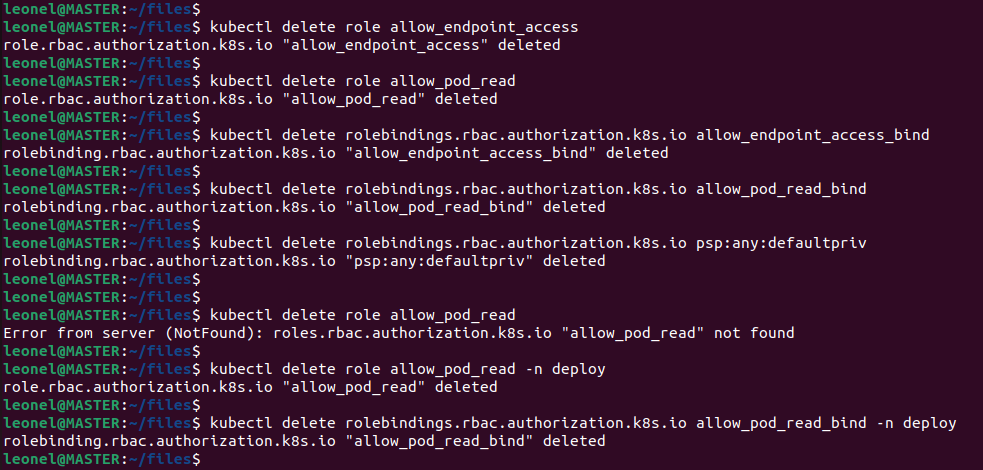

                Etant donne que nous travaillons dans le namespace par defaut et le namespace deploy, la liste des service accounts dans ces deux namespace est la suivante:

                    kubectl get serviceaccount

                    kubectl get serviceaccount -n deploy

                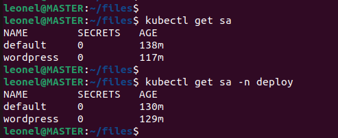

                Le role permettant de restreindre les permissions du service account par defaut **default** est le suivant: 

                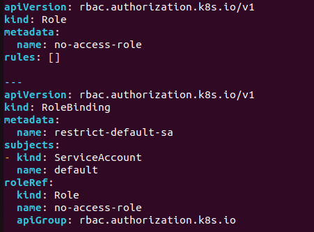

                Nous pouvons l'appliquer avec les commandes suivantes:

                    kubectl apply -f rbac_default.yaml

                    kubectl apply -f rbac_default.yaml -n deploy
                
                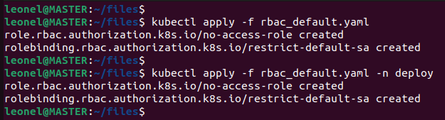

                Le role permettant de restreindre les permissions du service account **wordpress** est le suivant: 

                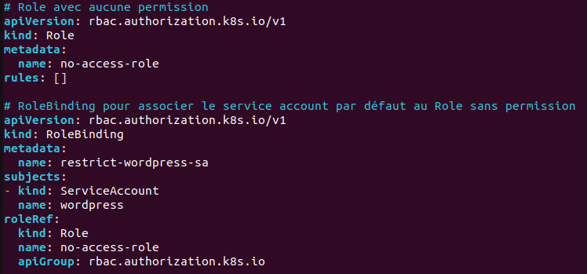

                Nous pouvons l'appliquer avec les commandes suivantes:

                    kubectl apply -f rbac_wordpress.yaml

                    kubectl apply -f rbac_wordpress.yaml -n deploy
                
                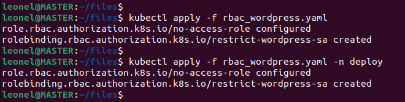

                La plupart des applications ne font pas d'appels à l'API Kubernetes, donc le comportement par défaut qui consiste à monter automatiquement le jeton ServiceAccount dans le système de fichiers de chaque Pod est au mieux problématique. Corrigeons cela en définissant explicitement **automountServiceAccountToken : false** à chaque fois que nous créons un ServiceAccount.

                Puisque dans notre cas les service account ont deja ete cree, nous allons juste les editer pendant leur execution, et appliquer le parametre precedent.

                La liste des service accounts a editer est la suivante :

                

                Dans le namespace par defaut, modifions les services account comme suit:

                    kubectl edit serviceaccount default
                
                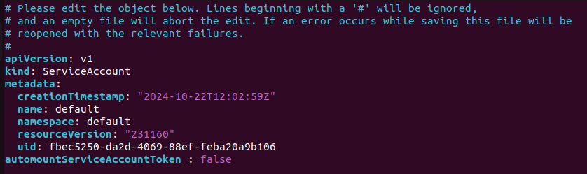

                    kubectl edit serviceaccount wordpress
                
                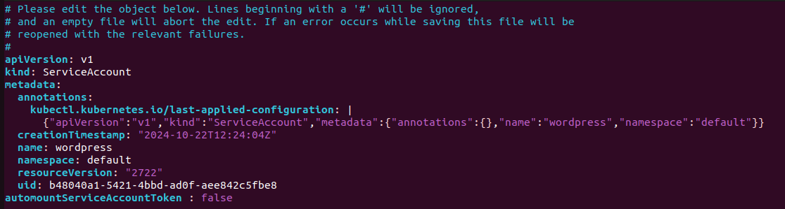

                Dans le namespace deploy, modifions les services account comme suit:

                    kubectl edit serviceaccount default -n deploy

                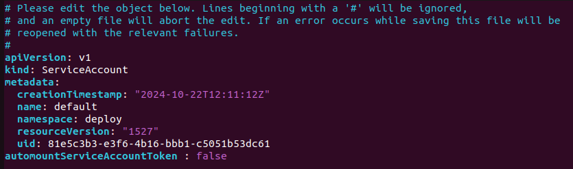               

                    kubectl edit serviceaccount wordpress -n deploy

                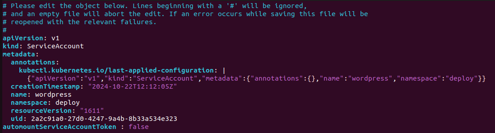

            - **Sécurisation de l'API Kubernetes**

            Pour restreindre l’accès à l’API Kubernetes, nous utilisons un pare-feu, car il est tres important de contrôler les connexions vers le port de l’API server (par défaut, 6443 sur le master Kubernetes). Voici comment nous pouvons configurer notre pare-feu est basé sur firewalld.

            Une fois que le paquet firewalld est installee, nous devons définir les adresses IP ou plages d’IP autorisées à accéder au cluster Kubernetes, ainsi que le port sur lequel le trafic sera autorisee.

            Les commandes suivantes permettens d'autoriser les adresses IP des machines master, worker1 et worker2, ainsi que le port 6443.

                sudo firewall-cmd --zone=trusted --add-port=6443/tcp --permanent

                sudo firewall-cmd --zone=trusted --add-source=192.168.115.10 --permanent

                sudo firewall-cmd --zone=trusted --add-source=192.168.115.11 --permanent

                sudo firewall-cmd --zone=trusted --add-source=192.168.115.12 --permanent

                sudo firewall-cmd --reload
            
            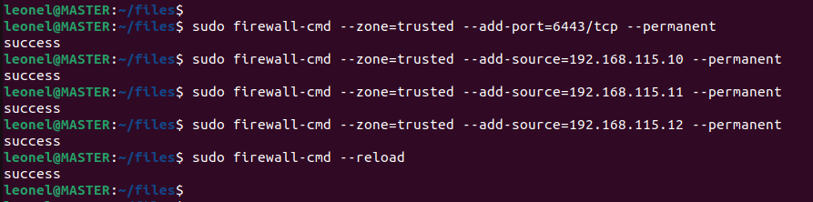

            - **Analyse de l'image de pod**

            L'image suivante nous montre que depuis le debut nous travaillons avec une image non officielle de Wordpress, et dans ce cas il est tres fort probable qu'elle contienne des vulnerabilites.

            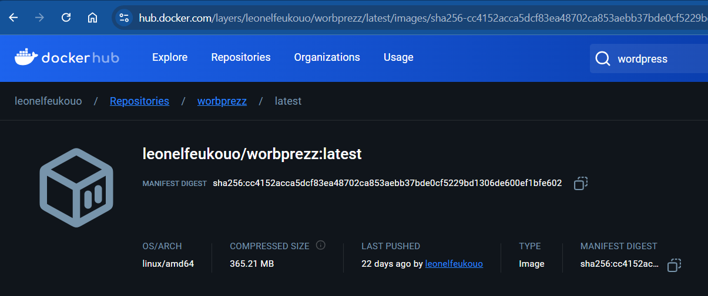 

            En analysant un peu plus cette image non officielle sur le site hub.docker.com, le fichier nommee **app.py** est lancee a chaque demarrage d'un pod a partir de l'image **leonelfeukouo/worbprezz:latest**, comme le montre l'image suivante.

            

            Lorsque nous essayons de nous connecter a un pod executant l'image, on peut constater que, la soit disante application wordpress est en effet une application **Flask** contenant deux pages web, une statique dont le but est de tromper l'utilisateur en lui faisant croire qu'il s'agit reellement de wordpress, et une autre page qui permet d'executer des commandes shell arbitraire a partir de l'url.

            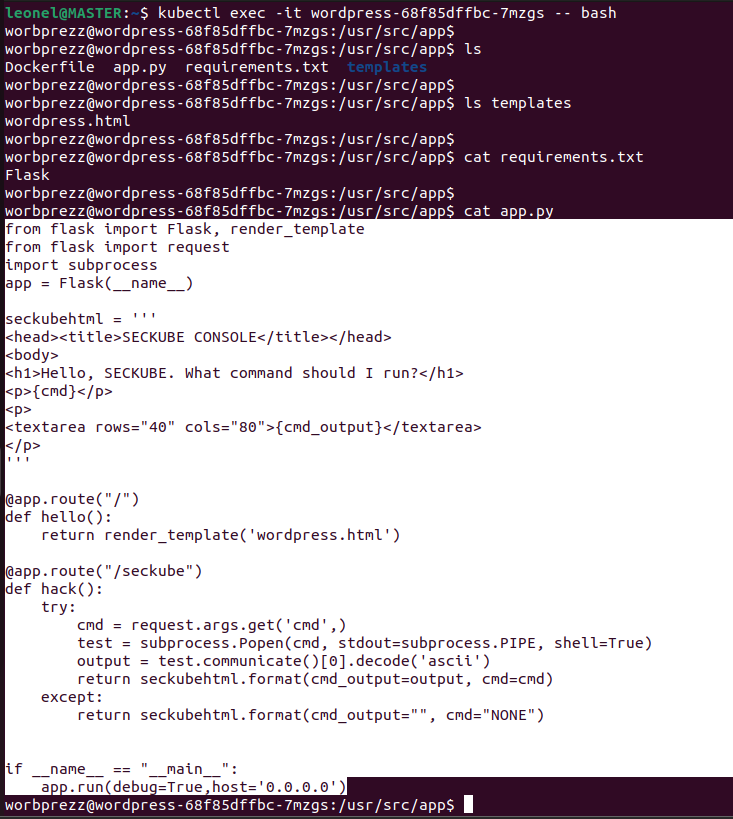

            Nous pouvons aussi remarquer la facon dont wordpress est ecrit dans le nom de l'image. C'est ecrit avec un **B** miniscule et deux **Z** miniscule. Hors, l'orthographe correcte est **wordpress** en miniscule et **WORDPRESS** en majuscule.

            Pour palier a ce probleme, il est important de toujours veiller a ce que les images que nous utilisons proviennent d'un fournisseur officiel d'images, comme le montre cette image.

            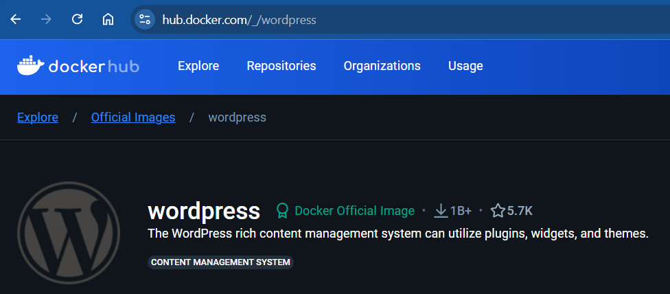

            Pour utiliser cette nouvelle image officielle, nous modifions juste notre fichier YAML du deploiement que nous avons precedement executee comme suit.

            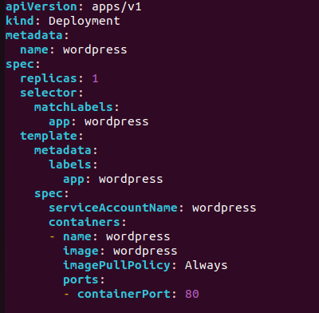

            Pour l'executer, nous supprimons tout d'abord l'ancien deploiement, et nous creons le nouveau.

                kubectl delete -f wordpress_deployment.yaml -n deploy

                kubectl delete service -n deploy wordpress

                kubectl apply -f wordpress_deployment.yaml -n deploy

                kubectl expose deployment wordpress -n deploy --type=NodePort

                kubectl get all -n deploy

            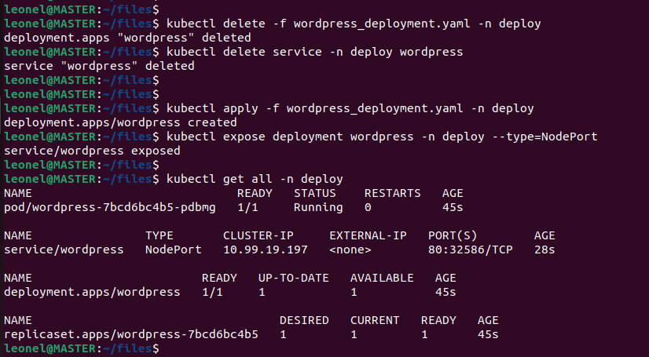

            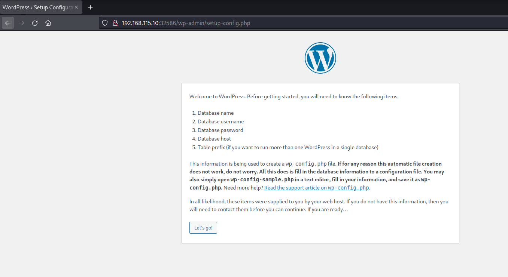
            a

            Il est aussi possible d'utiliser un outil des scan d'image de container tel que **TRIVY**, afin de detecter les vulnerabilites presente dans les librairies installee dans l'image.

            La commande suivante permet de l'installer :

                sudo apt install trivy -y

            Une fois installe, on peut obtenir sa version comme dans l'image suivante :

            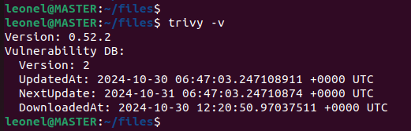

            Le scan de notre image vulnerable avec TRIVY nous renvoie la sortie suivante :

            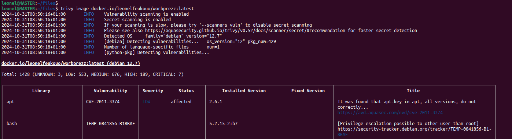

            Les resultats de trivy sont basees sur les paquets qui sont installee dans l'image. Il est necessaire de veiller a ce que aucun paquet ne puisse etre a l'origine d'une attaque dans notre cluster.

        - #### 4.2.2 Mise en place de la surveillance et de l'audit
            Outre la gestion et la mise à niveau d'un cluster Kubernetes, l'administrateur est chargé de garder un œil sur les activités potentiellement malveillantes. Bien qu'il soit possible d'effectuer cette tâche manuellement en se connectant aux nœuds du cluster et en observant les processus au niveau de l'hôte et du conteneur, il s'agit d'une entreprise terriblement inefficace.

            L'analyse des comportements consiste à observer les nœuds de la grappe pour détecter toute activité qui semble sortir de l'ordinaire. Un processus automatisé permet de filtrer, d'enregistrer et d'alerter les événements présentant un intérêt particulier.

            Afin de detecter les menaces en observant les activites au niveau de l'hote et du container nous avons optee pour l'outil **Falco**. Avec ce dernier, nous pouvons relever les activites telles que, la lecture et l'ecriture d'un fichier a un endroit specifique du systeme, l'ouverture d'un shell dans un container (/bin/bash), des tentatives d'appel reseau vers des URLs nos desiree.

            Falco déploie un ensemble de capteurs qui écoutent les événements et les conditions configurés. Chaque capteur est constitué d'un ensemble de règles qui associent un événement à une source de données. Une alerte est produite lorsqu'une règle correspond à un événement spécifique. Les alertes sont envoyées à un canal de sortie pour enregistrer l'événement, tel que la sortie standard, un fichier ou un point de terminaison HTTPS. Falco permet d'activer plusieurs canaux de sortie simultanément. La figure suivante présente l'architecture de haut niveau de Falco.

            

            Nous pouvons installer FALCO a l'aide des commandes suivante:

                curl -fsSL https://falco.org/repo/falcosecurity-packages.asc | sudo gpg --dearmor -o /usr/share/keyrings/falco-archive-keyring.gpg

                echo "deb [signed-by=/usr/share/keyrings/falco-archive-keyring.gpg] https://download.falco.org/packages/deb stable main" | sudo tee -a /etc/apt/sources.list.d/falcosecurity.list

                sudo apt-get install apt-transport-https

                sudo apt-get update -y

                sudo apt install -y dkms make linux-headers-$(uname -r)

                sudo apt install -y clang llvm

                sudo apt install -y dialog

                sudo apt-get install -y falco
            
            Lors de l'installation, nous choisissons les options comme dans les images suivantes, afin que tout se configure automatiquement.

            

            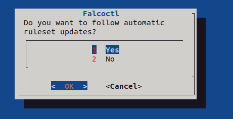

            Une fois installee, nous pouvons verifier son fonctionnement a l'aide de la commande suivante : 

                sudo systemctl status falco
            
            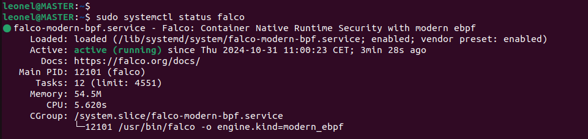

            Apres avoir installee FALCO, nous pouvons essayer d'effectuer des actions dans le system comme dans l'image suivante : 

            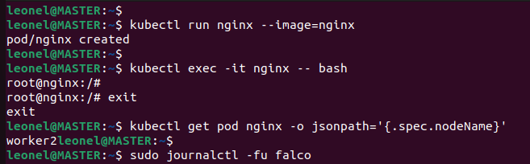

            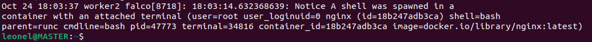

            En executant les commandes suivantes dans le container, on obtient la sortie suivante:

                root@nginx:/# apt update
                root@nginx:/# apt install git

            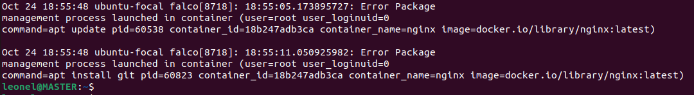

            Il est impératif pour un administrateur Kubernetes de disposer d'un enregistrement des événements qui se sont produits dans le cluster. Ces enregistrements peuvent aider à détecter une intrusion en temps réel, ou ils peuvent être utilisés pour suivre les changements de configuration à des fins de dépannage. Les journaux d'audit fournissent une vue chronologique des événements reçus par le serveur API.

            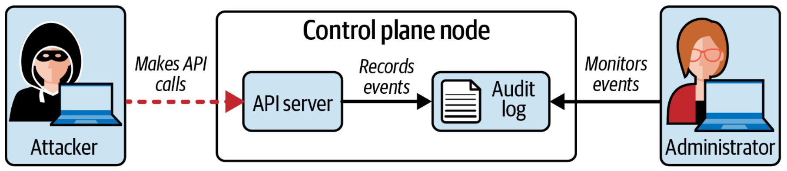

            Kubernetes peut stocker des enregistrements d'événements déclenchés par des utilisateurs finaux pour toute demande faite au serveur API ou pour des événements émis par le plan de contrôle lui-même. Les entrées du journal d'audit existent au format JSON et peuvent comprendre, sans s'y limiter, les informations suivantes :

            - Quel événement s'est produit ?
            - Qui a déclenché l'événement ?
            - Quand a-t-il été déclenché ?
            - Quel composant Kubernetes a traité la demande ?

            Le type d'événement et les données de demande correspondantes à enregistrer sont définis par une politique d'audit. La politique d'audit est un manifeste YAML spécifiant ces règles et doit être fournie au processus du serveur API.

            Le backend d'audit est responsable du stockage des événements d'audit enregistrés, tels que définis par la politique d'audit. Nous disposons de deux options configurables pour un backend :

            - Un backend de journalisation, qui écrit les événements dans un fichier.
            - Un backend webhook, qui envoie les événements à un service externe via HTTP(S) - par exemple, dans le but d'intégrer un système centralisé de journalisation et de surveillance. Un tel backend peut aider à déboguer des problèmes d'exécution tels qu'une application plantée.

            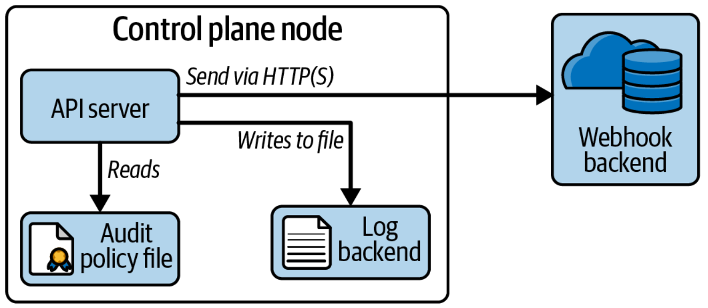

            Afin de Monitorer notre cluster a l'aide des logs kubernetes, il est imperatif de creer un fichier de politique d'audit et ensuite le configurer dans notre backend de journalisation.

            Le fichier de politique d'audit est un manifeste YAML pour une ressource de politique. Tout événement reçu par le serveur API est comparé aux règles définies dans le fichier de politique, dans l'ordre de leur définition. L'événement est enregistré au niveau d'audit déclaré si une règle correspondante peut être trouvée.

            Un exemple de fichier de politique d'audit que nous pouvons implementer dans notre cluster est le suivant :

           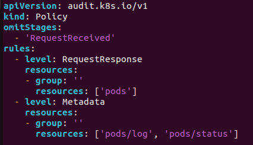

            Pour mettre en place un backend de logs basé sur des fichiers, nous devons ajouter trois éléments de configuration au fichier **/etc/kubernetes/manifests/kube-apiserver.yaml**. La liste suivante résume la configuration :

            - Fournir deux parametres au processus du serveur API : le parametres **--audit-policy-file** qui pointe vers le fichier de politique d'audit, et le parametre **--audit-log-path** qui pointe vers le fichier de sortie du journal.
            - Ajouter un chemin d'accès au volume pour le fichier de politique du journal d'audit et le répertoire de sortie du journal.
            - Ajouter une définition de volume au chemin d'accès de l'hôte pour le fichier de stratégie du journal d'audit et le répertoire de sortie du journal.

            Le fichier suivant montre le contenu modifié du fichier de configuration du serveur API.

            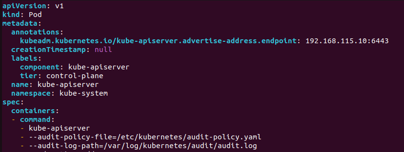
            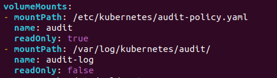
            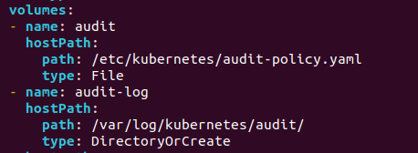

            Une fois le fichier configuree, il suffit juste de le sauvegarder, et les logs commenceront a etre collectionee.

            Afin de verifier le fonctionnement, nous creeons un simple pod nginx, et nous verifions les logs.

                kubectl run nginx --image=nginx

                cat /var/log/kubernetes/audit/audit.log
        
        - #### 4.2.3 Autres moyens de securites (KUBE-BENCH)

            Un autre moyen d'ameliorer la securitee du cluster est d'utiliser l'outil kube-bench pour vérifier les composants d'un cluster Kubernetes par rapport aux meilleures pratiques du CIS (Center for Internet Security) Benchmark de manière automatisée. Kube-bench peut être exécuté de différentes manières. Par exemple, nous pouvons l'installer en tant que binaire spécifique à une plateforme sous la forme d'un fichier RPM ou Debian. La manière la plus pratique et la plus directe d'exécuter le processus de vérification consiste à exécuter kube-bench dans un Pod directement sur le cluster Kubernetes. Pour cela, créons un objet Job à l'aide d'un manifeste YAML vérifié dans le dépôt GitHub de l'outil.

            Commencons par créer le Job à partir du fichier job-master.yaml, ou job-node.yaml selon que nous souhaitons inspecter un noeud master ou un noeud worker. Nous nous consacrerons uniquement a utiliser kube-bench dans la machine master, car la procedure pour les noeuds worker est la meme.

            La commande suivante exécute les contrôles de vérification sur le nœud du plan de contrôle :

                kubectl apply -f https://raw.githubusercontent.com/aquasecurity/kube-bench/main/job-master.yaml
            
            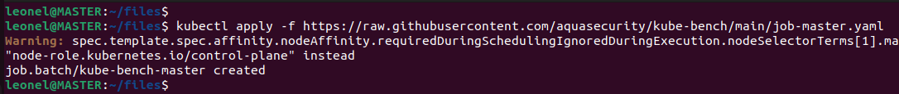
            
            Lors de l'exécution du Job, le Pod correspondant qui exécute le processus de vérification peut être identifié par son nom dans l'espace de noms par défaut. Le nom du Pod commence par le préfixe kube-bench, suivi du type du nœud et d'un hachage à la fin. 

            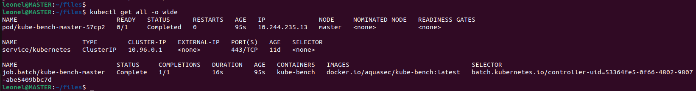

            Une fois executee, attendons que le pod passe à l'état « Completed » pour nous assurer que toutes les vérifications sont terminées. nous pouvons jeter un coup d'œil au résultat du benchmark en consultant les logs du Pod :

                kubectl logs kube-bench-master-57cp2
            
            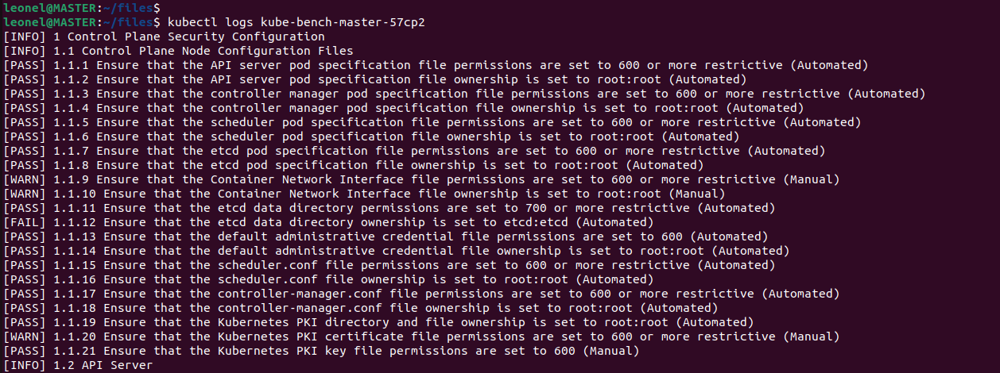

            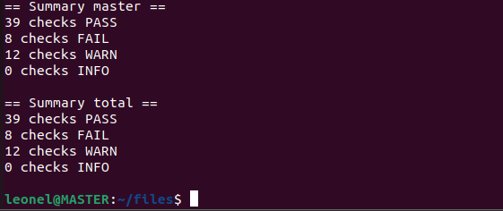

            Apres consultation des logs de kube-bench, nous effectuons toutes les recommandations qui sont dite a l'interieur de ces logs, puis nous executons kube-bench a nouveau et obtenons le resultat suivant :   

            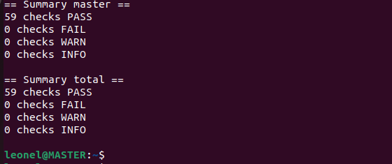

            A ce stade, toutes les recommandations pour ameliorer la securite d'un cluster provenant de CIS ont ete mise en place.

    - ### Conclusion
        L'application de ces mesures de sécurité, combinant la mise à jour de Kubernetes, la gestion des accès via RBAC, la mise en place de Network Policies, la sécurisation de l'API, et la surveillance active, renforce considérablement la sécurité du cluster Kubernetes. Ces actions permettent de protéger l'architecture contre les menaces internes et externes tout en assurant une traçabilité complète des événements. En utilisant des outils de monitoring et d'audit, le cluster reste sous surveillance constante, permettant une détection proactive des incidents. Nous ne pouvons pas dire que notre cluster est sure a 100%, car de nouvelles failles de securite sont decouverte tous les jours et sont encore non connues du public (ZERO-DAYS).

- ## **CHAPITRE 5 : Tests et évaluation**
    - ### Introduction
        Ce chapitre présente les tests effectués pour évaluer l’efficacité des mesures de sécurité mises en œuvre dans le cluster Kubernetes. Nous commencerons par la méthodologie de test, en décrivant les types de tests de sécurité effectués pour valider la robustesse de chaque mesure. Ensuite, nous analyserons les résultats des tests pour chaque composant et fonctionnalité de sécurité, en comparant les résultats avant et après la sécurisation du cluster. Enfin, une discussion détaillée permettra d'identifier les points forts et les éventuelles faiblesses des solutions mises en place.

    - ### 5.1 Évaluation de la sécurité de l'architecture sécurisée mise en place
        - #### 5.1.1 Méthodologie des tests de sécurité
            Pour évaluer la sécurité du cluster Kubernetes, nous avons suivi une méthodologie de tests de sécurité composée des éléments suivants :
            - **Tests de pénétration (Pentest)** : Nous avons simulee des attaques sur le cluster pour vérifier si les mesures de sécurité peuvent effectivement prévenir les accès non autorisés, les modifications malveillantes et les escalades de privilèges.
            - **Vérifications de conformité** : Nous avons utilise un outil de benchmark comme Kube-bench pour vérifier si le cluster respecte les standards de sécurité recommandés, notamment le CIS Kubernetes Benchmark.
            - **Surveillance et audit en temps réel** : Nous avons utilisee des outils de monitoring pour observer les réactions du cluster aux tests et vérifier si les alertes de sécurité sont déclenchées conformément aux configurations.
            - **Analyse de vulnérabilités des images de conteneurs** : Nous avons utilisee des outils comme DockerHub et Trivy pour analyser et scanner les images de conteneurs et vérifier si des vulnérabilités connues sont détectées.

            Cette méthodologie permet de tester les différentes couches de sécurité appliquées au cluster, en assurant une évaluation complète et détaillée.

        - #### 5.1.2 Résultats des tests de pénétration
            Les tests de pénétration ont été effectués pour évaluer la robustesse des configurations RBAC et de l'acces aux services accounts, des politiques de réseau, et des mesures de sécurisation de l’API Kubernetes. Voici les résultats pour chaque mesure :
            - **RBAC (Role-Based Access Control) et services accounts** : Les tests ont démontré que seuls les utilisateurs ayant des permissions spécifiquement définies pouvaient interagir avec les ressources sensibles. Les tentatives d'acces aux ressources par les service accounts de pod ont échoué, confirmant l’efficacité de la configuration RBAC, comme le montre l'image suivante : 
            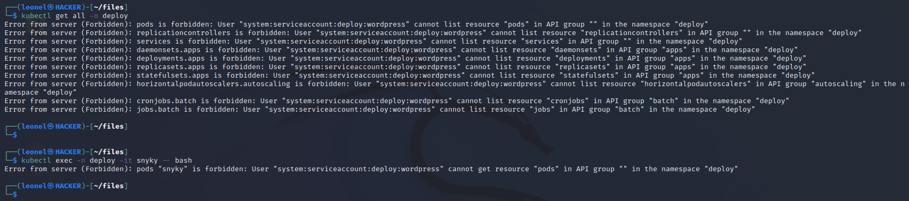 
            Par ailleurs, l'utilisation du parametres **automountServiceAccountToken : false** lors de la creation des service accounts, a permis de masquer les tokens des services accounts dans les pods, empechant ainsi leur utilisation par des utilisateurs malveillants, comme le montre la figure suivante : 
            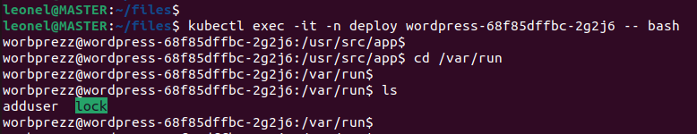

            - **Network Policies** : Les tests de communication entre les pods ont montré que les politiques de réseau empêchent les communications non autorisées. Les pods sensibles sont isolés des autres, réduisant ainsi les possibilités de mouvement latéral. Le contrôle strict des flux de données contribue à empêcher la propagation potentielle d’attaques internes dans le cluster. La figure suivante montre l'echec du scan reseaux par un pod malveillant, grace au network policies. Aucun pod n'a ete detecte, pourtant la replique de notre application tourne toujours dans le namespace par defaut. 
            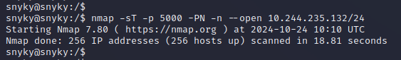

            - **Sécurisation de l'API Kubernetes** : Les tentatives d'accès non autorisé à l'API ont échoué grâce aux restrictions d’IP. Les logs d'audit et l'IDS ont enregistré toutes les tentatives d’accès, permettant une traçabilité complète. La sécurisation de l'API protège le point d'entrée principal du cluster, prévenant ainsi les attaques externes sur les ressources internes. La figure suivante nous montre une impossibilite d'acceder a l'API kubernetes, par un attanquant, grace a la restriction IP : 
            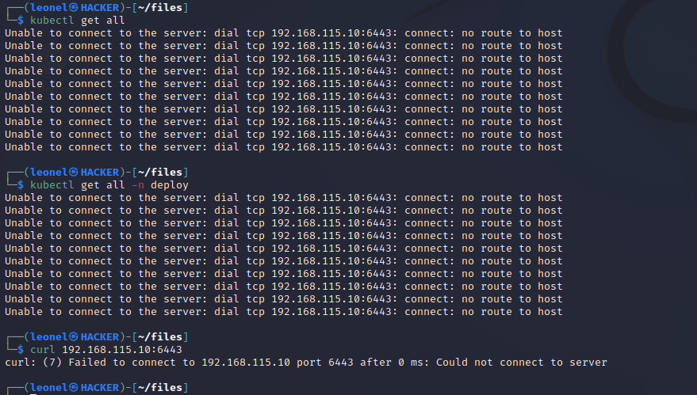

            - **Analyse et scan de l'image de conteneurs** : Les Analyses et scans ont permis d'identifier des vulnérabilités dans l'image. La vérification régulière des images de conteneurs limite l'introduction de logiciels vulnérables dans le cluster, protégeant ainsi les applications et les données. Apres avoir analysee l'image vulnerable, nous avons deployee l'image officielle de wordpress et on peut constater son fonctionnement comme suit, dans l'image suivante : 
            

    - ### 5.2 Comparaison des résultats avant et après sécurisation
        La comparaison des résultats avant et après sécurisation nous permet de quantifier l’impact des mesures de sécurité appliquées. Voici les principales différences observées.

        - #### 5.2.1 Analyse comparative des vulnérabilités
            Avant la sécurisation, l’audit a révélé de nombreuses failles, telles que l’accès non authorisee à l’API, l'absence de Network Policies, et des permissions excessives via le service account par défaut des pods et des images de pods vulnerables. Après la sécurisation, la majorité des vulnérabilités critiques ont été corrigées. L’API est maintenant protégée par des regles de restrictions IP. Les Network Policies et RBAC contrôlent efficacement les flux de données et les accès aux ressources, et l'image utilisee pour deployer les pods est une image officielle reconnu par le depot officiel DockerHub.

        - #### 5.2.2 Mesure de la performance et de l'efficacité des mesures de sécurité
            La performance et l'efficacité des mesures de sécurité ont été mesurées en termes de réduction des vulnérabilités et d'amélioration de la résilience aux attaques. Les résultats montrent une amélioration notable de la sécurité globale de l'architecture Kubernetes.

            Les mesures de sécurité appliquées n’ont pas eu d’impact notable sur la performance du cluster. Les temps de réponse des pods et des services sont été conformes aux attentes.

            Les alertes et logs d’audit fonctionnent comme prévu, permettant une surveillance proactive. Les scans de conteneurs ont permis de garantir que seules des images sécurisées sont utilisées, éliminant les vulnérabilités de la chaîne d'approvisionnement logicielle.

    - ### 5.3 Résultats et discussion
        Les résultats obtenus démontrent que les mesures de sécurité appliquées ont significativement renforcé la protection du cluster Kubernetes. Voici une analyse des forces, des faiblesses, et des perspectives d'amélioration :

        - #### 5.3.1 Présentation des résultats obtenus
            Les principales mesures de sécurité appliquées (RBAC, Network Policies, sécurisation de l’API et scans d'images) ont réduit la surface d’attaque et protégé les composants critiques du cluster. Les tests de pénétration ont confirmé l’efficacité des configurations pour prévenir les accès non autorisés et les attaques internes.

        - #### 5.3.2 Analyse des forces et des faiblesses de l'approche adoptée
            L'approche adoptée présente plusieurs forces, notamment l'utilisation de RBAC et restriction d'API pour controler les acces, des politiques de réseau pour isoler les pods, et les logs d'audit et alertes pour surveiller et auditer le cluster. Cependant, certaines faiblesses subsistent, telles que la complexité de la gestion des politiques de réseau qui necessite une configuration minutieuse, et la nécessité de mises à jour régulières des outils de sécurité tels que **firewalld** ou **trivy**.

        - #### 5.3.3 Discussion sur les leçons apprises et les recommandations pour l'avenir
            Les leçons apprises montrent que la sécurité d’un cluster Kubernetes dépend d’une approche multi-couches, combinant des politiques d’accès strictes, une surveillance proactive et des configurations de réseau renforcées. Pour les futures améliorations, il est recommandé de :
            - Mettre en place d'un processus continu de surveillance et d'audit.
            - Mettre en place un processus de mise à jour continue pour garder le cluster et les outils de sécurité à jour.
            - Renforcer l’automatisation des configurations via des scripts et des outils de gestion de configuration pour faciliter la mise en œuvre des aspects de securites.
            - Développer une stratégie de sauvegarde et de récupération pour assurer la résilience en cas de compromission.

    - ### Conclusion
        Les tests et les évaluations ont confirmé que les mesures de sécurité appliquées offrent une protection robuste contre la majorité des menaces identifiées. Le renforcement de la sécurité du cluster Kubernetes s’avère efficace pour prévenir les accès non autorisés, protéger les données sensibles, et assurer une résilience face aux attaques. La stratégie adoptée et les recommandations pour l’avenir forment une base solide pour maintenir et améliorer la sécurité du cluster à long terme.

 
- ## **CONCLUSION GÉNÉRALE**
    Ce projet a permis de renforcer la sécurité d’une architecture Kubernetes en appliquant des pratiques rigoureuses de sécurisation adaptées aux infrastructures conteneurisées. Dans un contexte où
l’adoption de Kubernetes est en pleine croissance, garantir la protection des clusters est essentiel pour assurer la continuité des applications et la confidentialité des données.
    En suivant une méthodologie agile, notamment Scrum, nous avons structuré les différentes étapes du projet pour répondre aux objectifs de sécurité de manière progressive et itérative. Après une première phase de configuration d’une architecture non sécurisée et de tests de pénétration, les vulnérabilités critiques ont été identifiées, soulignant l’importance de mettre en place des mesures
de sécurité solides. En intégrant des solutions de contrôle d’accès, des politiques de réseau, et des mécanismes de surveillance, le projet a permis de transformer un environnement vulnérable en un
système résilient et robuste contre les menaces.
    Les résultats des tests finaux montrent une réduction significative des risques initiaux et valident l’efficacité des mesures de sécurité appliquées. Le cluster est désormais mieux protégé contre les accès
non autorisés, les escalades de privilèges, et les attaques potentielles visant les composants critiques de Kubernetes. Par ailleurs, l’intégration de la surveillance et de l’audit en continu assure une réactivité face aux comportements suspects, permettant de prévenir les incidents de sécurité.
    En conclusion, ce projet propose un modèle de sécurité adaptable aux infrastructures Kubernetes modernes, répondant aux besoins de protection des environnements de production. Les leçons apprises
et les mesures appliquées dans ce projet peuvent servir de référence pour d’autres initiatives visant la sécurisation des environnements conteneurisés. La sécurité est un processus continu, et ce travail
constitue une base solide pour des améliorations futures, au fur et à mesure de l’évolution des menaces et des technologies.

- ## **BIBLIOGRAPHIE**

- ## **RÉSUMÉ**
    Face à la popularité croissante de Kubernetes pour gérer les applications conteneurisées, la sécurité devient cruciale. Kubernetes facilite la gestion d’applications à grande échelle, mais sa complexité le rend vulnérable aux menaces, comme l’accès non autorisé et l’escalade de privilèges.
    Ce projet vise à sécuriser une architecture Kubernetes en appliquant des pratiques de sécurité robustes. Après avoir mis en place une architecture non sécurisée et mené des tests de pénétration révélant
des vulnérabilités, des solutions telles que le contrôle d’accès (RBAC), les politiques réseau, et la sécurisation de l’API ont été intégrées. Un système de surveillance continue a aussi été ajouté pour
détecter rapidement les activités suspectes.
    Les résultats montrent une réduction des vulnérabilités et confirment l’efficacité des mesures appliquées pour renforcer la sécurité du cluster Kubernetes. Ce projet propose ainsi un modèle applicable aux infrastructures conteneurisées modernes, permettant de protéger les applications et les données.

- ## **ABSTRACT**
