# **THEME : "RENFORCEMENT DE LA SECURITE D'UNE ARCHITECTURE KUBERNETES"**

- ## **DÉDICACE**
    Ce travail est dédié à mon père FOTSING Jean-Philippe et a ma mère SIMO Clementine, dont le soutien indéfectible et les encouragements m'ont permis de mener à bien ce projet.

- ## **REMERCIEMENTS**
    Je tiens à exprimer ma gratitude à madame SAHAR BEN YAALA, pour son soutien, ses conseils et son aide tout au long de ce projet.

    Je remercie également tous mes amis, qui m'ont accompagnee durant toutes la duree de mes etudes en Tunisie.

- ## **TABLE DES MATIÈRES**

- ## **TABLE DES FIGURES**

- ## **LISTE DES TABLEAUX**

- ## **LISTE DES ABRÉVIATIONS**
    - API : Application Programming Interface
    - CI/CD : Continuous Integration/Continuous Deployment
    - RBAC : Role-Based Access Control
    - DDoS : Distributed Denial of Service
    - etc.

- ## **INTRODUCTION GÉNÉRALE**
    L'architecture Kubernetes est devenue un standard pour le déploiement et la gestion des applications conteneurisées à grande échelle. Cependant, comme toute technologie puissante, elle présente des défis significatifs en matière de sécurité. Ce projet de fin d'études se concentre sur le renforcement de la sécurité d'une architecture Kubernetes en utilisant des méthodologies et des techniques spécifiques. L'objectif principal de ce projet est de développer une architecture Kubernetes sécurisée et d'évaluer son efficacité à travers des tests rigoureux. Pour atteindre cet objectif, nous avons adopté la méthodologie Scrum, permettant une approche itérative et incrémentale. Ce rapport est structuré comme suit : Le premier chapitre présente le projet, incluant son contexte, ses objectifs et la méthodologie de travail. Le deuxième chapitre est une revue de l'état de l'art concernant la sécurité dans les environnements Kubernetes. Le troisième chapitre décrit la mise en œuvre de l'architecture non sécurisée et les tests de pénétration effectués. Le quatrième chapitre traite de la sécurisation de l'architecture et le cinquième chapitre présente les tests et l'évaluation de cette architecture sécurisée. Enfin, nous conclurons par une discussion sur les résultats obtenus et les recommandations pour l'avenir.

- ## **CHAPITRE 1 : Présentation du Projet**
    - ### Introduction
        Dans ce chapitre, nous allons introduire le projet en détaillant son contexte et ses objectifs, ainsi que la méthodologie de travail utilisée. Ce cadre nous permettra de comprendre les motivations derrière ce projet et les étapes suivies pour atteindre les résultats escomptés.

    - ### 1.1 Contexte et Objectifs
        - #### 1.1.1 Contexte du projet
            Avec l'adoption croissante des conteneurs pour le déploiement d'applications, Kubernetes est devenu une solution de référence pour l'orchestration des conteneurs. Cependant, cette popularité s'accompagne de nombreux défis en matière de sécurité. Les environnements Kubernetes peuvent être vulnérables à diverses menaces si des mesures de sécurité adéquates ne sont pas mises en place.

            Le contexte de ce projet s'inscrit dans la nécessité de renforcer la sécurité des environnements Kubernetes pour protéger les données et les applications des entreprises contre les attaques potentielles. Nous allons explorer les vulnérabilités communes et les solutions existantes pour proposer une architecture sécurisée.

        - #### 1.1.2 Objectifs de la sécurisation de l'architecture Kubernetes
            Les objectifs de ce projet sont multiples :
            - Identifier et comprendre les vulnérabilités spécifiques à Kubernetes.
            - Mettre en place une architecture Kubernetes initiale pour servir de base de comparaison.
            - Appliquer des techniques et des outils de sécurité pour renforcer cette architecture.
            - Évaluer l'efficacité des mesures de sécurité mises en place à travers des tests de pénétration.
            - Fournir des recommandations basées sur les résultats obtenus pour améliorer continuellement la sécurité dans les environnements Kubernetes.

    - ### 1.2 Méthodologie de Travail
        - #### 1.2.1 Explication de la méthodologie Scrum et de ses principes
            Scrum est une méthodologie de gestion de projet agile qui se concentre sur la réalisation de projets complexes grâce à des itérations courtes appelées sprints. Chaque sprint dure généralement entre une et quatre semaines et produit un incrément du produit potentiellement livrable. Les principaux rôles dans Scrum incluent le Product Owner, le Scrum Master et l'équipe de développement.

            Les principes fondamentaux de Scrum incluent :
            - **Transparence** : Tous les aspects significatifs du processus doivent être visibles pour ceux responsables du résultat.
            - **Inspection** : Les utilisateurs Scrum doivent fréquemment inspecter les artefacts Scrum et l'avancement vers un objectif de sprint pour détecter des variations indésirables.
            - **Adaptation** : Si un utilisateur Scrum détecte un ou plusieurs aspects du processus qui dévient des limites acceptables, et que le produit fini sera inacceptable, il doit ajuster le processus ou le matériel en cours.

        - #### 1.2.2 Adaptation de Scrum au projet de sécurisation de l'architecture Kubernetes
            Pour ce projet, la méthodologie Scrum a été adaptée de la manière suivante :
            - **Product Owner** : Le superviseur du projet (ici, notre encadreur), responsable de la définition des priorités de sécurité et des critères d'acceptation.
            - **Scrum Master** : Le chef de projet (ici, moi), facilitant les réunions Scrum et aidant à éliminer les obstacles.
            - **Équipe de Développement** : Composée de moi uniquement, impliqué dans le projet et chargée de l'implémentation des fonctionnalités de sécurité.

            Les travaux ont été organisés en sprints de deux semaines, chaque sprint ayant des objectifs clairs liés à la sécurisation de l'architecture Kubernetes. Les réunions quotidiennes de stand-up ont permis de suivre les progrès et d'ajuster les plans si nécessaire.

    - ### Conclusion
        Ce chapitre a introduit le projet en fournissant un aperçu du contexte et des objectifs, ainsi qu'une description de la méthodologie Scrum utilisée pour structurer et gérer les travaux. Ces fondations théoriques et méthodologiques nous préparent à explorer en détail l'état de l'art de la sécurité dans les environnements Kubernetes dans le prochain chapitre.
 
- ## **CHAPITRE 2 : État de l'art**
    - ### Introduction
        Le chapitre suivant présente une revue de la littérature existante sur la sécurité dans les environnements Kubernetes. Cette revue permet de situer notre projet dans le contexte des recherches et pratiques actuelles et d'identifier les principaux défis et solutions existantes.

    - ### 2.1 Revue de la littérature sur la sécurité dans les environnements Kubernetes
        - #### 2.1.1 Études académiques et recherches
            Plusieurs études académiques et recherche ont exploré les vulnérabilités et les défis de sécurité associés à Kubernetes. C'est le cas du guide de cours, pour la certification professionnelle "Certified Kubernetes Security Specialist" elabore par **Benjamin Muschko**, permettant :
            -   d'identifier, atténuer et/ou minimiser les menaces pesant sur les applications natives du cloud et les clusters Kubernetes; 
            - apprendre les tenants et les aboutissants des fonctions de sécurité de Kubernetes et des outils externes pour la détection et l'atténuation de la sécurité; 
            - démontrer les compétences nécessaires pour assumer les responsabilités d'un administrateur Kubernetes ou d'un développeur d'applications du point de vue de la sécurité;
            - résoudre les problèmes réels de Kubernetes dans un environnement pratique, en ligne de commande.

            https://www.oreilly.com/library/view/certified-kubernetes-security/9781098132965/ 

        - #### 2.1.2 Articles et livres blancs de l'industrie
            En plus des recherches académiques, de nombreux articles et livres blancs publiés par des experts de l'industrie offrent des perspectives pratiques sur la sécurité Kubernetes. Des entreprises comme Google, Red Hat, et AWS ont publié des guides de meilleures pratiques et des études de cas détaillant les mesures de sécurité efficaces dans les environnements Kubernetes.

            Par exemple, le rapport d'etude de RedHat menée auprès de 600 professionnels du DevOps, intitulé "The state of Kubernetes security report: 2024 edition" examine certains des défis les plus courants en matière de sécurité cloud-native et les impacts commerciaux que les organisations de toutes tailles rencontrent aujourd'hui et propose des mesures que vous pouvez prendre pour renforcer la sécurité de vos environnements cloud-native.

            https://www.redhat.com/en/engage/state-kubernetes-security-report-2024

    - ### 2.2 Présentation des principaux défis et des solutions existantes
        - #### 2.2.1 Défis courants en sécurité Kubernetes
            Les principaux défis en matière de sécurité Kubernetes incluent :
            - La gestion des accès et des permissions (RBAC).
            - La sécurisation des communications réseau entre les composants.
            - La protection des données sensibles (comme les secrets).
            - La détection et la réponse aux menaces en temps réel.

        - #### 2.2.2 Solutions actuelles et meilleures pratiques
            Les solutions courantes pour relever ces défis comprennent :
            - L'utilisation de Role-Based Access Control (RBAC) pour gérer les permissions.
            - L'implémentation de politiques de réseau pour restreindre les communications entre les pods.
            - L'utilisation de Kubernetes Secrets pour stocker et gérer les informations sensibles.
            - La mise en place de systèmes de surveillance et d'audit pour détecter les comportements anormaux et réagir rapidement aux incidents de sécurité.

    - ### Conclusion
        Ce chapitre a fourni un aperçu détaillé de l'état actuel des connaissances et des pratiques en matière de sécurité Kubernetes. En identifiant les défis et les solutions existantes, nous avons établi une base solide pour la mise en œuvre pratique décrite dans les chapitres suivants.

 
- ## **CHAPITRE 3 : Mise en œuvre**
    - ### Introduction
        Dans ce chapitre, nous allons décrire la mise en œuvre de l'architecture non sécurisée, qui servira de base pour les tests de pénétration et l'évaluation de la sécurité.

    - ### 3.1 Développement de l'architecture non sécurisée
        - #### 3.1.1 Mise en place de l'architecture initiale (Master et Workers)
            L'architecture initiale que nous allons déployer se presente comme suit dans l'image suivante :

            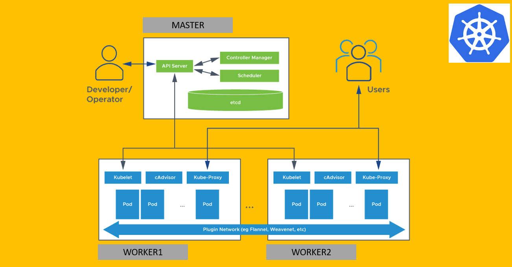

            Nous trouvons ci-dessous un guide étape par étape sur l'installation et la configuration de la version 1.23.7 de Kubernetes pour les nœuds maître (master) et travailleurs (worker1 & worker2).

            **PRÉ-REQUIS DANS LES TROIS MACHINES** :
            - Ubuntu 22.04, à telecharger sur le site officiel d'Ubuntu.

                https://ubuntu.com/download/desktop

            - Swap désactivé, à l'aide de la commande suivante :

                    sudo swapoff -a && sudo sed -i '/ swap /s/^/#/' /etc/fstab
            
                Pour desactiver definitivement, executer aussi:

                    systemctl --type swap
                
                puis
                
                    systemctl mask <type>.swap

            - Docker v20.10 installé, à l'aide du script suivant :

                https://github.com/rancher/install-docker/blob/master/dist/20.10.24.sh

                    sudo usermod -aG docker <current_user>

            **NOEUD MASTER** :

            - Installer les dependances
                
                    sudo apt install socat -y
                    sudo apt install conntrack -y
            
            - Ouvrir le Changelog de GitHub suivant

            https://github.com/kubernetes/kubernetes/tree/master/CHANGELOG

            - Trouver la version requise de k8s. Dans notre cas, il s'agit de 1.23 :

            

            - Cliquer sur le lien "Server Binaries" dans la section "Download for ..." de la version 1.23.7.

            
            
            - Télécharger les binaires pour l'architecture de votre processeur. Dans notre cas, pour amd64 :

            
            
                wget https://dl.k8s.io/v1.23.7/kubernetes-server-linux-amd64.tar.gz

            - Désarchiver le paquet téléchargé

                    tar -xvf ./kubernetes-server-linux-amd64.tar.gz

            - Copier tous les binaires du dossier non archivé **./kubernetes/server/bin/** vers **/usr/bin/** :

                    sudo cp `find ./kubernetes/server/bin -maxdepth 1 -type f | sed 's/^\.\///' | grep -v "\."` /usr/bin/

            - Configurer kubelet en tant qu'unité de service :

                Créer le fichier **/etc/systemd/system/kubelet.service.d/10-kubeadm.conf** avec le contenu suivant :

                    sudo mkdir /etc/systemd/system/kubelet.service.d

                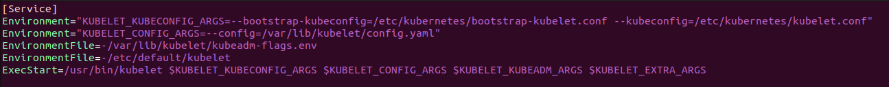

                Créer un autre fichier **/usr/lib/systemd/system/kubelet.service** avec le contenu suivant à l'intérieur :

                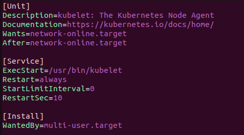

                Démarrer et activer kubelet.service :

                    sudo systemctl start kubelet.service
                    sudo systemctl enable kubelet.service
            
            - Initialiser le cluster:

                    sudo kubeadm init --kubernetes-version=v1.23.7 --pod-network-cidr=10.244.235.0/8
            
            - Donner l'autorisation a l'utilisateur courant d'executer les commandes Kubernetes:

                    mkdir -p $HOME/.kube
                    sudo cp -i /etc/kubernetes/admin.conf $HOME/.kube/config
                    sudo chown $(id -u):$(id -g) $HOME/.kube/config

            - Installer un gestionnaire réseaux. Dans notre cas, nous utiliserons CALICO :

                    kubectl apply -f https://docs.projectcalico.org/v3.21/manifests/calico.yaml

            **NOEUDS WORKER 1 ET 2**

            Le processus d'installation d'un nœud de travail est exactement le même que pour le nœud maître, sauf que apres avoir demarré et activé kubelet.service, nous devons exécuter la commande fournie par **kubeadm init** du master :

                    sudo kubeadm join 192.168.115.10:6443 --token c8kswm.plvgx5h7owe18bpt --discovery-token-ca-cert-hash sha256:99db9da245c433bbb334ffdb271071f02a4ec80854545b082977fc47108db1a9

            Une fois le cluster pret, on peut le constater avec les commandes suivantes dans la machine MASTER:

                kubectl get nodes
            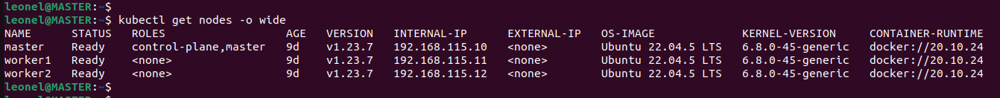

                kubectl get all (ou encore kubectl get all -n default)
            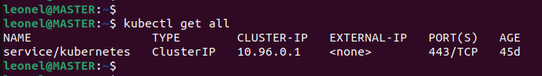

        - #### 3.1.2 Configuration des différents composants (pods, services, réseaux, etc.)
            Pour cela, nous avons configuré une architecture Kubernetes de base comprenant plusieurs pods, services, et autres, tous representés dans les image suivante : 
            
            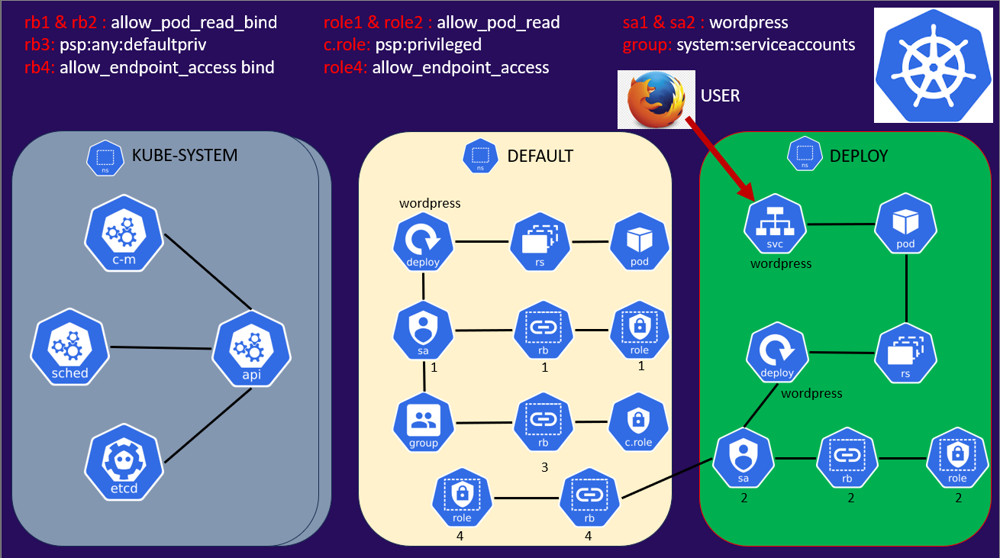
            
            **NB:** Les configurations initiales suivantes des différents composant n'incluent aucune mésure de sécurité spécifique, afin de servir de référence pour les améliorations ultérieures.

            - Elements dans les namespace propres a l'installation de Kubernetes

                Dans ces namespaces, comme par example le namespace **kube-system**, nous n'avons rien a configurer, car tout se fait automatiquement lors de l'installation du cluster.

                    kubectl get all -n kube-system
                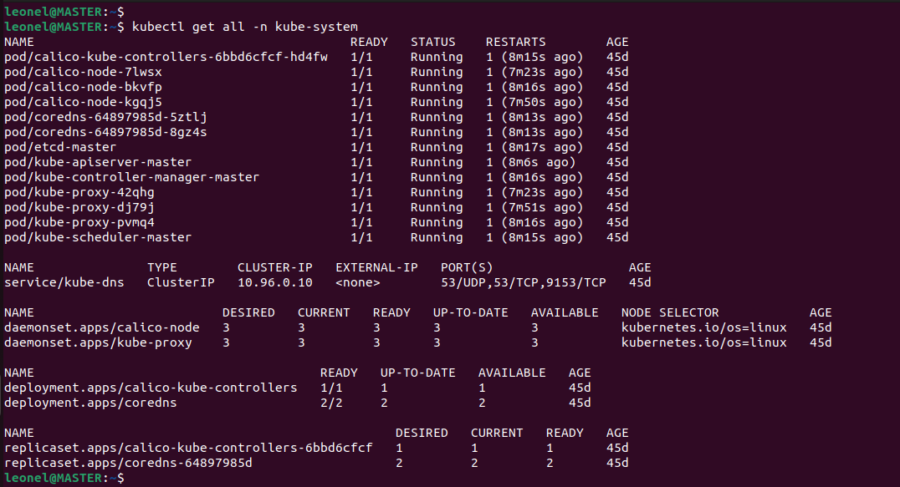

            - Eléments dans le namespace de déploiement (**deploy**)

                Tout d'abord, nous configurons le namespace **deploy**. Cela créera le namespace et liera tous les comptes de service de cet espace de noms à la politique de sécurité restreinte du pod.
                
                Le contenu du fichier est le suivant:

                

                La commande suivante permet de créer le namespace deploy :

                    kubectl apply -f ns_deploy.yaml
                
                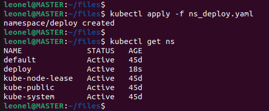
                
                NB: Apres avoir deployé tous les élements de ce namespace, nous changerons le label **pod-security.kubernetes.io/enforce** pour lui donner la valeur **restricted**, afin d'appliquer une politique de securite aux pods qui y sont deployés.

                Ensuite, nous créons le compte de service (Service Account) **wordpress** dans le namespace de deploiement. Cela introduira également une vulnérabilité dans la mesure où nous autoriserons ce compte de service à effectuer une grande variété d'actions au sein de l'espace de noms spécifique. Il s'agit d'une hypothèse assez courante mais, comme nous le montrerons, elle peut permettre à un attaquant d'élargir le rayon d'action d'un exploit.

                Le contenu du fichier est le suivant :

                

                La commande suivante permet de créer le compte de service **wordpress**, ainsi que le role **allow_pod_read** permettant d'effectuer une variété d'actions:

                    kubectl apply -f sa_wordpress.yaml -n deploy
                
                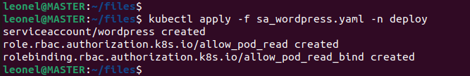
                
                NB: Le rolebinding **allow_pod_read_bind** permet de relier le compte de service précédent au role précédent.

                Ensuite, nous introduisons une deuxième vulnérabilité, permettant à cet utilisateur (SA) d'interroger les points d'extrémité du serveur API. Là encore, il ne s'agit pas nécessairement d'un problème évident, mais cela permettra à un attaquant d'obtenir des informations supplémentaires sur le cluster.

                Le contenu du fichier est le suivant:

                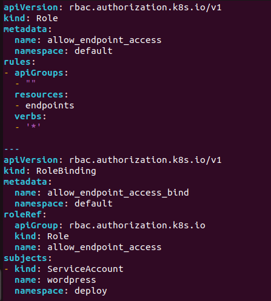

                La commande suivante permet, comme defini dans le fichier precedent, de créer un nouveau role **allow_endpoint_access** et le lier au compte de service **wordpress**.

                    kubectl apply -f allow_to_see_endpoints.yaml

                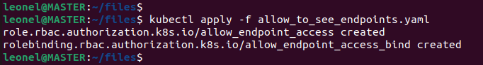
                
                Nous allons maintenant déployer l'application vulnérable dans le namespace deploy sécurisé.

                Le contenu du fichier est le suivant:

                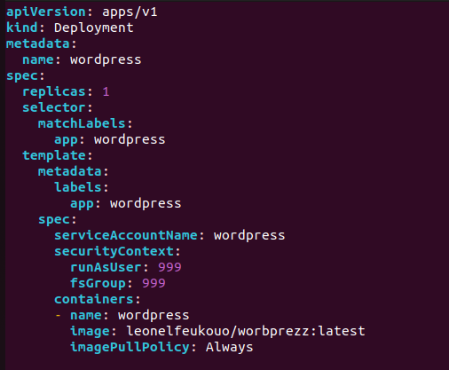

                La commande suivante permet d'appliquer le fichier precedent et créer le deploiement dans le namespace sécurisé.

                    kubectl apply -f wordpress_deployment.yaml -n deploy
                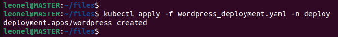
                
                    
                Nous pouvons voir le pod fonctionner dans le namespace sécurisé :
                        
                    kubectl get all -n deploy
                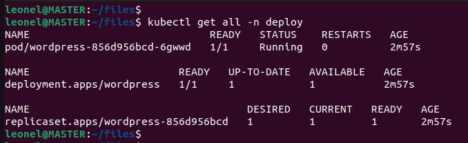
                
                Maintenant que l'application vulnérable fonctionne, nous l'exposons en dehors du cluster. Pour cela, nous avons besoin d'un Service de type NodePort, et de la commande suivante :

                    kubectl expose deployment wordpress -n deploy --type=NodePort --port=5000
                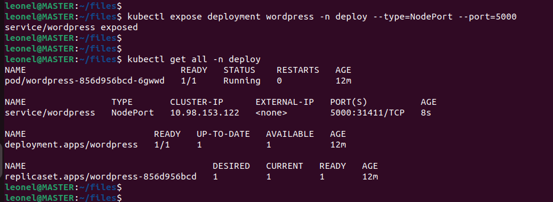

                À ce stade, nous pouvons afficher l'application vulnérable dans le navigateur d'une machine externe au cluster, en renseignant le port **31411**.

                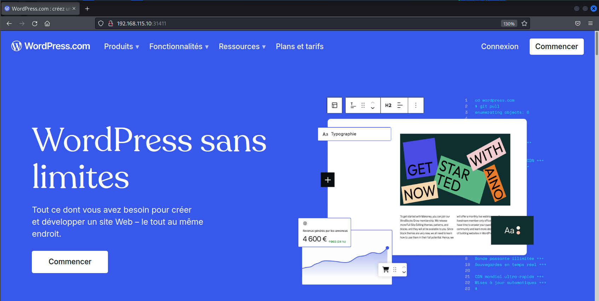

                Maintenant, nous devons modifier le namespace deploy, afin de mettre le label sur **restricted**.
                
                    kubectl edit ns deploy

                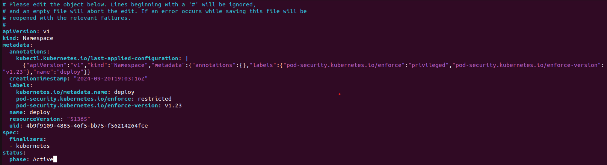

                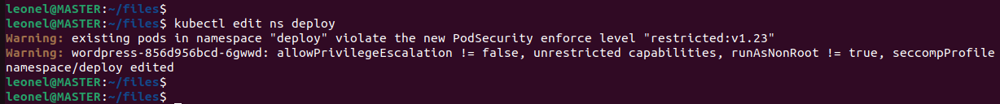

                Nous pouvons constater un **AVERTISSEMENT**, sur le fait qu'un pod ne respecte pas la politique de securite du namespace deploy, ce qui est necessaire pour les prochaines etapes de ce projet.

            - Eléments dans le namespace par defaut (**default**)

                A ce niveau, nous allons configurer le namespace par défaut et autoriser les comptes de service (sa) de ce namespace à accéder à la stratégie de sécurité Pod privilégiée. Là encore, il s'agit d'une vulnérabilité, basée sur l'hypothèse que nous contrôlons les autres namespace avec des liaisons de rôles spécifiques au namespace.

                Le contenu du fichier est le suivant:

                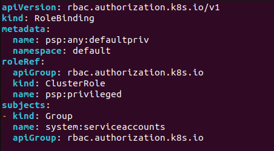

                La commande suivante permet d'appliquer le fichier précédent:

                    kubectl apply -f ns_default_role.yaml
                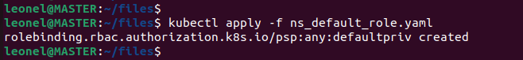
                                
                Ensuite, nous ajoutons le même compte de service et les mêmes rôles que dans notre espace de noms sécurisé :

                    kubectl apply -f sa_wordpress.yaml

                Nous ajoutons maintenant une instance de l'application vulnérable à l'espace de noms par défaut :
                    
                    kubectl apply -f wordpress_deployment.yaml

                Cela nous donne une configuration miroir dans le namespace par défaut que nous avons dans le namespace sécurisé deploy, mais par défaut nous n'appliquons pas la politique de sécurité restreinte du pod.

                    kubectl get all
                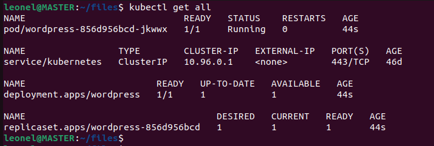

    - ### 3.2 Test de pénétration de l'architecture non sécurisée
        - #### 3.2.1 Simulation d'attaques courantes
            Pour évaluer la sécurité de l'architecture non sécurisée, nous avons simulé une unique chaine complete d'attques, repartie en sept etapes, comprennant plusieurs types d'attaques, exploitant des vulnerabilites courantes.

            **a- Examen de la vulnérabilité**

            Lorsqu'on ouvre l'application vulnérable dans notre navigateur à l'adresse http://192.168.115.10:31411, on arrive sur la page d'accueil de l'application. Mais en faisant une recherche poussée sur le site web, on constate qu'on a une seconde page web a l'adresse http://192.168.115.10:31411/seckube, qui exploite la vulnérabilité RCE (Remote Code Execution) en passant un paramètre URL **cmd**. 
            
            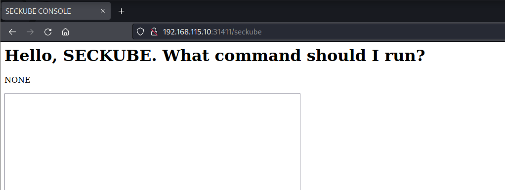
            
            Par exemple, l'url suivante exécute la commande **hostname** et affiche la sortie de la console sur la page retournée : http://192.168.115.10:31411/seckube?cmd=hostname

            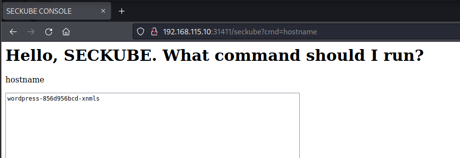

            Ceci prouve bien que le RCE fonctionne, alors utilisons-le pour obtenir des informations plus intéressantes. Remplacons le paramètre cmd par env pour imprimer les variables d'environnement des processus : http://192.168.115.10:31411/seckube?cmd=env

            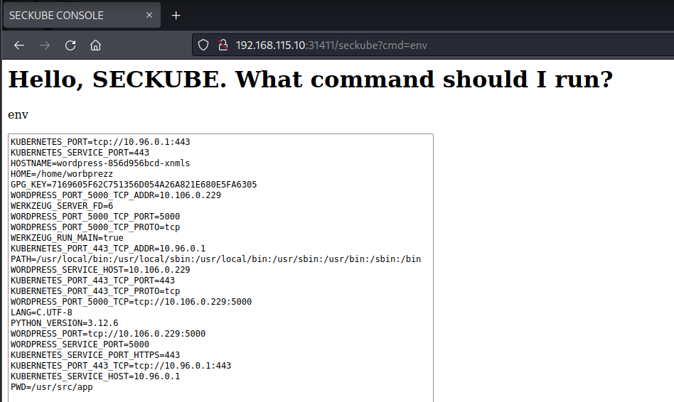

            En se basant sur les différents noms de variables commençant par KUBERNETES, il est assez sûr de supposer que ce processus s'exécute dans un conteneur, sur un cluster Kubernetes. De plus, étant donné que la commande hostname a retourné un nom préfixé par wordpress, la variable WORDPRESS_SERVICE_PORT=5000 signifie probablement qu'il y a un service Kubernetes qui écoute en interne sur le port 5000 et qu'une sorte de proxy qui traduit notre demande de port 31411 vers ce port. Enfin, la variable KUBERNETES_PORT=tcp://10.96.0.1:443 nous indique que l'adresse IP et le port internes de l'api-serveur Kubernetes sont 10.96.0.1:443.

            La prochaine information que nous voulons obtenir est l'adresse IP du pod dans lequel nous nous exécutons, alors lançons hostname -i : http://192.168.115.10:31411/seckube?cmd=hostname%20-i

            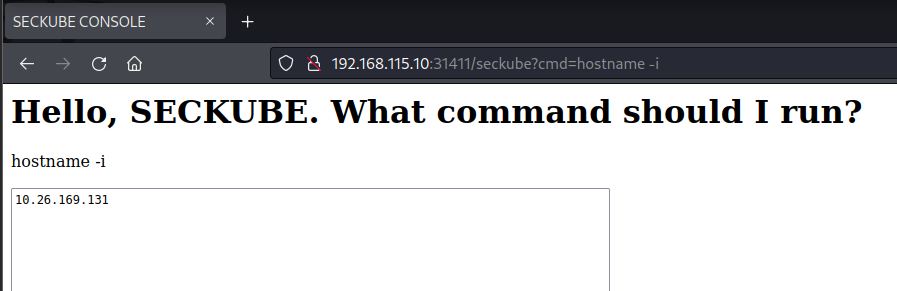

            **b- Accès au serveur api**

            Chaque Pod Kubernetes dispose par défaut d'un jeton de service associé à son ServiceAccount. Par défaut, ce jeton est monté automatiquement dans chaque Pod dans le chemin **/var/run/secrets/kubernetes.io/serviceaccount/token**. Utilisons le RCE pour essayer d'imprimer ce jeton à l'aide de la commande **cat** : http://192.168.115.10:31411/seckube?cmd=cat%20/var/run/secrets/kubernetes.io/serviceaccount/token

            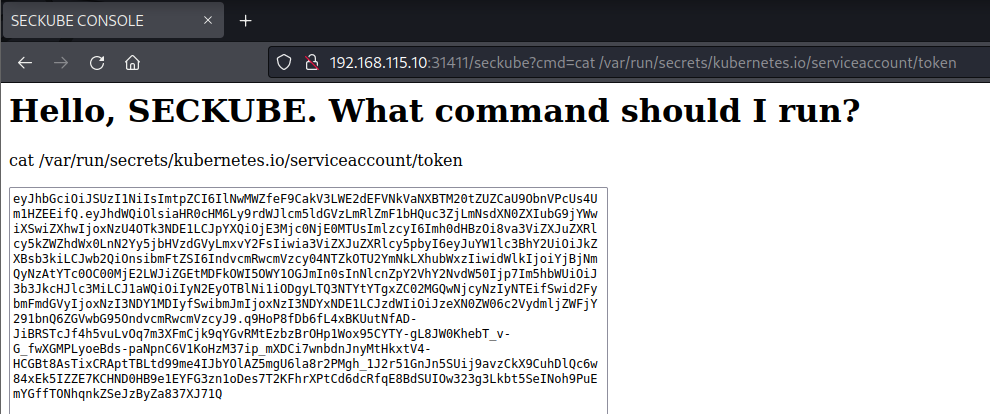

            Nous avons maintenant le jeton Pod, nous avons donc des informations d'identification avec lesquelles nous pouvons jouer. Cela peut être utilisé pour nous aider à explorer d'autres endroits dans le cluster.

            Voyons maintenant si nous disposons d'une sorte d'outil que nous pouvons utiliser pour effectuer des appels web via notre RCE. Voyons si nous disposons de **curl** : http://192.168.115.10:31411/seckube?cmd=curl%20google.com

            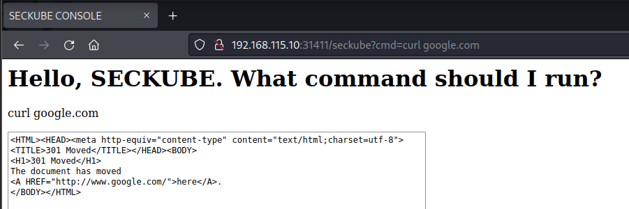

            On peut constater que nous avons bien access a l'outil curl.

            Ensuite, nous allons prendre tout ce que nous avons trouvee dans le conteneur et l'appliquer pour en sortir. Nous allons utiliser **curl** et le **token credential** pour essayer de nous connecter au serveur api de Kubernetes et lui demander les endpoints du cluster. Les détails de la connexion sont les suivants :

            - **Host** : la valeur de la variable KUBERNETES_PORT
            - **URI (identifiant uniforme de ressource)** : ici **endpoints**, dans le namespace par defaut, a l'emplacement **/api/v1/namespaces/default/endpoints**
            - **En-tête** : Un **Authorization: Bearer** contenant le contenu du fichier de jeton trouvee plus haut
            - **CA Cert** : Le certificat de l'autorité de certification qui, nous pouvons le supposer, se trouve dans l'emplacement par défaut, au même endroit que notre fichier de jetons, et s'appelle ca.crt.

            L'URL est le suivant : http://192.168.115.10:31411/seckube?cmd=curl%20--cacert%20/var/run/secrets/kubernetes.io/serviceaccount/ca.crt%20-H%20%22Authorization:%20Bearer%20$(cat%20/var/run/secrets/kubernetes.io/serviceaccount/token)%22%20https://10.96.0.1/api/v1/namespaces/default/endpoints

            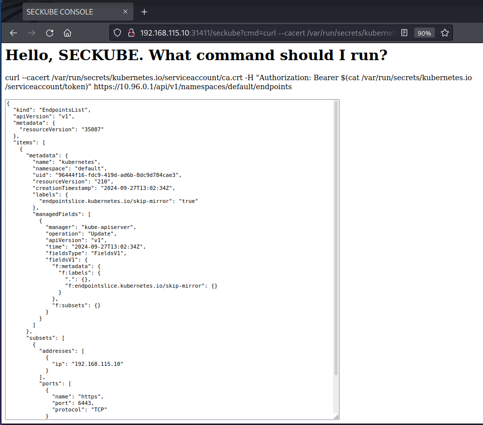

            Cette commande aboutit et la section qui nous interresse est :

                    "subsets": [
                      {
                        "addresses": [
                          {
                            "ip": "192.168.115.10"
                          }
                        ],
                        "ports": [
                          {
                            "name": "https",
                            "port": 6443,
                            "protocol": "TCP"
                          }
                        ]
                      }
                    ]
            
            **c- Recherche de faits sur le cluster**

            Nous voulons pouvoir utiliser kubectl pour accéder directement au cluster au lieu d'avoir à utiliser l'URL RCE encombrante. Pour ce faire, nous allons copier le contenu du jeton de http://192.168.115.10:31411/seckube?cmd=cat%20/var/run/secrets/kubernetes.io/serviceaccount/token dans le fichier de configuration kubectl. 

            Pour creer le fichier de configuration, nous nous servons du script suivant :

            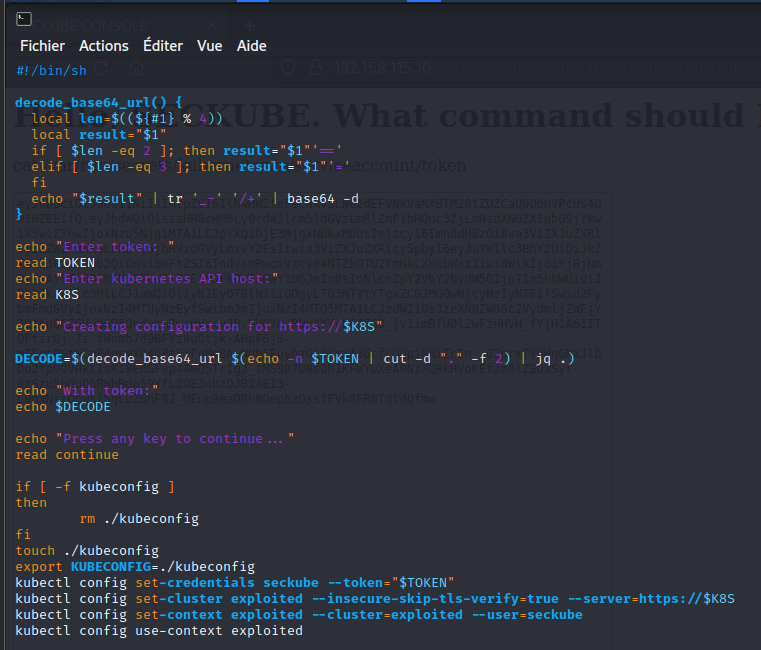

            Ce script permet de definir un nouvel utilisateur kubernetes nommee **seckube** avec son **TOKEN**, un nouveau cluster nommee **exploited**, creer un nouveau context nommee **exploited**, et de definir le context **exploited** comme celui par defaut.

            Lors de l'execution du script, il nous demande les informations suivantes, pour pouvoir se connecter au cluster distant :

            - Entrer le jeton : coller le contenu complet du jeton
            - Enter l'hote de l'API kubernetes : ici 192.168.115.10:6443.

            NB: Nous avons telecharger le binaire **kubectl** en suivant la meme procedure que lors du processus d'installation de kubernetes.

            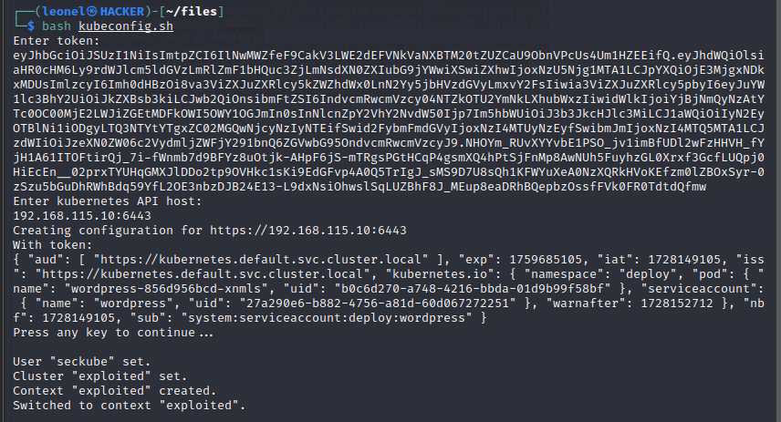

            Apres l'execution du script, nous obtenons le fichier suivant :

            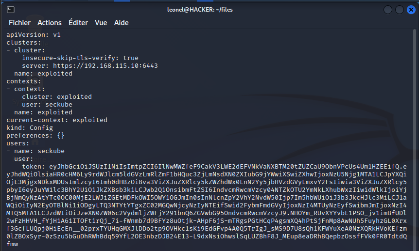

            Vérifions que le contexte est défini en exécutant la commande suivante : 
            
                kubectl config current-context 
            
            Il retourne **exploited**.

            Si cela ne fonctionne pas, il se peut que nous n'ayons pas defini la variable d'environnement **KUBECONFIG**. Pour résoudre ce problème, exécutons simplement la commande suivante : 
            
                export KUBECONFIG=kubeconfig 
            
            ou alors, executons cette commande : 
            
                kubectl config --kubeconfig=kubeconfig current-context

            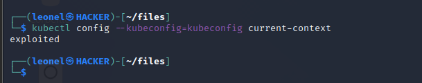

            Avec notre contexte kubectl maintenant défini, essayons d'accéder au cluster en exécutant la commande suivante :
            
                kubectl get pods
            
            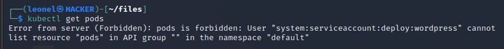

            L'erreur **Forbidden** que nous voyons ci-dessus nous indique simplement que le ServiceAccount que nous utilisons via le jeton n'a pas les privilèges suffisants pour lister les Pods dans le Namespace par défaut. Cette erreur, cependant, révèle quelque chose d'utile dans la valeur de l'utilisateur : **system:serviceaccount:deploy:webadmin**. Cette chaîne contient le nom de l'espace de nom dans lequel se trouve le ServiceAccount : **deploy**. Ainsi, le Pod à partir duquel nous avons copié le jeton s'exécute dans un espace de nom nommé "deploy".

            Compte tenu de ces informations, essayons de lister les Pods dans l'espace de nom deploy en ajoutant **-n deploy** à la commande :

            

            Succès ! C'est le pod que nous avons attaqué avec notre exploit RCE.

            Voyons quels autres privilèges ce jeton nous donne acces via la commande suivante :
            
                kubectl auth can-i --list

            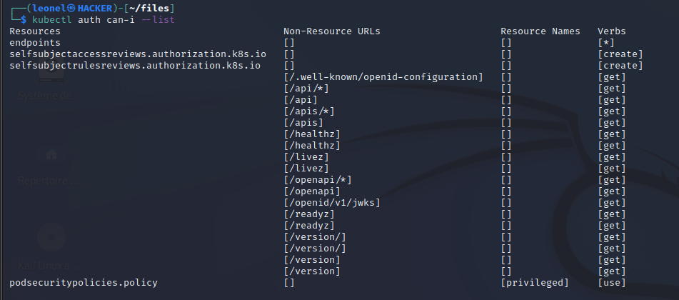

            Cela montre que, dans l'espace de noms par défaut, nous avons accès à tous les verbes (*) de la ressource endpoints et à un accès limité à d'autres ressources de type boilerplate qui ne sont pas intéressantes pour le moment (supprimées de l'exemple pour des raisons de concision.) L'absence de ressource pods ici est la raison pour laquelle nous avons obtenu cette erreur "Forbidden" lors de la première tentative de get pods dans l'espace de noms par défaut.

            Essayons la même commande dans l'espace de nom deploy: 
            
                kubectl auth can-i --list -n deploy
            
            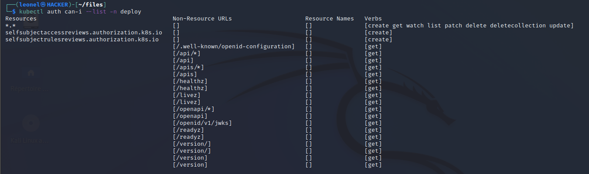

            Nous voyons ici le caractère générique **toutes les ressources (*.*)** avec l'ensemble de tous les verbes, ce qui signifie que nous avons un accès complet à toutes les ressources de l'espace de nom deploy !

            Nous savons maintenant que nous pouvons faire un certain nombre de choses dans l'espace de noms deploy, et pas grand-chose par défaut.

            **d- Établir une tête de pont dans le cluster**

            Maintenant que nous avons des permissions dans le namespace deploy, nous allons escalader nos privilèges pour pénétrer dans d'autres zones du cluster.

            Tout d'abord, exécutons le Pod wordpress et voyons ce qui est disponible pour nous. 

            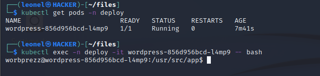

            Maintenant que nous avons un shell dans le Pod, voyons si nous sommes (ou pouvons devenir) root. Vérifions notre utilisateur avec whoami :

            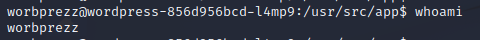

            Nous ne somme pas root, mais voyons si on peut devenir root avec la commande suivante: 
            
                sudo su-

            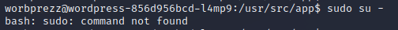

            Pas de sudo. Cela nous indique que l'image est mieux construite que la plupart des images par défaut, car les auteurs ont pris le temps de passer à un utilisateur non root et n'utilisent pas sudo.

            Voyons si nous pouvons modifier le système de fichiers : 
            
                touch test
            
            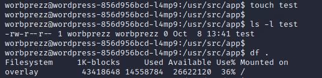

            Nous pouvons écrire dans le système de fichiers racine, ce qui signifie que nous pouvons télécharger un logiciel ou modifier une configuration. Nous savons déjà que nous avons curl, donc c'est tout à fait possible. Il s'agit d'une vulnérabilité, causée par le fait de ne pas définir **readonlyRootFilesystem=true** dans le contexte de securite du pod et de ne pas l'appliquer dans le **PSP (Pod Security Policy)**.

            Bien que cela soit intéressant, il sera difficile d'élever les privilèges à la racine dans le Pod, alors quittons la session exécutive, et passons à autre chose pour l'instant.

            Essayons de lancer un pod avec un utilisateur root en utilisant le fichier suivant, qui consiste en un conteneur exécutant l'image alpine qui dort simplement mais s'exécute en tant que root par défaut.

            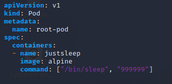

                kubectl apply -f root_pod.yaml

            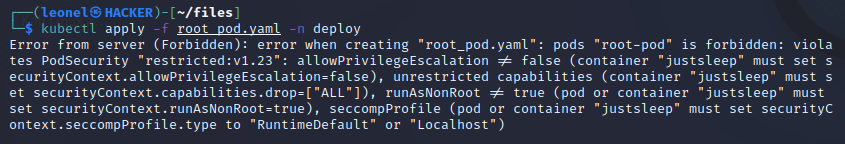

            L'erreur montre que plusieurs violations de **PodSecurity (PSP)** ont été détectées, ce qui indique que la PSA (Pod Security Admission) est activée. Sur la base des règles spécifiques citées, il s'agit probablement d'une politique restreinte (restricted) du contexte de securite du Pod. Cela empêche également le démarrage d'un conteneur privilégié.

            Compte tenu des restrictions imposées par le PSA, essayons de déployer notre propre pod à l'aide d'une image de conteneur et d'outils qui nous aideront à explorer le cluster. Le fichier suivant est un Pod qui exécute notre conteneur avec les paramètres de contexte de securite appropriés pour satisfaire la PSA.

            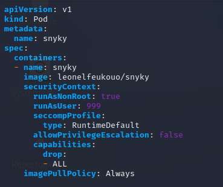

                kubectl apply -f nonroot_nonpriv_restricted.yaml -n deploy
            
            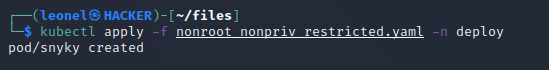

            Nous allons maintenant exécuter notre nouveau Pod et voir ce que nous pouvons faire : 
            
                kubectl exec -n deploy -it snyky -- bash
            
            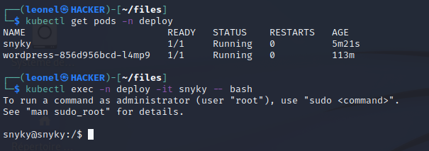

            Cette image contient sudo, mais malgré ce que dit l'invite de connexion, si nous essayons d'exécuter **sudo ls**, nous obtenons l'erreur suivante :

            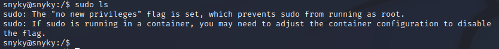

            En effet, les paramètres securityContext du manifeste Pod sont définis sur **allowPrivilegeEscalation : false** pour satisfaire la PSA.

            À ce stade, nous n'avons pas d'accès root au Pod, mais nous disposons d'un shell dans un conteneur qui nous donne notre point de départ.

            **e- Explorer au-delà de notre espace de noms**

            **f- Échapper à notre espace de noms**

            **g- Posséder le cluster**

        - #### 3.2.2 Identification des vulnérabilités et des points faibles
            Les tests de pénétration ont révélé plusieurs vulnérabilités dans l'architecture initiale, notamment :
            - L'accès non autorisé à certains services.
            - La possibilité d'exécuter des commandes arbitraires sur les pods.
            - L'absence de restrictions de réseau permettant une communication non sécurisée entre les pods.

    - ### Conclusion
        Ce chapitre a décrit le développement et le déploiement de l'architecture non sécurisée, ainsi que les résultats des tests de pénétration initiaux. Ces résultats serviront de référence pour la mise en œuvre des mesures de sécurité décrites dans le prochain chapitre.
 
- ## **CHAPITRE 4 : Sécurisation de l'architecture**
    - ### Introduction
        Ce chapitre se concentre sur la sécurisation de l'architecture Kubernetes initiale en appliquant des mesures de sécurité recommandées.

    - ### 4.1 Planification des fonctionnalités de sécurisation à implémenter dans les sprints
        - #### 4.1.1 Identification des priorités de sécurité
            Les priorités de sécurité ont été définies en fonction des vulnérabilités identifiées lors des tests de pénétration initiaux. Les mesures prioritaires incluent :
            - L'implémentation de RBAC pour contrôler les accès.
            - La configuration des politiques de réseau pour restreindre les communications.
            - La sécurisation des données sensibles.

        - #### 4.1.2 Définition des critères d'acceptation
            Les critères d'acceptation pour chaque fonctionnalité de sécurité incluent :
            - La capacité de restreindre les accès non autorisés.
            - La prévention des communications non sécurisées entre les pods.
            - La protection efficace des données sensibles.

    - ### 4.2 Application des mesures de sécurité recommandées
        - #### 4.2.1 Configuration des outils de sécurité (pare-feu, contrôle d'accès, etc.)
            Les outils de sécurité suivants ont été configurés :
            - Role-Based Access Control (RBAC) pour gérer les permissions.
            - Politiques de réseau pour restreindre les communications entre les pods.
            - Kubernetes Secrets pour stocker et gérer les informations sensibles.

        - #### 4.2.2 Mise en place de la surveillance et de l'audit
            Des systèmes de surveillance et d'audit ont été mis en place pour détecter et répondre aux menaces en temps réel. Cela inclut :
            - L'intégration de Prometheus pour la surveillance des performances.
            - L'utilisation de Fluentd pour la gestion des logs et l'audit.

    - ### Conclusion
        Ce chapitre a détaillé les mesures de sécurité mises en place pour renforcer l'architecture Kubernetes initiale. Ces mesures devraient améliorer considérablement la sécurité de l'environnement.

- ## **CHAPITRE 5 : Tests et évaluation**
    - ### Introduction
        Dans ce chapitre, nous allons évaluer l'efficacité des mesures de sécurité mises en place en effectuant des tests et en comparant les résultats avant et après sécurisation.

    - ### 5.1 Évaluation de la sécurité de l'architecture sécurisée mise en place
        - #### 5.1.1 Méthodologie des tests de sécurité
            La méthodologie des tests de sécurité implique la réalisation de tests de pénétration similaires à ceux effectués sur l'architecture non sécurisée. Cela inclut :
            - Des tests d'accès non autorisé.
            - Des tentatives d'exécution de commandes arbitraires.
            - Des simulations d'attaques DDoS.

        - #### 5.1.2 Résultats des tests de pénétration
            Les tests de pénétration ont montré une amélioration significative de la sécurité. Par exemple :
            - Les tentatives d'accès non autorisé ont été bloquées par RBAC.
            - Les communications non sécurisées entre les pods ont été restreintes par les politiques de réseau.
            - Les données sensibles ont été protégées efficacement par Kubernetes Secrets.

    - ### 5.2 Comparaison des résultats avant et après sécurisation
        - #### 5.2.1 Analyse comparative des vulnérabilités
            L'analyse comparative des vulnérabilités a révélé que les mesures de sécurité mises en place ont réduit de manière significative les risques. Les vulnérabilités identifiées dans l'architecture initiale ont été corrigées, et l'environnement est maintenant mieux protégé contre les attaques courantes.

        - #### 5.2.2 Mesure de la performance et de l'efficacité des mesures de sécurité
            La performance et l'efficacité des mesures de sécurité ont été mesurées en termes de réduction des vulnérabilités et d'amélioration de la résilience aux attaques. Les résultats montrent une amélioration notable de la sécurité globale de l'architecture Kubernetes.

    - ### 5.3 Résultats et discussion
        - #### 5.3.1 Présentation des résultats obtenus
            Les résultats obtenus montrent que les mesures de sécurité mises en place ont été efficaces pour renforcer la sécurité de l'architecture Kubernetes. Les tests de pénétration ont confirmé la réduction des vulnérabilités et l'amélioration de la protection des données.

        - #### 5.3.2 Analyse des forces et des faiblesses de l'approche adoptée
            L'approche adoptée présente plusieurs forces, notamment l'utilisation de RBAC, des politiques de réseau, et des Kubernetes Secrets. Cependant, certaines faiblesses subsistent, telles que la complexité de la gestion des politiques de réseau et la nécessité de mises à jour régulières des outils de sécurité.

        - #### 5.3.3 Discussion sur les leçons apprises et les recommandations pour l'avenir
            Les leçons apprises incluent l'importance de la planification et de l'évaluation continues des mesures de sécurité. Les recommandations pour l'avenir incluent :
            - La mise en place d'un processus continu de surveillance et d'audit.
            - L'adoption de nouvelles technologies de sécurité à mesure qu'elles deviennent disponibles.
            - La formation continue des équipes sur les meilleures pratiques en matière de sécurité Kubernetes.

    - ### Conclusion
        Ce chapitre a présenté les tests et l'évaluation de l'architecture sécurisée, montrant une amélioration significative par rapport à l'architecture initiale. Les résultats confirment l'efficacité des mesures de sécurité mises en place.

 
- ## **CONCLUSION GÉNÉRALE**
    Ce rapport a détaillé le projet de renforcement de la sécurité d'une architecture Kubernetes, en utilisant une méthodologie Scrum pour structurer le travail. À travers une série de tests et d'évaluations, nous avons démontré l'efficacité des mesures de sécurité mises en place. Les principaux résultats montrent une amélioration significative de la sécurité, avec une réduction notable des vulnérabilités et une meilleure protection des données et des applications. Ce projet souligne l'importance de la sécurité dans les environnements Kubernetes et propose des recommandations pour les futures améliorations. Nous espérons que ce rapport contribuera à une meilleure compréhension des défis de sécurité dans les environnements Kubernetes et servira de guide pour les professionnels cherchant à renforcer la sécurité de leurs déploiements.

- ## **BIBLIOGRAPHIE**

- ## **RÉSUMÉ**
    Ce projet de fin d'études vise à renforcer la sécurité d'une architecture Kubernetes en appliquant des mesures spécifiques et en évaluant leur efficacité. La méthodologie Scrum a été utilisée pour structurer le travail, et les résultats montrent une amélioration significative de la sécurité globale. Ce rapport présente les détails du projet, y compris le contexte, les objectifs, la mise en œuvre, et les résultats des tests de sécurité.

- ## **ABSTRACT**
    This final project aims to enhance the security of a Kubernetes architecture by implementing specific measures and evaluating their effectiveness. The Scrum methodology was used to structure the work, and the results show a significant improvement in overall security. This report details the project, including the context, objectives, implementation, and security test results.